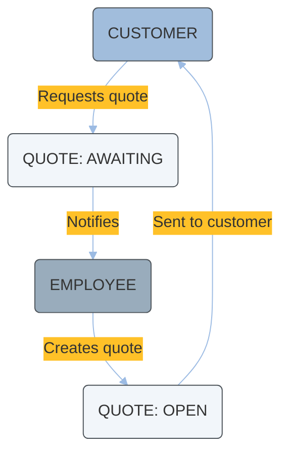
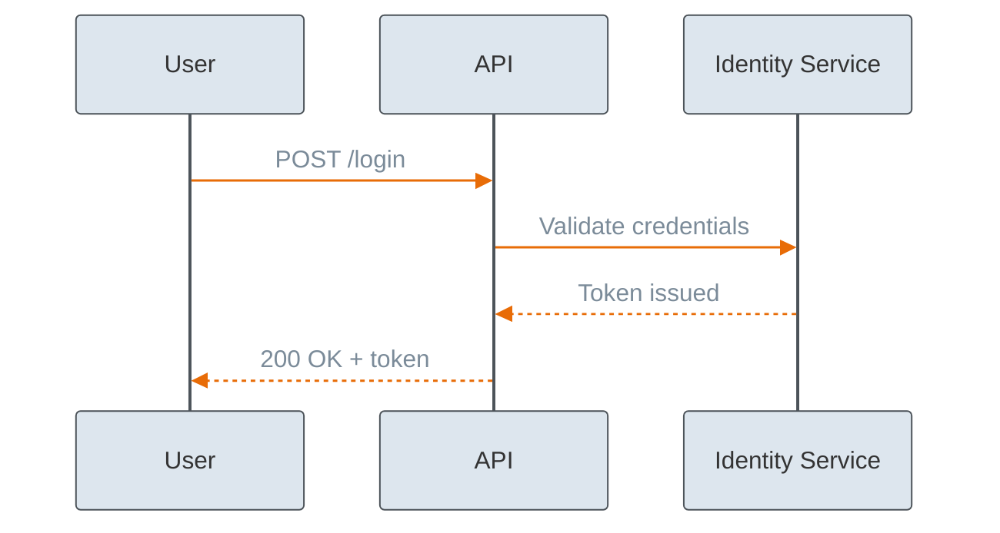
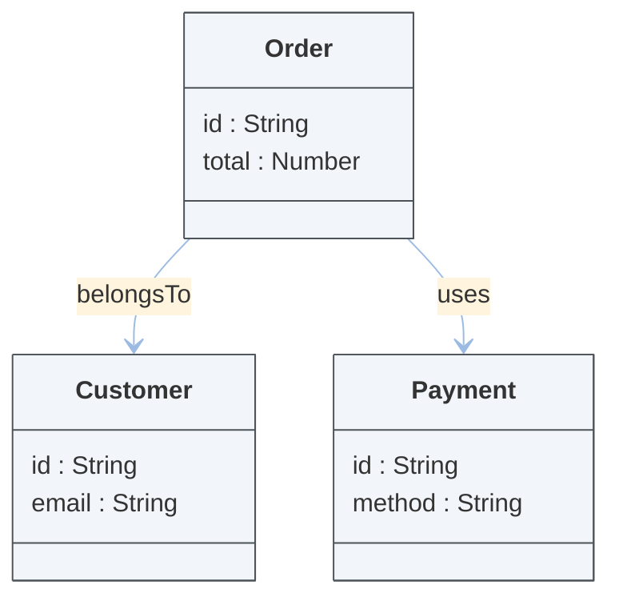

# Examples

## Example 1: Flowchart from process text

Input:
"Create a flowchart for quote approval with customer, employee, and quote states. Use our brand style."

Output pattern:

## Example 2: Sequence diagram from API interaction steps

Input:
"Create a sequence diagram for login request, token validation, and response."

Output pattern:

## Example 3: Class diagram with branded boxes

Input:
"Model Order, Customer, and Payment relationships as class diagram."

Output pattern:

