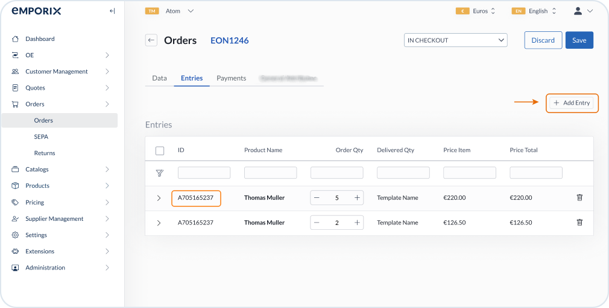

# Images & Icons

## Placing pictures in docs

* Each Gitbook space has its own images path under `.gitbook/assets` folders. Place the image asset in a relevant location and refer to its path in a document using the ``
* Wrap images with the `<figure>` tag
* Add `alt` text for description of what the image presents, use a brief phrase.
* Define `<figcaption>` to display the image description in the doc underneath the picture.
* Where needed, add `width` param to change the image size on the screen.
* Align images to the center (default behavior).

Example:

```
<figure><figcaption>Creating a catalog in Management Dashboard</figcaption></figure>
```

## Placing icons in docs

* Refer to an icon path using the `` to place it in line with text.
* Do not use `<figcaption>` for icons.

## Editing pictures in PhotoScape

* Frames:
  * Color: #DDE6EE
  * Roundness: 10
  * Stroke: 2/3
* Highlights:
  * Color: #E86C07
  * Shape: Rounded Rectangle
* Arrows:
  * Color: #E86C07
* Blur to hide sensitive data
  * Lens blur
  * Strength: 30
  * Brush size: 15
  * Hardness: 25
* More brand colors: [Emporix Style Guide](https://figma.com/design/dAuV0qAntjHxBaypNLd1Os/Emporix-Style-Guide?node-id=23-101\&node-type=frame\&t=TBbRBa6UdWfIFjzk-0).

Example:

<figure><figcaption><p>Example screenshot styling</p></figcaption></figure>
