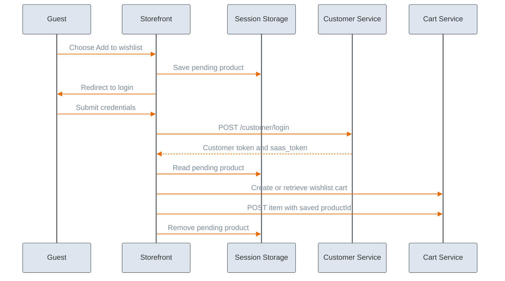

# Wishlist Cart Tutorial

The Cart Service supports wishlists as a dedicated cart type. A logged-in customer can have an open `shopping` cart for checkout and a separate open `wishlist` cart for saved products at the same time. Cart uniqueness is defined by the combination of `siteCode`, `type`, `legalEntityId`, and (`sessionId` or `customerId`).


Use the Cart Service with the `"type": "wishlist"` for the "save-for-later" functionality. The Shopping List Service is intended for frequently purchased items and reorder lists, not classic wishlists.



Wishlists should be used by authenticated customers. Although the Cart API allows creating a `type: "wishlist"` cart for an anonymous session, such carts are assigned to the `sessionId` and are only accessible during that session. If the guest customer never logs in, the wishlist is lost when the session ends or the token expires. For storefronts, it is better to prompt guest customers to log in before adding products to a wishlist.


## How wishlists work

Wishlists require a `customerId` so saved items persist across visits. Unlike a `shopping` cart — which can be used anonymously and merged on login (see the [How to merge carts](cart.md#how-to-merge-carts) in the Cart Tutorial) — a `wishlist` cart is not suitable for anonymous sessions because session-bound carts are lost when the session ends.

## Prerequisites

Log in the customer with the [Logging in a customer](https://developer.emporix.io/api-references/api-guides/companies-and-customers/customer-management/api-reference/authentication-and-authorization#post-customer-tenant-login) endpoint. Use `{{CUSTOMER_ACCESS_TOKEN}}` and `{{SAAS_TOKEN}}` from the response in the Cart Service requests below. Use the customer identity from the `saas_token` as `{{customerId}}` when retrieving carts.

## How to manage a wishlist for a logged-in customer



#### Create or retrieve a wishlist cart

Retrieve an existing wishlist cart or create one if none exists by calling the [Retrieving a cart by criteria](https://developer.emporix.io/api-references/api-guides/checkout/cart/api-reference/carts#get-cart-tenant-carts) with `type=wishlist` and `create=true`.




[api-reference](api-reference/)


```bash
curl -i -X GET \
  'https://api.emporix.io/cart/{{tenant}}/carts?siteCode=main&customerId={{customerId}}&type=wishlist&create=true' \
  -H 'Authorization: Bearer {{CUSTOMER_ACCESS_TOKEN}}' \
  -H 'saas-token: {{SAAS_TOKEN}}'
```

Use the cart `id` from the response as `{{wishlistCartId}}` in the following steps.



#### Add a product to the wishlist

Use the same cart item endpoints as for a shopping cart. Provide the wishlist cart ID in the `cartId` path parameter.

To add a product, call the [Adding a product to cart](https://developer.emporix.io/api-references/api-guides/checkout/cart/api-reference/cart-items#post-cart-tenant-carts-cartid-items) endpoint.




[api-reference](api-reference/)


```bash
curl -i -X POST \
  'https://api.emporix.io/cart/{{tenant}}/carts/{{wishlistCartId}}/items?siteCode=main' \
  -H 'Authorization: Bearer {{CUSTOMER_ACCESS_TOKEN}}' \
  -H 'Content-Type: application/json' \
  -H 'saas-token: {{SAAS_TOKEN}}' \
  -d '{
    "itemYrn": "urn:yaas:saasag:caasproduct:product:{{tenant}};{{productId}}",
    "price": {
      "priceId": "683987a51fb08560120d5354",
      "effectiveAmount": 50,
      "originalAmount": 50,
      "currency": "EUR"
    },
    "quantity": 1
  }'
```



#### Remove a wishlist item

To remove a single item, call the [Deleting a cart item](https://developer.emporix.io/api-references/api-guides/checkout/cart/api-reference/cart-items#delete-cart-tenant-carts-cartid-items-itemid) endpoint with the wishlist cart ID and item ID. Use the item `id` from the wishlist cart response as `{{itemId}}`.




[api-reference](api-reference/)


```bash
curl -i -X DELETE \
  'https://api.emporix.io/cart/{{tenant}}/carts/{{wishlistCartId}}/items/{{itemId}}' \
  -H 'Authorization: Bearer {{CUSTOMER_ACCESS_TOKEN}}' \
  -H 'saas-token: {{SAAS_TOKEN}}'
```



## How to move a wishlist item to the shopping cart

To move a wishlist item to the shopping cart, add the product to the customer's `shopping` cart and remove it from the `wishlist` cart.



#### Add the product to the shopping cart

* Retrieve the shopping cart and wishlist cart independently using the `type` query parameter on the [Retrieving a cart by criteria](https://developer.emporix.io/api-references/api-guides/checkout/cart/api-reference/carts#get-cart-tenant-carts) endpoint (`shopping` and `wishlist`). Use `create=true` on the shopping cart request if the customer does not have an open shopping cart yet.



**Shopping cart**

```bash
curl -i -X GET \
  'https://api.emporix.io/cart/{{tenant}}/carts?siteCode=main&customerId={{customerId}}&type=shopping&create=true' \
  -H 'Authorization: Bearer {{CUSTOMER_ACCESS_TOKEN}}' \
  -H 'saas-token: {{SAAS_TOKEN}}'
```
**Wishlist cart**

```bash
curl -i -X GET \
  'https://api.emporix.io/cart/{{tenant}}/carts?siteCode=main&customerId={{customerId}}&type=wishlist' \
  -H 'Authorization: Bearer {{CUSTOMER_ACCESS_TOKEN}}' \
  -H 'saas-token: {{SAAS_TOKEN}}'
```

Use the shopping cart `id` as `{{shoppingCartId}}`, the wishlist cart `id` as `{{wishlistCartId}}`, and the wishlist item `id` as `{{itemId}}`.

* Add the product to the customer's `type: "shopping"` cart by calling the [Adding a product to cart](https://developer.emporix.io/api-references/api-guides/checkout/cart/api-reference/cart-items#post-cart-tenant-carts-cartid-items) endpoint.


[api-reference](api-reference/)


```bash
curl -i -X POST \
  'https://api.emporix.io/cart/{{tenant}}/carts/{{shoppingCartId}}/items?siteCode=main' \
  -H 'Authorization: Bearer {{CUSTOMER_ACCESS_TOKEN}}' \
  -H 'Content-Type: application/json' \
  -H 'saas-token: {{SAAS_TOKEN}}' \
  -d '{
    "itemYrn": "urn:yaas:saasag:caasproduct:product:{{tenant}};{{productId}}",
    "price": {
      "priceId": "683987a51fb08560120d5354",
      "effectiveAmount": 50,
      "originalAmount": 50,
      "currency": "EUR"
    },
    "quantity": 1
  }'
```



#### Remove the product from the wishlist

Remove the product from the `type: "wishlist"` cart by calling the [Deleting a cart item](https://developer.emporix.io/api-references/api-guides/checkout/cart/api-reference/cart-items#delete-cart-tenant-carts-cartid-items-itemid) endpoint.




[api-reference](api-reference/)


```bash
curl -i -X DELETE \
  'https://api.emporix.io/cart/{{tenant}}/carts/{{wishlistCartId}}/items/{{itemId}}' \
  -H 'Authorization: Bearer {{CUSTOMER_ACCESS_TOKEN}}' \
  -H 'saas-token: {{SAAS_TOKEN}}'
```



## How to handle guest add-to-wishlist

Guest customers cannot persist a wishlist without logging in. When a guest chooses to add an item to a wishlist on the storefront, follow these steps.

### Guest add-to-wishlist flow





#### Store the pending product

This step belongs to the storefront logic, not a Cart Service call itself. Store the selected product before redirecting to login, for example, in the `sessionStorage`. After a successful login, read the stored value, add the product to the wishlist cart, then clear it. 

Example of storing the pending product:

```json
{
  "kind": "wishlist-add",
  "productId": "123",
  "quantity": 1,
  "sourcePath": "/product/123"
}
```



#### Redirect the customer to login

Redirect the customer to the login or registration page. Keep the pending product in `sessionStorage` until login succeeds.



#### Log in the customer

Log in the customer as described in [Prerequisites](#prerequisites).



#### Add the product to the wishlist

Read the stored `productId` from `sessionStorage`, then continue with [Create or retrieve a wishlist cart](#create-or-retrieve-a-wishlist-cart) and [Add a product to the wishlist](#add-a-product-to-the-wishlist). Clear the pending product from storage after the item is added.


