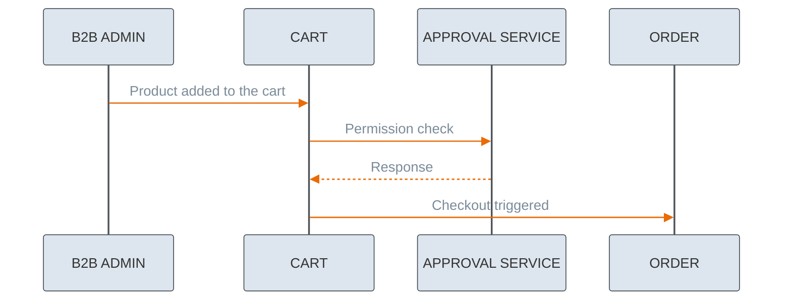
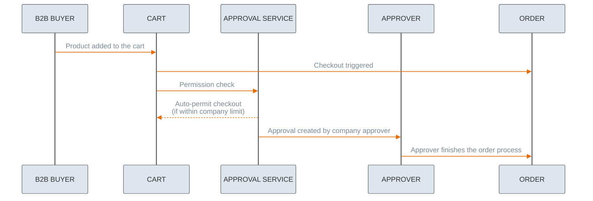
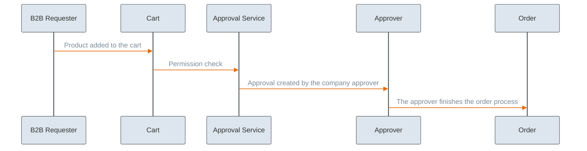

---
seo:
  title: Approval Service Tutorials
  description: Approvals Management
icon: graduation-cap
---

# Approval Tutorials

An approval process is essential for organizations to define the proper purchasing flow and enforce budget limits. Depending on the role of the customer creating an order, some orders are approved automatically, while others require additional confirmation from eligible users. This feature enables customers to manage approval processes for orders.

The approval flow begins when a customer adds products to the cart in the storefront.
The functionality supports four scopes, designed for *Admin*, *Buyer* and *Requester* roles.

Scopes designed for a customer:

* `approval.approval_read_own`
* `approval.approval_manage_own`

Scopes designed for a customer, admin (`B2B_ADMIN`), buyer (`B2B_BUYER`) and requester (`B2B_REQUESTER`):

* `approval.approval_read`
* `approval.approval_manage`


Users are able to read or manage only the approvals that are assigned to them. 


See the different approval flows depending on the roles:

Admin:



Buyer:



Requester: 



## Scopes rules

Only the customers from `B2B_REQUESTER` and `B2B_BUYER` groups can create an approval, and only a customer of the same company can be chosen as an approver. An approver needs to be assigned to the `B2B_ADMIN` or `B2B_BUYER` group.

An approval for a given resource can be created only by the resource owner. The approval can be updated, but only if it's still pending processing — the status is then visible as `PENDING`.

Customers can manage only the approvals which are assigned to them. The scopes are granted automatically when a customer is logged in to our system.

The scopes that are granted depend on the user group to which the user is assigned. Nevertheless, if a token needs to be generated based on an API key, then you can use the Customer Service to get the token: [Customer Service – Customer Token](https://developer.emporix.io/api-references/api-guides/companies-and-customers/customer-management/api-reference/authentication-and-authorization#get-customer-tenant-validateauthtoken).

## How to manage approvals

An approval can be created (requested) only by a customer who doesn't have the permission to trigger the checkout, which means they can't create an order.
Only customers from the `B2B_REQUESTER` and `B2B_BUYER` groups can create an approval.
Customers from the `B2B_BUYER` group can create approval only when the cost of the order exceeds the company limit, then the approval from an admin is required.
If the user is a B2C user or an admin, the Approval API returns either info about no necessary approval or an error. The API is scoped specifically for `B2B_REQUESTER` and `B2B_BUYER` roles.

### How to check user approval rights

To check user approval rights upfront, send the request to [Retrieving all groups to which a user is assigned](https://developer.emporix.io/api-references/api-guides/users-and-permissions/iam/api-reference/users#get-iam-tenant-users-userid-groups) endpoint.




[api-reference](../../users-and-permissions/iam/api-reference/)


You can also perform the check during checkout. If the user lacks the necessary rights, the approval flow can be triggered after the checkout fails. However, this approach requires first distinguishing between B2B and B2C users to verify whether they belong to a B2B legal entity or group.

### How to check eligible approvers

Query your IAM or company user service for users in the same legal entity who belong to B2B_ADMIN or B2B_BUYER groups.

You can optionally surface their names/emails in the UI to let the Requester choose.

### How to start the approval flow

To start with the flow, you need to create an approval. Send a request to the [Creating a single approval](https://developer.emporix.io/api-references/api-guides/companies-and-customers/approval-service/approval-api-reference/approvals#post-approval-tenant-approvals) endpoint.

Only users from the `B2B_REQUESTER` or `B2B_BUYER` can initiate the flow. They are the users with the `approval.approval_manage_own` scope.




[api-reference](../approval-service/api-reference/)


```bash
curl -i -X POST 
  'https://api.emporix.io/approval/{tenant}/approvals' 
  -H 'Authorization: Bearer <YOUR_TOKEN_HERE>' 
  -H 'Content-Type: application/json' 
  -d '{
    "id": "64e241ced632aa413a27a318",
    "resourceType": "CART",
    "resourceId": "cartId",
    "action": "CHECKOUT",
    "approver": {
      "userId": "aaa2f2b6-7dc8-45ff-9f20-4e6163c14cbb"
    },
    "comment": "Comment to the approval user",
    "details": {
      "currency": "EUR",
      "paymentMethods": [
        {
          "provider": "stripe",
          "customAttributes": {
            "paymentType": "invoice"
          },
          "method": "invoice",
          "amount": 3
        }
      ],
      "shipping": {
        "zoneId": "deliveryarea",
        "methodId": "4-more_hours_timeframe",
        "amount": 10,
        "methodName": "Delivery method name",
        "shippingTaxCode": "STANDARD"
      },
      "payment": {
        "paymentId": "636cc738-f0cd-11ed-a05b-0242ac120003",
        "customAttributes": {
          "attribute1": "value of the attribute1",
          "attribute2": "value of the attribute2"
        }
      },
      "addresses": [
        {
          "contactName": "John Doe",
          "street": "Fritz-Elsas-Straße",
          "streetNumber": "20",
          "streetAppendix": "",
          "zipCode": "70173",
          "city": "Stuttgart",
          "country": "DE",
          "type": "SHIPPING",
          "contactPhone": "123456789"
        },
        {
          "contactName": "John Doe",
          "street": "Fritz-Elsas-Straße",
          "streetNumber": "20",
          "streetAppendix": "",
          "zipCode": "70173",
          "city": "Stuttgart",
          "country": "DE",
          "type": "BILLING",
          "contactPhone": "123456789"
        }
      ]
    }
  }'
```

### Update an approval

After creating the approval, items can be updated by the PATCH endpoint. Customers can change the status, details, delivery window and comment of the approval.

To update an approval, send a request to the [Updating a single approval](https://developer.emporix.io/api-references/api-guides/companies-and-customers/approval-service/approval-api-reference/approvals#patch-approval-tenant-approvals-approvalid) endpoint.




[api-reference](../approval-service/api-reference/)


```bash
curl -i -X PATCH 
  'https://api.emporix.io/approval/{tenant}/approvals/{approvalId}' 
  -H 'Authorization: Bearer <YOUR_TOKEN_HERE>' 
  -H 'Content-Type: application/json' 
```

### Retrieve an approval

Approvals can be fetched by a customer. Only the approval which is assigned to the customer is returned.

To retrieve an approval, send a request to the [Retrieving a single approval](https://developer.emporix.io/api-references/api-guides/companies-and-customers/approval-service/approval-api-reference/approvals#get-approval-tenant-approvals-approvalid) endpoint.




[api-reference](../approval-service/api-reference/)


```bash
curl -i -X GET 
  'https://api.emporix.io/approval/{tenant}/approvals/{approvalId}' 
  -H 'Authorization: Bearer <YOUR_TOKEN_HERE>'
```

## FAQ

### Do I get approval notifications?

After sending the approval request, an email notification is sent to the approver. You can also see a confirmation message indicating that the approval was requested. In your Saved Carts, you can check the status of your request.

### Are multiple approvers supported?

Currently, the Emporix approval service supports only one approver per request. There is no built-in mechanism to define multiple approvers where “any one can approve.” A possible workaround is to create a user account using a shared email address, such as approvers@emporix.com, which can be accessed by multiple team members.



To learn more about the approval groups, see the [Approvals](https://developer.emporix.io/ce/core-commerce/customer-management/approvals) user guides documentation.

