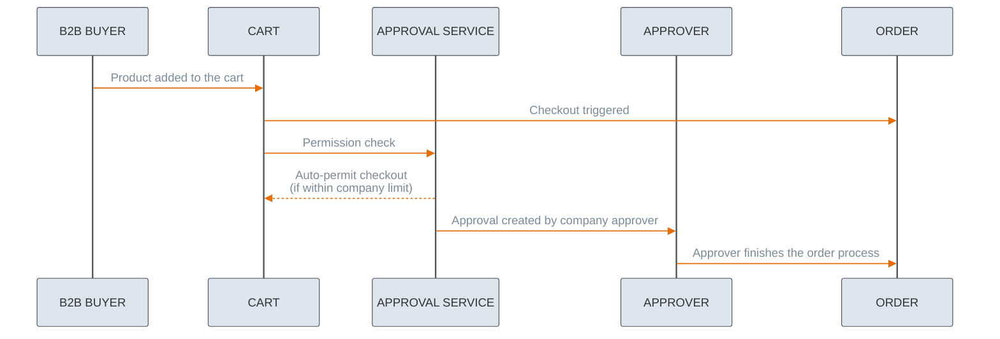
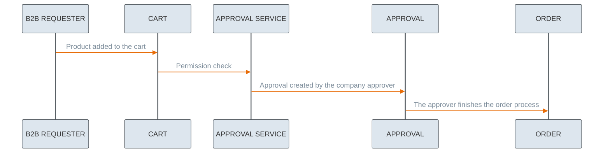

---
seo:
  title: Approval Service Tutorials
  description: Approvals Management
icon: graduation-cap
---

# Approval Tutorials

An approval process is essential for organizations to define the proper purchasing flow and enforce budget limits. Depending on the role of the customer creating an order, some orders are approved automatically, while others require additional confirmation from eligible users. This feature enables customers to manage approval processes for orders.

```mermaid
---
config:
  layout: fixed
  theme: base
  look: classic
  themeVariables:
    background: transparent
    lineColor: "#9CBBE3"
    arrowheadColor: "#9CBBE3"
    edgeLabelBackground: "#FFC128" 
    edgeLabelTextColor: "#4C5359"
---
classDiagram
    class Approval {
        id : String
        approver : Customer
        requestor : Customer
        resource : ResourceCart
    }

    class Customer {
        id : String
        firstName : String
        lastName : String
    }

    class ResourceCart {
        id : String
        totalPrice : Price
        subTotalPrice : Price
        subtotalAggregate : SubtotalAggregate
        siteCode : String
        deliveryWindow : DeliveryWindow
        items : Item[]
    }

    class Price {
        currency : String
        amount : Number
    }

    class SubtotalAggregate {
        currency : String
        netValue : Number
        grossValue : Number
        taxValue : Number
    }

    class DeliveryWindow {
        id : String
        slotId : String
        deliveryDate : String
    }

    class Item {
        quantity : Number
        itemPrice : Price
        itemYrn : String
    }

    Approval --> Customer : approver
    Approval --> Customer : requestor
    Approval --> ResourceCart : resource
    ResourceCart --> Price : totalPrice
    ResourceCart --> Price : subTotalPrice
    ResourceCart --> SubtotalAggregate : subtotalAggregate
    ResourceCart --> DeliveryWindow : deliveryWindow
    ResourceCart --> Item : items
    ```

## Roles and scopes

The approval flow begins when a customer adds products to the cart in the storefront.
The functionality supports four scopes, designed for *Admin*, *Buyer* and *Requester* roles.

Scopes designed for a customer:

* `approval.approval_read_own`
* `approval.approval_manage_own`

Scopes designed for a customer, admin (`B2B_ADMIN`), buyer (`B2B_BUYER`) and requester (`B2B_REQUESTER`):

* `approval.approval_read`
* `approval.approval_manage`


Users are able to read or manage only the approvals that are assigned to them. 


See the different approval flows depending on the roles placing the order:

**Admin**

```mermaid
---
config:
  layout: fixed
  theme: base
  themeVariables:
    primaryColor: '#DDE6EE'
    primaryBorderColor: '#4C5359'
    actorBkg: '#DDE6EE'
    actorBorder: '#4C5359'
    actorLineColor: '#4C5359'
    signalColor: '#E86C07'
    signalTextColor: '#7B8B99'
    background: transparent 
---
sequenceDiagram
    participant Admin as B2B ADMIN
    participant Cart as CART
    participant Approval as APPROVAL SERVICE
    participant Order as ORDER

    Admin ->> Cart: Product added to the cart
    Cart ->> Approval: Permission check
    Approval -->> Cart: Response
    Cart ->> Order: Checkout triggered
```
**Buyer**

**Requester**

### Role rules

Only customers from the `B2B_REQUESTER` and `B2B_BUYER` groups can create an approval, and only a customer from the same company can be chosen as the approver. An approver must belong to the `B2B_ADMIN` or `B2B_BUYER` group.

An approval can be created (requested) only by a customer who does not have permission to trigger checkout - this means they cannot create an order. Additionally, `B2B_BUYER` customers can create an approval only if the order cost exceeds the company limit, in which case approval from an Admin is required. For `B2C` users or Admins, the Approval API either indicates that no approval is necessary or returns an error.

An approval for a given resource can only be created by the resource owner. Approvals can be updated while their status is PENDING. Customers can manage only the approvals assigned to them.

Scopes are granted automatically when a customer logs in, depending on their group. If a token needs to be generated based on an API key, then you can use the Customer Service to get the token: [Customer Service – Customer Token](https://developer.emporix.io/api-references/api-guides/companies-and-customers/customer-management/api-reference/authentication-and-authorization#get-customer-tenant-validateauthtoken).

## Managing approvals

### How to check user rights for approval flow

You can check the approval rights either with IAM or Approval service.

* **IAM**: To check user approval rights upfront, send the request to [Retrieving all groups to which a user is assigned](https://developer.emporix.io/api-references/api-guides/users-and-permissions/iam/api-reference/users#get-iam-tenant-users-userid-groups) endpoint.




[api-reference](../../users-and-permissions/iam/api-reference/)



```bash
curl -L 
  --url 'https://api.emporix.io/iam/{tenant}/users/{userId}/groups' 
  --header 'Authorization: Bearer YOUR_OAUTH2_TOKEN' 
  --header 'Accept: */*'
```

* **Approval**: You can perform the check during checkout. If the user lacks the necessary rights, the approval flow can be triggered after the checkout fails. However, this approach requires first distinguishing between B2B and B2C users to verify whether they belong to a B2B legal entity or group.

### How to check eligible approvers

To check approvers from your company, query the IAM Service or company user service for users in the same legal entity who belong to `B2B_ADMIN` or `B2B_BUYER` groups.

Send the request to the [Retrieving users assigned to a group](https://developer.emporix.io/api-references/api-guides/users-and-permissions/iam/api-reference/groups#get-iam-tenant-groups-groupid-users) endpoint and provide the `groupId` (*Admin* or *Buyer* group) to get a response with assigned users.




[api-reference](../../users-and-permissions/iam/api-reference/)


```bash
curl -L 
  --url 'https://api.emporix.io/iam/{tenant}/groups/{groupId}/users' 
  --header 'Authorization: Bearer YOUR_OAUTH2_TOKEN' 
  --header 'Accept: */*'
```

### How to start the approval flow

To start with the flow, you need to create an approval. 

Send a request to the [Creating a single approval](https://developer.emporix.io/api-references/api-guides/companies-and-customers/approval-service/approval-api-reference/approvals#post-approval-tenant-approvals) endpoint.

Only customers with the `B2B_REQUESTER` or `B2B_BUYER` roles can initiate the flow. They are the users with the `approval.approval_manage_own` scope.
If a customer is in `B2B_ADMIN` role, the create approval flow does not start.




[api-reference](../approval-service/approval-api-reference/)


```bash
curl -i -X POST 
  'https://api.emporix.io/approval/{tenant}/approvals' 
  -H 'Authorization: Bearer <YOUR_TOKEN_HERE>' 
  -H 'Content-Type: application/json' 
  -d '{
    "id": "64e241ced632aa413a27a318",
    "resourceType": "CART",
    "resourceId": "cartId",
    "action": "CHECKOUT",
    "approver": {
      "userId": "aaa2f2b6-7dc8-45ff-9f20-4e6163c14cbb"
    },
    "comment": "Comment to the approval user",
    "details": {
      "currency": "EUR",
      "paymentMethods": [
        {
          "provider": "stripe",
          "customAttributes": {
            "paymentType": "invoice"
          },
          "method": "invoice",
          "amount": 3
        }
      ],
      "shipping": {
        "zoneId": "deliveryarea",
        "methodId": "4-more_hours_timeframe",
        "amount": 10,
        "methodName": "Delivery method name",
        "shippingTaxCode": "STANDARD"
      },
      "payment": {
        "paymentId": "636cc738-f0cd-11ed-a05b-0242ac120003",
        "customAttributes": {
          "attribute1": "value of the attribute1",
          "attribute2": "value of the attribute2"
        }
      },
      "addresses": [
        {
          "contactName": "John Doe",
          "street": "Fritz-Elsas-Straße",
          "streetNumber": "20",
          "streetAppendix": "",
          "zipCode": "70173",
          "city": "Stuttgart",
          "country": "DE",
          "type": "SHIPPING",
          "contactPhone": "123456789"
        },
        {
          "contactName": "John Doe",
          "street": "Fritz-Elsas-Straße",
          "streetNumber": "20",
          "streetAppendix": "",
          "zipCode": "70173",
          "city": "Stuttgart",
          "country": "DE",
          "type": "BILLING",
          "contactPhone": "123456789"
        }
      ]
    }
  }'
```

### Update an approval

After creating the approval, items can be updated by the PATCH endpoint. Customers can change the status, details, delivery window and comment of the approval.

To update an approval, send a request to the [Updating a single approval](https://developer.emporix.io/api-references/api-guides/companies-and-customers/approval-service/approval-api-reference/approvals#patch-approval-tenant-approvals-approvalid) endpoint.




[api-reference](../approval-service/approval-api-reference/)


```bash
curl -i -X PATCH 
  'https://api.emporix.io/approval/{tenant}/approvals/{approvalId}' 
  -H 'Authorization: Bearer <YOUR_TOKEN_HERE>' 
  -H 'Content-Type: application/json' 
```

### Retrieve an approval

Approvals can be fetched by a customer. Only the approval which is assigned to the customer is returned.

To retrieve an approval, send a request to the [Retrieving a single approval](https://developer.emporix.io/api-references/api-guides/companies-and-customers/approval-service/approval-api-reference/approvals#get-approval-tenant-approvals-approvalid) endpoint.




[api-reference](../approval-service/approval-api-reference/)


```bash
curl -i -X GET 
  'https://api.emporix.io/approval/{tenant}/approvals/{approvalId}' 
  -H 'Authorization: Bearer <YOUR_TOKEN_HERE>'
```

## FAQ

### How do I get approval notifications?

After sending the approval request, an email notification is sent to the approver. 
As a requester, you can also see a confirmation message indicating that the approval was requested. You can find it in your storefront account under Saved Carts. You can also check there the status of your request.

### Are multiple approvers supported?

The Approval Service supports only one approver per request. There is no built-in mechanism to define multiple approvers. A possible workaround is to create a user account using a shared email address, such as approvers@emporix.com, which can be accessed by multiple team members.


To learn more about the approval groups, see the [Approvals](https://developer.emporix.io/ce/core-commerce/customer-management/approvals) user guides documentation.

To see an end-to-end flow from the storefront perspective, see the [User Management and Approvals](https://developer.emporix.io/ce/customer-use-cases/scenarios-introduction/right-roles#requesting-an-approval) use case.

