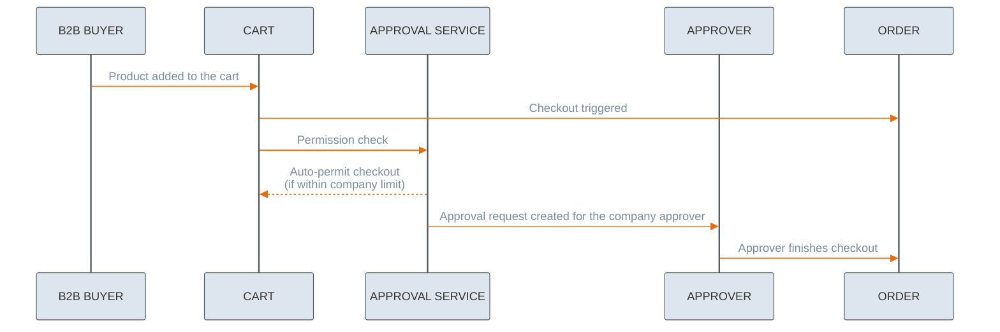
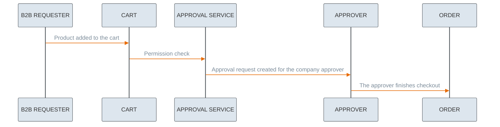
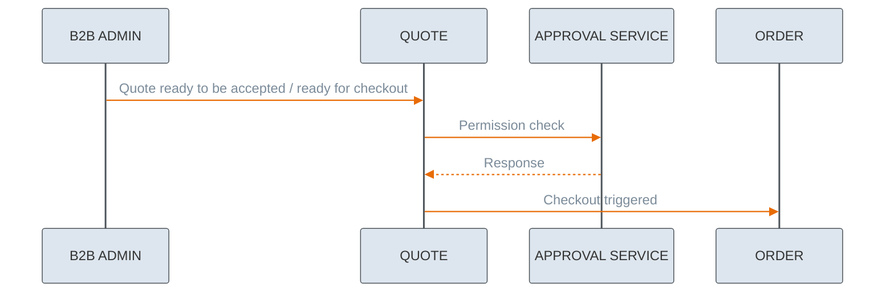
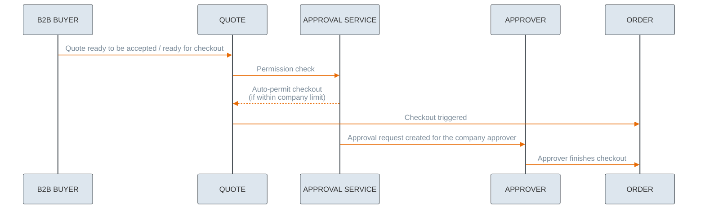
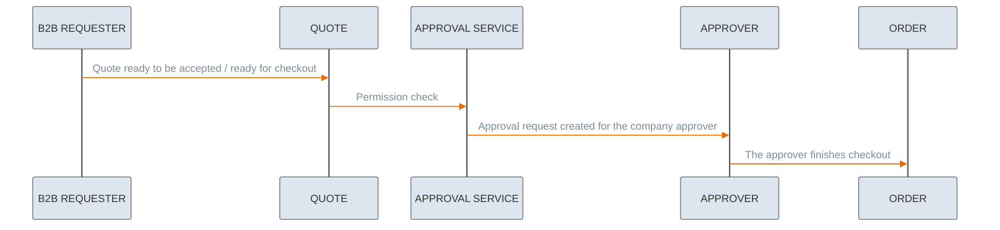

---
seo:
  title: Approval Service Tutorials
  description: Approvals Management
icon: graduation-cap
layout:
  width: wide
---

# Approval Tutorials

An approval process is essential for organizations to define the proper purchasing flow and enforce budget limits. Depending on the role of the customer, some checkouts are approved automatically, while others require additional confirmation from eligible users. The Approval Service supports approvals for orders placed from a cart and for orders placed from an accepted quote.


**Quote checkout approval** requires enabling the feature in [System Preferences](https://app.gitbook.com/s/bTY7EwZtYYQYC6GOcdTj/management-dashboard/settings/system-preferences) in the Management Dashboard. Set **Enable quote approval process** (`approval.enableQuoteApprovalProcess`) to active before customers can use the approval workflow for quote checkout.


## Approval use cases

Both flows use the same `action` value (`CHECKOUT`) and the same roles, scopes, and approval statuses. They differ by resource type, when the approval is created, and request payload.

| **Order approval (cart checkout)** | **Quote checkout approval** |
| --- | --- | --- |
| When | Customer checks out a cart on the storefront | Customer checks out an open quote to create an order |
| Prerequisite | B2B approval setup (roles and company limits) | B2B approval setup, and the `approval.enableQuoteApprovalProcess` setting enabled in the System Preferences |
| `resourceType` | `CART` | `QUOTE` |
| `resourceId` | Cart ID | Quote ID |
| `action` | `CHECKOUT` | `CHECKOUT` |
| `details` in POST | Required (shipping, addresses, currency, payment, and so on) | Omitted — the service loads quote line and price data from the quote |
| Outcome | Approver completes checkout → order from cart | Approver completes checkout → order from quote |
| Related docs | [Checkout Service](../../checkout/checkout/) | [Quote Tutorial](../../quotes/quote/quote.md), [Checkout Service](../../checkout/checkout/) |


**Approval Service status** (for example, `PENDING`, `APPROVED`, `CLOSED`) is separate from **Quote Service status** (for example, `AWAITING`, `OPEN`, `ACCEPTED`). Quote checkout approval applies after the quote is ready to be converted to an order — see the [Quote Tutorial](../../quotes/quote/quote.md) for the full quote lifecycle.


```mermaid
---
config:
  layout: fixed
  theme: base
  look: classic
  themeVariables:
    background: transparent
    lineColor: "#9CBBE3"
    arrowheadColor: "#9CBBE3"
    
---
classDiagram
    class Approval {
        id : String
        approver : Customer
        requestor : Customer
        resource : Resource
    }

    class Customer {
        id : String
        firstName : String
        lastName : String
    }

    class ResourceCart {
        id : String
        totalPrice : Price
        subTotalPrice : Price
        subtotalAggregate : SubtotalAggregate
        siteCode : String
        deliveryWindow : DeliveryWindow
        items : Item[]
    }

    class ResourceQuote {
        id : String
        totalPrice : Price
        items : Item[]
    }

    Approval --> Customer : approver
    Approval --> Customer : requestor
    Approval --> ResourceCart : resource (CART)
    Approval --> ResourceQuote : resource (QUOTE)

    class Approval
    class Customer
    class ResourceCart
    class ResourceQuote
    style Approval fill:#F2F6FA, stroke:#4C5359
    style Customer fill:#F2F6FA, stroke:#4C5359
    style ResourceCart fill:#F2F6FA, stroke:#4C5359
    style ResourceQuote fill:#F2F6FA, stroke:#4C5359
  ```

## Roles and scopes

The approval flow begins when a customer adds products to a cart or works on an open quote in the storefront.
The functionality supports four scopes, designed for *Admin*, *Buyer* and *Requester* roles.

Scopes designed for a customer:

* `approval.approval_read_own`
* `approval.approval_manage_own`

Scopes designed for a customer, admin (`B2B_ADMIN`), buyer (`B2B_BUYER`) and requester (`B2B_REQUESTER`):

* `approval.approval_read`
* `approval.approval_manage`

{% hint style="warning" %}
Users are able to read or manage only the approvals that are assigned to them. 
{% endhint %}

See the different approval flows depending on the role and resource type.

### Order approval (cart checkout)

**Admin**

```mermaid
---
config:
  layout: fixed
  theme: base
  themeVariables:
    primaryColor: '#DDE6EE'
    primaryBorderColor: '#4C5359'
    actorBkg: '#DDE6EE'
    actorBorder: '#4C5359'
    actorLineColor: '#4C5359'
    signalColor: '#E86C07'
    signalTextColor: '#7B8B99'
    background: transparent 
---
sequenceDiagram
    participant Admin as B2B ADMIN
    participant Cart as CART
    participant Approval as APPROVAL SERVICE
    participant Order as ORDER

    Admin ->> Cart: Product added to the cart
    Cart ->> Approval: Permission check
    Approval -->> Cart: Response
    Cart ->> Order: Checkout triggered
```

**Buyer**


```mermaid
---
config:
  layout: fixed
  theme: base
  themeVariables:
    primaryColor: '#DDE6EE'
    primaryBorderColor: '#4C5359'
    actorBkg: '#DDE6EE'
    actorBorder: '#4C5359'
    actorLineColor: '#4C5359'
    signalColor: '#E86C07'
    signalTextColor: '#7B8B99'
    background: transparent 
---
sequenceDiagram
    participant Buyer as B2B BUYER
    participant Cart as CART
    participant Approval as APPROVAL SERVICE
    participant Approver as APPROVER
    participant Order as ORDER

    Buyer ->> Cart: Product added to the cart
    Cart ->> Order: Checkout triggered

    Cart ->> Approval: Permission check
    Approval -->> Cart: Auto-permit checkout<br/>(if within company limit)

    Approval ->> Approver: Approval request created for the company approver
    Approver ->> Order: Approver finishes checkout
```

**Requester**


```mermaid
---
config:
  layout: fixed
  theme: base
  themeVariables:
    primaryColor: '#DDE6EE'
    primaryBorderColor: '#4C5359'
    actorBkg: '#DDE6EE'
    actorBorder: '#4C5359'
    actorLineColor: '#4C5359'
    signalColor: '#E86C07'
    signalTextColor: '#7B8B99'
    background: transparent 
---
sequenceDiagram
    participant BR as B2B REQUESTER
    participant C as CART
    participant AS as APPROVAL SERVICE
    participant A as APPROVER
    participant O as ORDER

    BR->>C: Product added to the cart
    C->>AS: Permission check
    AS->>A: Approval request created for the company approver
    A->>O: The approver finishes checkout
```

### Quote checkout approval

Quote checkout follows the same role logic as cart checkout. The resource is a **quote** instead of a cart, and checkout is initiated on the quote (for example after the customer accepts the quote).

**Admin**


```mermaid
---
config:
  layout: fixed
  theme: base
  themeVariables:
    primaryColor: '#DDE6EE'
    primaryBorderColor: '#4C5359'
    actorBkg: '#DDE6EE'
    actorBorder: '#4C5359'
    actorLineColor: '#4C5359'
    signalColor: '#E86C07'
    signalTextColor: '#7B8B99'
    background: transparent 
---
sequenceDiagram
    participant Admin as B2B ADMIN
    participant Quote as QUOTE
    participant Approval as APPROVAL SERVICE
    participant Order as ORDER

    Admin ->> Quote: Quote ready to be accepted / ready for checkout
    Quote ->> Approval: Permission check
    Approval -->> Quote: Response
    Quote ->> Order: Checkout triggered
```

**Buyer**


```mermaid
---
config:
  layout: fixed
  theme: base
  themeVariables:
    primaryColor: '#DDE6EE'
    primaryBorderColor: '#4C5359'
    actorBkg: '#DDE6EE'
    actorBorder: '#4C5359'
    actorLineColor: '#4C5359'
    signalColor: '#E86C07'
    signalTextColor: '#7B8B99'
    background: transparent 
---
sequenceDiagram
    participant Buyer as B2B BUYER
    participant Quote as QUOTE
    participant Approval as APPROVAL SERVICE
    participant Approver as APPROVER
    participant Order as ORDER

    Buyer ->> Quote: Quote ready to be accepted / ready for checkout
    Quote ->> Approval: Permission check
    Approval -->> Quote: Auto-permit checkout<br/>(if within company limit)
    Quote ->> Order: Checkout triggered

    Approval ->> Approver: Approval request created for the company approver
    Approver ->> Order: Approver finishes checkout
```

**Requester**


```mermaid
---
config:
  layout: fixed
  theme: base
  themeVariables:
    primaryColor: '#DDE6EE'
    primaryBorderColor: '#4C5359'
    actorBkg: '#DDE6EE'
    actorBorder: '#4C5359'
    actorLineColor: '#4C5359'
    signalColor: '#E86C07'
    signalTextColor: '#7B8B99'
    background: transparent 
---
sequenceDiagram
    participant BR as B2B REQUESTER
    participant Q as QUOTE
    participant AS as APPROVAL SERVICE
    participant A as APPROVER
    participant O as ORDER

    BR->>Q: Quote ready to be accepted / ready for checkout
    Q->>AS: Permission check
    AS->>A: Approval request created for the company approver
    A->>O: The approver finishes checkout
```

### Role rules

Only customers from the `B2B_REQUESTER` and `B2B_BUYER` groups can create an approval, and only a customer from the same company can be chosen as the approver. An approver must belong to the `B2B_ADMIN` or `B2B_BUYER` group.

An approval for a given resource can only be created by the resource owner — the customer who owns the cart or quote and does not have sufficient permissions to complete checkout. Approvals can be updated while their status is `PENDING`. Customers can manage only the approvals assigned to them.

Scopes are granted automatically when a customer logs in, depending on their group. If a token needs to be generated based on an API key, use the Customer Service to get the token: [Customer Service – Customer Token](https://developer.emporix.io/api-references/api-guides/companies-and-customers/customer-management/api-reference/authentication-and-authorization#get-customer-tenant-validateauthtoken).

#### Checkout-specific rules (cart and quote)

An approval can be created (requested) only by a customer who does not have permission to complete checkout on their own — they cannot place the order without approval. Additionally, `B2B_BUYER` customers create an approval only if the checkout amount exceeds the company limit, in which case approval from an Admin is required. For `B2C` users or Admins, the Approval Service API either indicates that no approval is necessary or returns an error.

#### Cart checkout-specific rules

Cart checkout approval is the default B2B approval flow and does not require an extra tenant setting beyond roles and company limits.

* Use `resourceType: CART` and the cart ID as `resourceId`.
* Include `details` in the create request — shipping, addresses, currency, payment methods, and related checkout data are required. The Approval Service stores this payload for the approver; it does not load checkout data from the cart alone.
* The requestor must own an active cart with the items to purchase. On the storefront, the flow typically starts when checkout is blocked or when the integration creates an approval after a failed checkout attempt.
* After the approver approves, complete checkout through the [Checkout Service](../../checkout/checkout/) using the cart ID and the data from the approval `details`.
* To verify permissions before checkout, call [Checking the resource approval](https://developer.emporix.io/api-references/api-guides/companies-and-customers/approval-service/approval-api-reference/approval#post-approval-tenant-approval-permitted) with `resourceType: CART`, the cart `resourceId`, and `action: CHECKOUT`.

#### Quote checkout-specific rules

Quote checkout approval is available only when **Enable quote approval process** setting (System Preferences) is active for the tenant.

* Use `resourceType: QUOTE` and the quote ID as `resourceId`. Do not send `details` in the create request — the Approval Service resolves line items and prices from the quote.
* After the approver approves, complete checkout through the [Checkout Service](../../checkout/checkout/) using the quote ID. See the [Quote Tutorial](../../quotes/quote/quote.md) for quote statuses before and after checkout.

## Managing approvals

### How to check user rights for approval flow

You can check the approval rights with the Approval Service API.

Perform the check during cart or quote checkout. If the user lacks the necessary rights, the approval flow can be triggered after checkout fails. This approach requires first distinguishing between B2B and B2C users to verify whether they belong to a B2B legal entity or group.

To check for the eligible approvers from your company, use the dedicated [Search for the users eligible to act as approvers](https://developer.emporix.io/api-references/api-guides/companies-and-customers/approval-service/approval-api-reference/search) endpoint.




[api-reference](../../companies-and-customers/approval-service/approval-api-reference/)


```bash
curl -L \
  --request POST \
  --url 'https://api.emporix.io/approval/{{tenant}}/search/users' \
  --header 'Authorization: Bearer {{OAUTH2_ACCESS_TOKEN}}' \
  --header 'Content-Type: application/json' \
  --data '{
    "resourceId": "cartId",
    "resourceType": "CART",
    "action": "CHECKOUT"
  }'
```

Depending on the use case, provide the `CART` or `QUOTE` resource details.

### How to start the approval flow

To start the flow, create an approval.

Send a request to the [Creating a single approval](https://developer.emporix.io/api-references/api-guides/companies-and-customers/approval-service/approval-api-reference/approvals#post-approval-tenant-approvals) endpoint.

Only customers with the `B2B_REQUESTER` or `B2B_BUYER` roles can initiate the flow. They are the users with the `approval.approval_manage_own` scope.
If a customer is in the `B2B_ADMIN` role, the create approval flow does not start.




[api-reference](../approval-service/approval-api-reference/)





Use `resourceType: CART` and include `details` with shipping, payment, and address information required for checkout.

```bash
curl -i -X POST \
  'https://api.emporix.io/approval/{{tenant}}/approvals' \
  -H 'Authorization: Bearer {{OAUTH2_ACCESS_TOKEN}}' \
  -H 'Content-Type: application/json' \
  -d '{
    "id": "64e241ced632aa413a27a318",
    "resourceType": "CART",
    "resourceId": "cartId",
    "action": "CHECKOUT",
    "approver": {
      "userId": "aaa2f2b6-7dc8-45ff-9f20-4e6163c14cbb"
    },
    "comment": "Comment to the approval user",
    "details": {
      "currency": "EUR",
      "paymentMethods": [
        {
          "provider": "stripe",
          "customAttributes": {
            "paymentType": "invoice"
          },
          "method": "invoice",
          "amount": 3
        }
      ],
      "shipping": {
        "zoneId": "deliveryarea",
        "methodId": "4-more_hours_timeframe",
        "amount": 10,
        "methodName": "Delivery method name",
        "shippingTaxCode": "STANDARD"
      },
      "payment": {
        "paymentId": "636cc738-f0cd-11ed-a05b-0242ac120003",
        "customAttributes": {
          "attribute1": "value of the attribute1",
          "attribute2": "value of the attribute2"
        }
      },
      "addresses": [
        {
          "contactName": "John Doe",
          "street": "Fritz-Elsas-Straße",
          "streetNumber": "20",
          "streetAppendix": "",
          "zipCode": "70173",
          "city": "Stuttgart",
          "country": "DE",
          "type": "SHIPPING",
          "contactPhone": "123456789"
        },
        {
          "contactName": "John Doe",
          "street": "Fritz-Elsas-Straße",
          "streetNumber": "20",
          "streetAppendix": "",
          "zipCode": "70173",
          "city": "Stuttgart",
          "country": "DE",
          "type": "BILLING",
          "contactPhone": "123456789"
        }
      ]
    }
  }'
```





Use `resourceType: QUOTE`, set `resourceId` to the quote ID, and omit `details`. Ensure **Enable quote approval process** is active for the tenant.

```bash
curl -i -X POST \
  'https://api.emporix.io/approval/{{tenant}}/approvals' \
  -H 'Authorization: Bearer {{OAUTH2_ACCESS_TOKEN}}' \
  -H 'Content-Type: application/json' \
  -d '{
    "resourceType": "QUOTE",
    "resourceId": "Q1000797",
    "action": "CHECKOUT",
    "approver": {
      "userId": "99952941"
    },
    "comment": "Comment for quote checkout approval"
  }'
```

After approval, trigger checkout from the quote through the Checkout Service. See [Creating a quote by a customer](../../quotes/quote/quote.md#creating-a-quote-by-a-customer) and the quote lifecycle in the [Quote Tutorial](../../quotes/quote/quote.md).




### How to update an approval

After creating the approval, items can be updated by the PATCH endpoint. Customers can change the status, details, delivery window and comment of the approval.

To update an approval, send a request to the [Updating a single approval](https://developer.emporix.io/api-references/api-guides/companies-and-customers/approval-service/approval-api-reference/approvals#patch-approval-tenant-approvals-approvalid) endpoint.


For quote approvals (`resourceType: QUOTE`), the service manages resource data from the quote. Update status and comments rather than line items unless your integration explicitly supports patch operations on quote-backed approvals.





[api-reference](../approval-service/approval-api-reference/)


```bash
curl -i -X PATCH \
  'https://api.emporix.io/approval/{{tenant}}/approvals/{{approvalId}}' \
  -H 'Authorization: Bearer {{OAUTH2_ACCESS_TOKEN}}' \
  -H 'Content-Type: application/json' \
```

### How to retrieve an approval

Approvals can be fetched by a customer. Only the approval which is assigned to the customer is returned.

To retrieve an approval, send a request to the [Retrieving a single approval](https://developer.emporix.io/api-references/api-guides/companies-and-customers/approval-service/approval-api-reference/approvals#get-approval-tenant-approvals-approvalid) endpoint.




[api-reference](../approval-service/approval-api-reference/)


```bash
curl -i -X GET \
  'https://api.emporix.io/approval/{{tenant}}/approvals/{{approvalId}}' \
  -H 'Authorization: Bearer {{OAUTH2_ACCESS_TOKEN}}' \
```

## FAQ

### How do I get approval notifications?

After sending the approval request, an email notification is sent to the approver. 
As a requester, you can also see a confirmation message indicating that the approval was requested. 
In the Emporix B2B Commerce Frontend, approval requests can be viewed and managed under the **Approvals** view.

### Is quote checkout approval optional?

Yes. It applies only when **Enable quote approval process** (`approval.enableQuoteApprovalProcess`) is active in System Preferences. Cart checkout approval follows the standard B2B role and company-limit rules without this setting.

### Are multiple approvers supported?

The Approval Service supports only one approver per request. There is no built-in mechanism to define multiple approvers. A possible workaround is to create a user account using a shared email address, such as for example approvers@yourcompany.com, which can be accessed by multiple team members.


To learn more about the approval groups, see the [Approvals](https://app.gitbook.com/s/bTY7EwZtYYQYC6GOcdTj/core-commerce/customer-management/approvals) user guides documentation.

To see an end-to-end quote approval flow from the B2B Commerce Frontend perspective, see the [Quotes](https://app.gitbook.com/s/OgeoK7nW6gEh0q1ceUZP/commerce-examples/quote-process). 

To see the end-to-end cart approval process, see the [Users Management and Approvals](https://app.gitbook.com/s/bTY7EwZtYYQYC6GOcdTj/customer-use-cases/scenarios-introduction/right-roles#approval-requests-flow)
