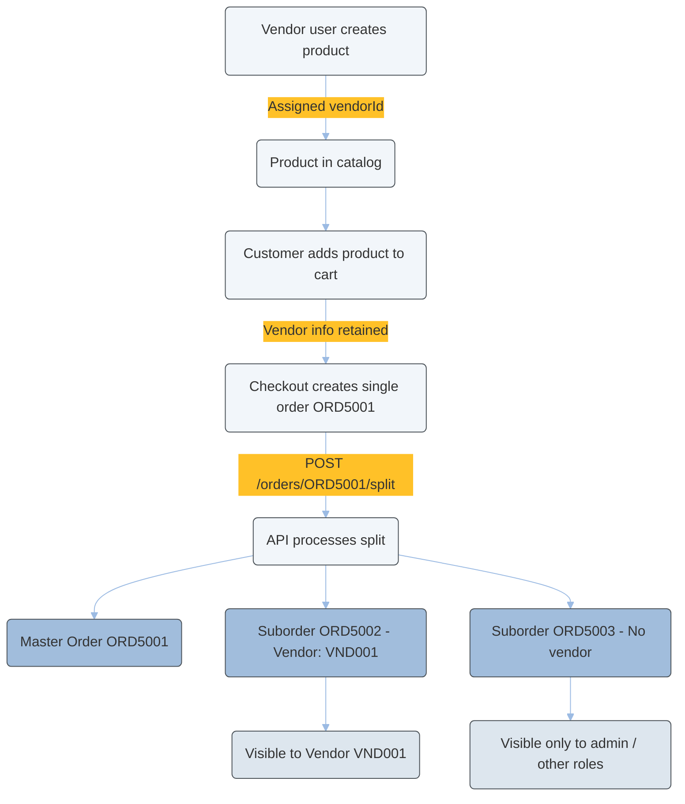

---
seo:
  title: Vendor Service Tutorial
  description: vendor
icon: graduation-cap
---

# Vendor Tutorial

Vendor Service allows you to configure how vendor's employees access products and orders. As an end-to-end feature, it integrates with the IAM, Product, and Order services to deliver a tailored solution. This service is also build to manage locations and associated data.

Related Services:

* [IAM](../../users-and-permissions/iam/)
* [Product](../../products-labels-and-brands/product-service/)
* [Order](../../orders/order/)

## How to create a vendor?

To create a vendor, send a request to the [Creating a vendor](https://developer.emporix.io/api-references/api-guides-and-references/companies-and-customers/vendor-service/api-reference/vendors#post-vendor-tenant-vendors) endpoint.




[api-reference](api-reference/)


```bash
curl -L 
  --request POST 
  --url 'https://api.emporix.io/vendor/vendor/{tenant}/vendors' 
  --header 'Authorization: Bearer YOUR_OAUTH2_TOKEN' 
  --header 'Content-Type: application/json' 
  --data '{
  "name": "ABC Company",
  "type": "COMPANY",
  "legalInfo": {
    "legalName": "ABC Company Inc.",
    "registrationDate": "2022-03-31T13:18:02.379Z",
    "countryOfRegistration": "US",
    "taxRegistrationNumber": "1234567890"
  },
  "contactDetails": [
    {
      "firstName": "Jane",
      "lastName": "Doe",
      "email": "jane.doe@example.com",
      "phone": "+1-555-0123"
    }
  ]
}
```

Your vendor is created and you get its ID in the request response, for example `6880c8e860a76003fbece674`.

When a vendor is created, it automatically creates four new user groups for your tenant - `vendor.order.manager`, `vendor.order.viewer.`, `vendor.product.manager`, `vendor.product.viewer`. In the example based on ABC Company the groups are:

* ABC Company Vendor Product Manager
* ABC Company Vendor Product Viewer
* ABC Company Vendor Order Manager
* ABC Company Vendor Order Viewer

The specific vendor group access rights are:

| Group                   | Order Access   | Product Access | Notes |
|--------------------------|----------------|----------------|-------|
| Vendor order manager | Manage orders  | ✗              | – |
| Vendor order viewer   | Read orders    | ✗              | – |
| Vendor product manager| ✗              | Manage products, including prices, availability, and media | Can also be granted permissions to publish/unpublish products. |
| Vendor product viewer | ✗              | Read products, including prices, availability, and media | Cannot be granted publishing rights. |

If you want to check what vendors are created for your tenant, send the request to [Retrieving all vendors](https://developer.emporix.io/api-references/api-guides-and-references/companies-and-customers/vendor-service/api-reference/vendors#get-vendor-tenant-vendors) endpoint.

As a response, you get information about all your tenant vendors with company and location details, for example:

```bash
  {
    "id": "6880c8e860a76003fbece674",
    "name": "ABC Company",
    "type": "COMPANY",
    "legalInfo": {
      "legalName": "ABC Company Inc.",
      "registrationDate": "2022-03-31T13:18:02.379Z",
      "countryOfRegistration": "US",
      "taxRegistrationNumber": "1234567890"
    },
    "metadata": {
      "version": 1,
      "createdAt": "2025-07-23T11:35:04.108Z",
      "modifiedAt": "2025-07-23T11:35:04.108Z"
    },
    "contactDetails": [
      {
        "firstName": "Jane",
        "lastName": "Doe",
        "email": "jane.doe@example.com",
        "phone": "+1-555-0123"
      }
    ]
  }
```

## How to set up a location for an existing vendor?

To set up a location for the vendor, send the request to the [Creating a location](https://developer.emporix.io/api-references/api-guides-and-references/companies-and-customers/vendor-service/api-reference/locations#post-vendor-tenant-locations) endpoint.

```bash
curl -L 
  --request POST 
  --url 'https://api.emporix.io/vendor/{tenant}/locations' 
  --header 'Authorization: Bearer YOUR_OAUTH2_TOKEN' 
  --header 'Content-Type: application/json' 
  --data '{
  "name": "Example HQ",
  "type": "HEADQUARTER",
  "contactDetails": {
    "emails": [
      "jane.doe@example.com",
      "adam.smith@sample.org"
    ],
    "phones": [
      "1234567890",
      "123456789"
    ],
    "addressLine1": "W Sample St",
    "addressLine2": "3601-3799",
    "city": "South Bend",
    "state": "Indiana",
    "postcode": "46619",
    "countryCode": "US",
    "tags": [
      "shipping"
    ]
  }
}'
```

As a response you get the location ID, for example `687a4055b036735470a91bb8` that you can assign to your vendor.

## How to link users group with a vendor?

Start with checking the groups that are created for your tenant. Send the request to [Retrieving all groups](https://developer.emporix.io/api-references/api-guides-and-references/users-and-permissions/iam/api-reference/groups#get-iam-tenant-groups) endpoint.




[api-reference](../../users-and-permissions/iam/api-reference/)


If you have created a vendor earlier for the tenant, you should see all the relevant vendor groups in the response. For example:

```bash
{
    "id": "c507639b-fa08-4dc4-923b-108b114d2ec7",
    "name": {
      "en": "ABC Company Vendor Product manager"
    },
    "accessControls": [
      "4ac869fc-d548-4ec8-8e06-c01491314224"
    ],
    "userType": "EMPLOYEE",
    "vendorId": "6880c8e860a76003fbece674",
    "metadata": {
      "version": 1,
      "createdAt": "2025-07-23T11:35:04.680Z",
      "modifiedAt": "2025-07-23T11:35:04.680Z"
    }
  },
  {
    "id": "65d7d8a0-ae60-4594-8651-fdb1abdabe86",
    "name": {
      "en": "ABC Company Vendor Order manager"
    },
    "accessControls": [
      "4ac869fc-d548-4ec8-8e06-c01491314223"
    ],
    "userType": "EMPLOYEE",
    "vendorId": "6880c8e860a76003fbece674",
    "metadata": {
      "version": 1,
      "createdAt": "2025-07-23T11:35:04.679Z",
      "modifiedAt": "2025-07-23T11:35:04.679Z"
    }
  },
  {
    "id": "579f1391-59c9-4c89-a3e5-faaaaae31f42",
    "name": {
      "en": "ABC Company Vendor Order viewer"
    },
    "accessControls": [
      "1ac869fc-d548-4ec8-8e06-c01491314231"
    ],
    "userType": "EMPLOYEE",
    "vendorId": "6880c8e860a76003fbece674",
    "metadata": {
      "version": 1,
      "createdAt": "2025-07-23T11:35:04.679Z",
      "modifiedAt": "2025-07-23T11:35:04.679Z"
    }
  },
  {
    "id": "46ab8103-0e4c-431e-8264-190e55de6a3f",
    "name": {
      "en": "ABC Company Vendor Product viewer"
    },
    "accessControls": [
      "1ac869fc-d548-4ec8-8e06-c01491314232"
    ],
    "userType": "EMPLOYEE",
    "vendorId": "6880c8e860a76003fbece674",
    "metadata": {
      "version": 1,
      "createdAt": "2025-07-23T11:35:04.682Z",
      "modifiedAt": "2025-07-23T11:35:04.682Z"
    }
  }
```

Each vendor group has it's own ID. To assign a user to the vendor group, send the request to [Adding a user to a group](https://developer.emporix.io/api-references/api-guides-and-references/users-and-permissions/iam/api-reference/group-assignments#post-iam-tenant-groups-groupid-users) endpoint. Provide the vendor group's ID and user's ID in the request.


A single user can belong to only one vendor group.





[api-reference](../../users-and-permissions/iam/api-reference/)


```bash
curl -L 
  --request POST 
  --url 'https://api.emporix.io/iam/{tenant}/groups/{groupId}/users' 
  --header 'Authorization: Bearer YOUR_OAUTH2_TOKEN' 
  --header 'Content-Type: application/json' 
  --data '{
    "userId": "3bf883fc-d18a-4175-8137-aaf64f810835",
    "userType": "EMPLOYEE"
  }'
```

You can then check the user's assignment to a vendor group by sending a request to the [Retrieving a list of vendor users](https://developer.emporix.io/api-references/api-guides-and-references/users-and-permissions/iam/api-reference/management-dashboard-users#get-iam-tenant-users-vendors-vendorid) endpoint.

## How does product relate to a vendor?

When a logged-in user who belongs to a vendor creates a product, that product is automatically assigned to the vendor. This means every such product has a `vendorId` field populated.

When a customer adds a product to the cart that belongs to a vendor, the system automatically adds that vendor information to the cart entry. This ensures that when the checkout happens, every product “knows” which vendor it belongs to.

## How does vendor work with order splitting?

When the customer completes the checkout, a single order is created containing all the selected products. Each order entry retains the vendor information and is a standard order but with vendor details.

If you need to separate this combined order into vendor-specific suborders, send the request to the [Splitting Order](https://developer.emporix.io/api-references/api-guides-and-references/orders/order/api-reference/orders-tenant-managed#post-order-v2-tenant-salesorders-orderid-split) endpoint.

You can also use a Digital Process for the splitting mechanism, see the Order Splitting Digital Process template for reference:&#x20;




* Only orders in the CREATED status can be split.
* Orders that are already suborders or have been split before cannot be split again.
* Orders with discounts cannot be split.


When you send this request, the API analyses all the order entries and groups them by vendor:

* The original order becomes a master order with orderType: `MASTER_ORDER`.
* Suborders are created:
  * One for each unique vendor.
  * One extra for items without a vendor.
  * `splitInfo` field is added with:
    * `splitBy` field, currently the `VENDOR_ID` is supported.
    * `uniqueValue` field reflects the VendorID, or is null when no vendor is assigned

### Order split example

Check how the order splitting flow works on the example:

1. A vendor creates a product → it’s automatically assigned to their vendor ID.
2. A customer adds products to the cart → vendor info stays with each product.
3. Checkout creates a single combined order.
4. Calling /split transforms it into:
   * One master order (ORD5001)
   * Multiple suborders (ORD5002, ORD5003) — one per vendor and one for non-vendor items.

Vendors can only view and manage their own suborders.

Master order example after split:

```bash
{
  "id": "ORD5001",
  "cartId": "CART123",
  "createdBy": "USR789",
  "status": "CREATED",
  "orderType": "MASTER_ORDER",
  "splitInfo": {
    splitBy:VENDOR_ID
    }
  "subOrders": ["ORD5002", "ORD5003"]
}
```

Vendor-specific suborder example:

```bash
{
  "id": "ORD5002",
  "createdBy": "USR789",
  "status": "CREATED",
  "masterOrder": "ORD5001",
  "orderType": "SUB_ORDER",
  "splitInfo": {
    "splitBy": "VENDOR_ID",
    "uniqueValue": "VND001"
  },
  "vendor": {
    "id": "VND001",
    "name": "RawMaterial INC B"
  },
  "entries": [
    {
      "productId": "PRD1001",
      "quantity": 2
    }
  ]
}
```

Suborder for products without vendor example:

```bash
{
  "id": "ORD5003",
  "createdBy": "USR789",
  "status": "CREATED",
  "masterOrder": "ORD5001",
  "orderType": "SUB_ORDER",
  "splitInfo": {
    "splitBy": "VENDOR_ID",
    "uniqueValue": null
  },
  "entries": [
    {
      "productId": "PRD2001",
      "quantity": 1
    }
  ]
}
```


