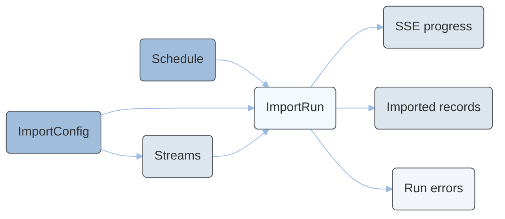

---
seo:
  title: Import Tool Tutorials
  description: Learn how to trigger, schedule, monitor, and inspect import runs with the Import Tool.
icon: graduation-cap
layout:
  width: wide
  title:
    visible: true
  description:
    visible: true
  tableOfContents:
    visible: true
  outline:
    visible: true
  pagination:
    visible: true
  metadata:
    visible: true
---

# Import Tool Tutorial

The Import Tool imports external master data into Emporix. A configuration groups one or more streams, where each stream extracts from a source connection, maps fields to an Emporix target type, and upserts idempotently. Imports run asynchronously and stream per-stream progress over Server-Sent Events (SSE).


This functionality is in preview mode - some of the features may not be fully operational yet.



To learn more about the Import Tool, see the [Import Tool](./).



This tutorial covers triggering, scheduling, monitoring, cancelling, and inspecting import runs. An import configuration must already exist for your tenant.

Creating and changing configurations, connections, streams, and mappings requires the `importtool.import_manage` scope.


The following diagram shows how the main Import Tool resources relate to each other:



A typical operational workflow follows these steps:

1. **List configurations** and choose the `configId` you want to run.
2. **Inspect streams** to confirm source entities and target types.
3. **Trigger a `DELTA` run** (or a `dryRun` first if you want to validate without writing).
4. **Monitor progress** by polling the run endpoint or subscribing to SSE events.
5. If the run ends as `PARTIAL` or `FAILED`, **retrieve errors** and fix the source data or mappings.
6. **Search imported records** to confirm the expected outcomes.

The sections below walk through each step in detail. All operations use the `importtool.import_trigger` scope documented in the [API Reference](api-reference/).

## Prerequisites

Make sure you have the following:

* A **service OAuth2 token** with the `importtool.import_trigger` scope. For more information, see [Authentication and Authorization](../quickstart/authentication-and-authorization/README.md).
* An **enabled import configuration** with active streams already exists for your tenant.

## How to inspect import configurations

Before triggering a run, verify that the configuration you want to use exists and is enabled.

To list all import configurations for your tenant, send a request to the [Retrieving all import configurations](api-reference/#get-importtool-tenant-configs) endpoint.

```bash
curl -i -X GET \
  'https://api.emporix.io/importtool/{tenant}/configs' \
  -H 'Authorization: Bearer {{OAUTH2_ACCESS_TOKEN}}'
```

To retrieve a single configuration by its identifier, send a request to the [Retrieving an import configuration](api-reference/#get-importtool-tenant-configs-id) endpoint.

```bash
curl -i -X GET \
  'https://api.emporix.io/importtool/{tenant}/configs/{id}' \
  -H 'Authorization: Bearer {{OAUTH2_ACCESS_TOKEN}}'
```

The response includes fields such as `name`, `enabled`, `deltaEnabled`, and `sourceConnId`. Note the configuration `id` — you need it for scheduling and triggering runs.




[api-reference](api-reference/)


## How to inspect configuration streams

Each configuration contains one or more streams. A stream defines which source entity is extracted, how fields are mapped, and which Emporix target type receives the upserted records.

To list the streams for a configuration, ordered by sequence, send a request to the [Retrieving all streams of a configuration](api-reference/#get-importtool-tenant-configs-configid-streams) endpoint.

```bash
curl -i -X GET \
  'https://api.emporix.io/importtool/{tenant}/configs/{configId}/streams' \
  -H 'Authorization: Bearer {{OAUTH2_ACCESS_TOKEN}}'
```

To retrieve a single stream, including its resolved target types, send a request to the [Retrieving a stream](api-reference/#get-importtool-tenant-streams-id) endpoint.

```bash
curl -i -X GET \
  'https://api.emporix.io/importtool/{tenant}/streams/{id}' \
  -H 'Authorization: Bearer {{OAUTH2_ACCESS_TOKEN}}'
```

Each stream response includes `sourceEntity`, `targetWriter`, `targetType`, and `mode`. The `mode` field indicates how the stream contributes to the target:

* `STANDALONE` — the stream upserts records independently.
* `COMPOSITE_CHILD` — the stream contributes child records to a composite parent.
* `COMPOSITE_MERGE` — the stream merges data into a composite parent.




[api-reference](api-reference/)


## How to schedule recurring imports

You can run a configuration automatically on a cron schedule.

To check whether a schedule already exists, send a request to the [Retrieving a schedule](api-reference/#get-importtool-tenant-configs-configid-schedule) endpoint. If no schedule is configured, the endpoint returns `204 No Content`.

```bash
curl -i -X GET \
  'https://api.emporix.io/importtool/{tenant}/configs/{configId}/schedule' \
  -H 'Authorization: Bearer {{OAUTH2_ACCESS_TOKEN}}'
```

To create or update a schedule, send a request to the [Scheduling an import run](api-reference/#put-importtool-tenant-configs-configid-schedule) endpoint with a Spring cron expression (six fields), time zone, and `enabled` flag.

```bash
curl -i -X PUT \
  'https://api.emporix.io/importtool/{tenant}/configs/{configId}/schedule' \
  -H 'Authorization: Bearer {{OAUTH2_ACCESS_TOKEN}}' \
  -H 'Content-Type: application/json' \
  -d '{
    "cron": "0 0 2 * * *",
    "timezone": "Europe/Berlin",
    "enabled": true
  }'
```

In this example, the configuration runs every day at 02:00 in the `Europe/Berlin` time zone. The saved schedule response includes `nextFireAt` when a next run time can be calculated.




[api-reference](api-reference/)


## How to trigger an import run

To start an import manually, send a request to the [Triggering an import run](api-reference/#post-importtool-tenant-configs-configid-runs) endpoint. The endpoint returns immediately with the run in a `RUNNING` state; progress is available through polling or SSE.

```bash
curl -i -X POST \
  'https://api.emporix.io/importtool/{tenant}/configs/{configId}/runs' \
  -H 'Authorization: Bearer {{OAUTH2_ACCESS_TOKEN}}' \
  -H 'Content-Type: application/json' \
  -d '{
    "mode": "FULL"
  }'
```

Request body fields:

| Field | Required | Description |
| --- | --- | --- |
| `mode` | No | `FULL` or `DELTA`. Defaults to `DELTA`. |
| `dryRun` | No | When `true`, maps and validates records without performing remote writes. |

To validate a configuration without writing data, trigger a dry run:

```bash
curl -i -X POST \
  'https://api.emporix.io/importtool/{tenant}/configs/{configId}/runs' \
  -H 'Authorization: Bearer {{OAUTH2_ACCESS_TOKEN}}' \
  -H 'Content-Type: application/json' \
  -d '{
    "mode": "DELTA",
    "dryRun": true
  }'
```


If a run is already active for the configuration, the endpoint returns `409 Conflict` with the message `An import run is already active for this configuration.`


On success, the response includes the run `id`, `status`, `mode`, and counters such as `recordsRead`, `created`, `updated`, `skipped`, `failed`, and `deleted`. Save the run `id` for monitoring and troubleshooting.

To list previous runs for a configuration, send a request to the [Retrieving run history](api-reference/#get-importtool-tenant-configs-configid-runs) endpoint.

```bash
curl -i -X GET \
  'https://api.emporix.io/importtool/{tenant}/configs/{configId}/runs?page=0&size=20' \
  -H 'Authorization: Bearer {{OAUTH2_ACCESS_TOKEN}}'
```




[api-reference](api-reference/)


## How to monitor an import run

You can monitor a run by polling its status or by subscribing to the SSE progress stream.

### Poll run status

To retrieve a run together with per-stream progress, send a request to the [Retrieving a run](api-reference/#get-importtool-tenant-runs-runid) endpoint.

```bash
curl -i -X GET \
  'https://api.emporix.io/importtool/{tenant}/runs/{runId}' \
  -H 'Authorization: Bearer {{OAUTH2_ACCESS_TOKEN}}'
```

The response contains a `run` object and a `streams` array. Each stream entry includes its own `status` and counters. Terminal run statuses are `SUCCEEDED`, `PARTIAL`, `FAILED`, and `CANCELLED`.

### Stream run progress over SSE

To receive live progress updates, open the [Streaming run progress](api-reference/#get-importtool-tenant-runs-runid-events) endpoint. The stream sends:

1. An initial `snapshot` event with the run and stream state.
2. A `stream` event for each processed batch.
3. A final `run` event when the run finishes.

```bash
curl -i -N -X GET \
  'https://api.emporix.io/importtool/{tenant}/runs/{runId}/events' \
  -H 'Authorization: Bearer {{OAUTH2_ACCESS_TOKEN}}' \
  -H 'Accept: text/event-stream'
```


`curl` is useful for debugging the event stream. In production, use an SSE-capable HTTP client or `EventSource`.





[api-reference](api-reference/)


## How to cancel an import run

To request cancellation of an active run, send a request to the [Cancelling a run](api-reference/#post-importtool-tenant-runs-runid-cancel) endpoint.

```bash
curl -i -X POST \
  'https://api.emporix.io/importtool/{tenant}/runs/{runId}/cancel' \
  -H 'Authorization: Bearer {{OAUTH2_ACCESS_TOKEN}}'
```

By default, cancellation is **cooperative** — the run stops after the current batch completes. To stop the run immediately and unblock the configuration, pass `force=true`:

```bash
curl -i -X POST \
  'https://api.emporix.io/importtool/{tenant}/runs/{runId}/cancel?force=true' \
  -H 'Authorization: Bearer {{OAUTH2_ACCESS_TOKEN}}'
```

On success, the endpoint returns `202 Accepted` with `accepted: true`. If the run is already finished or unknown, `accepted` is `false`.




[api-reference](api-reference/)


## How to inspect imported data

After a successful or partial run, verify what was imported.

### List imported data types

To see which target types currently hold imported records, send a request to the [Retrieving imported data types](api-reference/#get-importtool-tenant-data-types) endpoint.

```bash
curl -i -X GET \
  'https://api.emporix.io/importtool/{tenant}/data/types' \
  -H 'Authorization: Bearer {{OAUTH2_ACCESS_TOKEN}}'
```

### Search imported records by type

To search records of a given target type, send a request to the [Searching imported records](api-reference/#get-importtool-tenant-data-records) endpoint. The `type` query parameter is required. The optional `search` parameter filters by natural key.


The `search` parameter performs a case-insensitive substring match on the record's natural key only. It is not the Emporix query language, so field selectors and operators (for example `field:value`, comparisons, or boolean logic) are not supported.


```bash
curl -i -X GET \
  'https://api.emporix.io/importtool/{tenant}/data/records?type=product&search=SKU-1001&page=0&size=20' \
  -H 'Authorization: Bearer {{OAUTH2_ACCESS_TOKEN}}'
```

Each record includes `naturalKey`, `targetType`, `fields`, `outcome` (for example `CREATED` or `UPDATED`), and `importedAt`.

### Search records for a specific stream

To search only the records produced by one stream, send a request to the [Searching a stream's imported records](api-reference/#get-importtool-tenant-data-streams-streamid-records) endpoint. The optional `search` parameter uses the same natural-key substring filter as the type-based search endpoint.

```bash
curl -i -X GET \
  'https://api.emporix.io/importtool/{tenant}/data/streams/{streamId}/records?search=&page=0&size=20' \
  -H 'Authorization: Bearer {{OAUTH2_ACCESS_TOKEN}}'
```




[api-reference](api-reference/)


## Troubleshooting

When a run finishes with status `PARTIAL` or `FAILED`, inspect the recorded errors.

To retrieve paginated errors for a run, send a request to the [Retrieving run errors](api-reference/#get-importtool-tenant-runs-runid-errors) endpoint.

```bash
curl -i -X GET \
  'https://api.emporix.io/importtool/{tenant}/runs/{runId}/errors?page=0&size=50' \
  -H 'Authorization: Bearer {{OAUTH2_ACCESS_TOKEN}}'
```

Each error record includes:

* `naturalKey` — the source natural key of the offending record.
* `streamId` — the stream where the error occurred.
* `stage` — the pipeline stage, for example extraction or mapping.
* `errorCode` — a machine-readable error code.
* `message` — a human-readable description.

Use these fields to identify which source records failed and at which stage of the import pipeline.




[api-reference](api-reference/)
