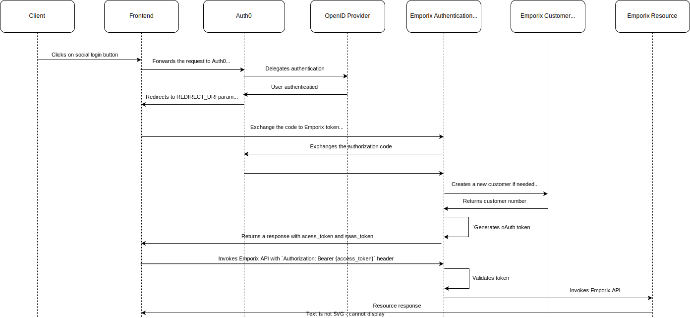

---
seo:
  title: Auth0
  description: Auth0 integration
  parent: identity-providers
icon: id-badge
---

# Auth0

Auth0 is a popular and widely used platform that provides tools to add authentication and authorization features to other applications. Auth0 is designed to simplify the complex processes of identity management and security, allowing developers to focus on building the applications rather than dealing with the complexity of user authentication.

* To see how to go through the Auth0 configuration with Emporix and our demo storefront, check the [Auth0](https://app.gitbook.com/s/bTY7EwZtYYQYC6GOcdTj/system-management/authentication-and-authorization/auth0) system management user guide.

## Auth0 configuration flow with social login diagram

<figure><figcaption></figcaption></figure>
