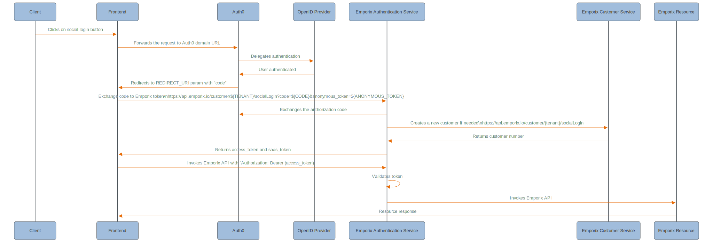

---
seo:
  title: Auth0
  description: Auth0 integration
  parent: identity-providers
icon: id-badge
---

# Auth0

Auth0 is a popular and widely used platform that provides tools to add authentication and authorization features to other applications. Auth0 is designed to simplify the complex processes of identity management and security, allowing developers to focus on building the applications rather than dealing with the complexity of user authentication.

* To see how to go through the Auth0 configuration with Emporix and our demo storefront, check the [Auth0](https://app.gitbook.com/s/bTY7EwZtYYQYC6GOcdTj/system-management/authentication-and-authorization/auth0) system management user guide.

## Auth0 configuration flow with social login diagram

<figure><figcaption></figcaption></figure>

<!--
```mermaid
---
config:
  layout: fixed
  theme: base
  themeVariables:
    primaryColor: '#DDE6EE'
    primaryBorderColor: '#4C5359'
    actorBkg: '#A1BDDC'
    actorBorder: '#4C5359'
    actorLineColor: '#4C5359'
    signalColor: '#E86C07'
    signalTextColor: '#7B8B99'
    background: transparent 
---
sequenceDiagram
    participant Client
    participant Frontend
    participant Auth0
    participant OpenIDProvider as OpenID Provider
    participant EmpAuth as Emporix Authentication Service
    participant EmpCustomer as Emporix Customer Service
    participant EmpResource as Emporix Resource

    Client ->> Frontend: Clicks on social login button
    Frontend ->> Auth0: Forwards the request to Auth0 domain URL
    Auth0 ->> OpenIDProvider: Delegates authentication
    OpenIDProvider ->> Auth0: User authenticated
    Auth0 ->> Frontend: Redirects to REDIRECT_URI param with "code"
    Frontend ->> EmpAuth: Exchange code to Emporix token\nhttps://api.emporix.io/customer/${TENANT}/socialLogin?code=${CODE}&anonymous_token=${ANONYMOUS_TOKEN}
    EmpAuth ->> Auth0: Exchanges the authorization code
    EmpAuth ->> EmpCustomer: Creates a new customer if needed\nhttps://api.emporix.io/customer/{tenant}/socialLogin
    EmpCustomer ->> EmpAuth: Returns customer number
    EmpAuth ->> Frontend: Returns access_token and saas_token
    Frontend ->> EmpAuth: Invokes Emporix API with `Authorization: Bearer (access_token)`
    EmpAuth ->> EmpAuth: Validates token
    EmpAuth ->> EmpResource: Invokes Emporix API
    EmpResource ->> Frontend: Resource response
  ```
  -->