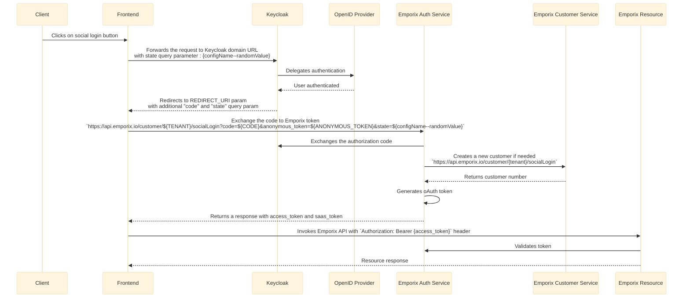

---
seo:
  title: Keycloak
  description: Keycloak integration
  parent: identity-providers
icon: id-badge
---

# Keycloak

[Keycloak](https://www.keycloak.org) is an open-source Identity and Access Management (IAM) solution that supports standard protocols like OpenID Connect, OAuth 2.0, and SAML 2.0. Integrating Keycloak with Emporix allows for secure management of user authentication and access across applications. At the same time it reduces development effort and aligns with enterprise compliance needs.

## Prerequisite

If you want to integrate your Keycloak account with Emporix, contact our [Emporix Support Team](mailto:support@emporix.com) and provide us with the following data:

```bash
{
    "domain" : "",
    "token_endpoint": "",
    "provider": "keycloak",
    "client_id" : "",
    "redirect_uri" : "",
    "client_secret" : "",
    "public_key" : ""
    }
```

* The  `domain` is the Keycloak domain value, for example: `keycloak.eu.yourdomain.com`.

* The `token_endpoint` is the endpoint that is used for the token call, for Keycloak it’s usually `protocol/openid-connect/token`.

* The `provider` is the provider that is configured for the IDP, the provider value can be then used in the state parameter, thanks to that it’s possible to have multiple configurations for one tenant. For example: `keycloak_siteA`, `keycloak_siteB`.
* The `client_id` and `client_secret` are the credentials provided by the customer, to find the credentials in the Keycloak app go to **Clients** -> **Clients list**. 

    <figure><figcaption></figcaption></figure>

* The `redirect_uri` is a value provided by customer that indicates where a user should be redirected after authentication flow. The value points storefront url. For example: `https://storefront.emporix.io/keycloak`.
* The `public_key` is a value provided by customer as their signing certificate.  It has to be stored in one line, however each line of the original certificate value should be separated by `\n`. 
  * Copy the value to the json in the `public_key` field and surround it with `-----BEGIN CERTIFICATE-----\n{TOKEN}\n-----END CERTIFICATE-----`

    <figure><figcaption></figcaption></figure>

Request example:

```bash
{
    "domain" : "keycloak.eu.yourdomain.com",
    "token_endpoint": "protocol/openid-connect/token",
    "provider": "keycloak",
    "client_id" : "showcase",
    "redirect_uri" : "https://storefront.emporix.io/keycloak",
    "client_secret" : "8Ku1to4R3mJAJ3tJ3u045EgKt4YfqRoN",
    "public_key" : "-----BEGIN CERTIFICATE-----\nMIICnzCCAYcCBgGYHysPdTANBgkqhkiG9w0BAQsFADATMRwDwYDVQQDDAhWYWlsbGFudDAeFw0yNTA3MTgyMDExMTJaFw0zNTA3MTgyMDEyNTJaMBMxETAPBgNVBAMMCFZhaWxsYW50MIIBIjANBgkqhkiG9w0BAQEFAAOCAQ8AMIIBCgKCAQEAjvCfvrd4TDFRJ8ZqvwhoQMicDBSZq2DRaKilTdRK8zYKWK0feBrP1cl9pR58peQugBQpodxTE7F11sMDGoMicHvonXGIaETpQvYnZWwauBrNbp4HfCiHnQkqTQa8Q2fIUjJ0vmVxquGmPzyq0rmysuTeM4ltxdaZ6/6WDmMHnUcXYn/vgQ+7T7fZZKmtdwDytergnF1Ycoe16ZTraPTTkIfhpJTnbP3LxxB94dZV55maVkJC0vBpr3IyG7Oii6xOpg8HwIQ85K/27kSZXgM2mNHaMQ+wCK4wrcQsbf7aOeR3waDkxA4ZKwD9MesCwfKcdfY4fw27aiVwIDAQABM0GCSqGSIb3DQEBCwUAA4IBARTtCkCIIsp3CNmI1+m3JhgBLcNITwa/4jOJQghMx32j8Fxfq4IDAsG36w1YF7AOUqdokz3bqH6mU//wJVyzYcejGrzQLWAweWHWX2uTi0+7xv64diUrwFVSenkagShLRQsDx3r0RSePP3SFhIlkwB8wTE4k5Xryay2ehmLk/CBH3cBYng0x+HQNxwFzrRBXVyXbW61Qp8zyozKEyJG1rtbrMfX7h86ESv0d7mUF7PXkiT2/KANNVC1PQB88L9zOkSADdDd/vqs6lV5x+40Y2puNjJXBqkqOI4Cnsyyjh/EkODXEmaXIHjYWdETh4WdWJV4A0Mgyd+3HKvv8VfN0F0\n-----END CERTIFICATE-----"
}
```
## Keycloak configuration flow with social login diagram

