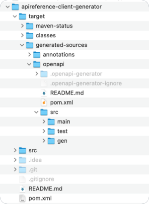

# OpenAPI Generator

To facilitate customizations of Emporix Commerce Engine, so that it is tailored to your needs, you can use the OpenAPI generator
The tool allows you to generate code out of the API reference specifications.
You can create a Software Development Kit (SDK) based on the OpenAPI-generated code using Emporix services,
which you can then integrate into your codebase to seamlessly build your platform with the Commerce Engine.

### Prerequisites

Make sure you have the following tools installed:

* maven - version 3.5.4_1 or higher
* Java - version 17.0 or higher

### Installing

Download the Maven project OpenAPI Generator and unpack it in a relevant destination.



### Using OpenAPI Generator

1. Download Emporix OpenAPI reference documentation for all Commerce Engine services from the [Emporix API](../README.md).
2. For the service of your interest, copy its API reference yml file to the `src/main/resources/apis` directory.


The file has to be named as `api.yml`.\
If you want to choose a different name for the file, adjust the `pom.xml` by pointing to the right file name in the `<inputSpec></inputSpec>` property.


3. In the command-line tool, open `apireference-client-generator` and run

```
mvn clean compile
```

**Result:** This command generates the code out of API reference documentation in the `target` directory. You can see the generated classes under `/target/generated-sources/openapi/src/`.

##


