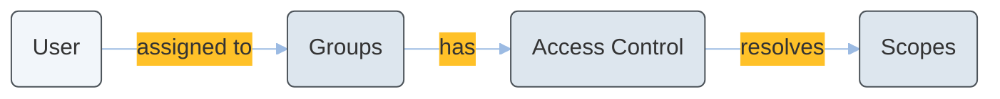
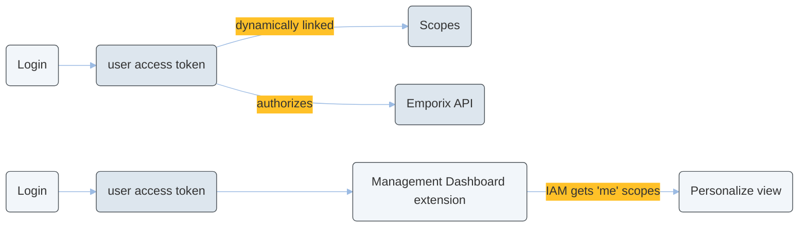

---
seo:
  title: Custom scopes for custom entities
  description: End-to-end IAM and Schema authorization for tenant-defined custom entities.
icon: key
layout:
  width: wide
---

# Custom scopes for custom entities

This tutorial explains how to configure end-to-end authorization for custom entities by combining IAM custom scopes and Schema custom-instance APIs.

When tenants define custom entities, authorization should remain consistent with platform entities. The platform therefore supports tenant-defined custom scopes in IAM, automatic type-specific scopes in Schema, and ownership-aware scopes (`*_own`) for creator-limited access.

The overall flow is:



Scopes follow the naming convention `[service].[resource]_[action]`. Access to endpoints is scope-driven, which means each Emporix API endpoint declares the scopes it requires. User scopes in the access token are resolved from IAM group assignments and access controls, and when a required scope is missing the API returns `403 Forbidden`.

The tenant-wide Schema scopes are:

- `schema.custominstance_read`
- `schema.custominstance_manage`

These scopes apply to custom instances across all custom entity types.
When a custom entity type is created (for example `DOCUMENT`), scopes are provisioned for that type:

- `custom.document_read`
- `custom.document_manage`
- `custom.document_read_own`
- `custom.document_manage_own`

These scopes target a single custom entity type and to support ownership-based access checks, custom instances include immutable owner data:

```json
{
  "owner": {
    "type": "CUSTOMER",
    "userId": "79474954",
    "legalEntityId": "0149b1314144a01491314z128"
  }
}
```

The `owner` is assigned when an instance is created and must not be updated later.

The scopes are a part of access controls that are assigned to a user group. 
The runtime authorization works in a following flow:



## Define custom scope for custom entity

Custom-instance endpoints accept one of the following scope sets:

- Read endpoints: `schema.custominstance_read` or `custom.{lowerCaseType}_read` or `custom.{lowerCaseType}_read_own`
- Manage endpoints: `schema.custominstance_manage` or `custom.{lowerCaseType}_manage` or `custom.{lowerCaseType}_manage_own`

- Use `schema.custominstance_*` when the client must handle many custom entity types.
- Use `custom.{lowerCaseType}_*` when you need least-privilege, type-specific access.
- Use `*_own` scopes when users should only access instances they created.



### Create or upsert a custom entity type in Schema

To create a custom entity type, call the [Creating a custom schema type](https://developer.emporix.io/api-references/api-guides/utilities/schema/api-reference/custom-schema-type#post-schema-tenant-custom-entities) endpoint. This step provisions type-scoped `custom.{lowerCaseType}_*` scopes.

```bash
curl -i -X POST \
  'https://api.emporix.io/schema/{tenant}/custom-entities' \
  -H 'Authorization: Bearer <YOUR_TOKEN_HERE>' \
  -H 'Content-Type: application/json' \
  -d '{
    "id": "DOCUMENT",
    "name": {
      "en": "Document"
    }
  }'
```




### Optional: Define IAM custom scopes 
The step is optional, but recommended to do.

To create or update a custom scope, call the [Upserting a custom scope](https://developer.emporix.io/api-references/api-guides/users-and-permissions/iam/api-reference/custom-scopes#put-iam-tenant-custom-scopes-scopeid) endpoint.

```bash
curl -i -X PUT \
  'https://api.emporix.io/iam/{tenant}/custom-scopes/myproject.bulk_export_manage' \
  -H 'Authorization: Bearer <YOUR_TOKEN_HERE>' \
  -H 'Content-Type: application/json' \
  -d '{
    "description": {
      "en": "Allows triggering bulk export jobs."
    }
  }'
```



### Map scopes into access controls

To map scopes into IAM, call the [Upserting an access control](https://developer.emporix.io/api-references/api-guides/users-and-permissions/iam/api-reference/access-controls#put-iam-tenant-access-controls-accesscontrolid) endpoint.

```bash
curl -i -X PUT \
  'https://api.emporix.io/iam/{tenant}/access-controls/custom-document-manage' \
  -H 'Authorization: Bearer <YOUR_TOKEN_HERE>' \
  -H 'Content-Type: application/json' \
  -d '{
    "resourceId": "custom.document",
    "roleId": "manage",
    "scopes": [
      "custom.document_manage",
      "custom.document_manage_own"
    ]
  }'
```



### Assign access controls to groups and users

To assign access controls, call the [Creating a new group](https://developer.emporix.io/api-references/api-guides/users-and-permissions/iam/api-reference/groups#post-iam-tenant-groups) endpoint and include your access controls in the group payload.

```bash
curl -i -X POST \
  'https://api.emporix.io/iam/{tenant}/groups' \
  -H 'Authorization: Bearer <YOUR_TOKEN_HERE>' \
  -H 'Content-Type: application/json' \
  -d '{
    "name": {
      "en": "Custom Document Managers"
    },
    "userType": "EMPLOYEE",
    "accessControls": [
      "custom-document-manage"
    ]
  }'
```

Then call the [Adding a user to a group](https://developer.emporix.io/api-references/api-guides/users-and-permissions/iam/api-reference/groups#post-iam-tenant-groups-groupid-users) endpoint.

```bash
curl -i -X POST \
  'https://api.emporix.io/iam/{tenant}/groups/{groupId}/users' \
  -H 'Authorization: Bearer <YOUR_TOKEN_HERE>' \
  -H 'Content-Type: application/json' \
  -d '{
    "userId": "00u4ukqvzlEP31sCk417",
    "userType": "EMPLOYEE"
  }'
```




### Request OAuth2 tokens and call Schema custom-instance APIs

Request an OAuth2 token with the configured IAM scopes, then call Schema custom-instance endpoints.

```bash
curl -i -X POST \
  'https://api.emporix.io/oauth/token' \
  -H 'Content-Type: application/x-www-form-urlencoded' \
  --data-urlencode 'grant_type=client_credentials' \
  --data-urlencode 'client_id=<CLIENT_ID>' \
  --data-urlencode 'client_secret=<CLIENT_SECRET>' \
  --data-urlencode 'scope=custom.document_manage'
```

Then call the [Creating a custom instance](https://developer.emporix.io/api-references/api-guides/utilities/schema/api-reference/custom-instance#post-schema-tenant-custom-entities-type-instances) endpoint.

```bash
curl -i -X POST \
  'https://api.emporix.io/schema/{tenant}/custom-entities/DOCUMENT/instances' \
  -H 'Authorization: Bearer <YOUR_TOKEN_HERE>' \
  -H 'Content-Type: application/json' \
  -d '{
    "id": "doc-1001",
    "name": {
      "en": "Warranty document"
    }
  }'
```




[api-reference](../../utilities/schema/api-reference/)





For more details, see the [IAM Tutorial](../../users-and-permissions/iam/iam.md) and [Schema Tutorial](../../utilities/schema/schema.md).

