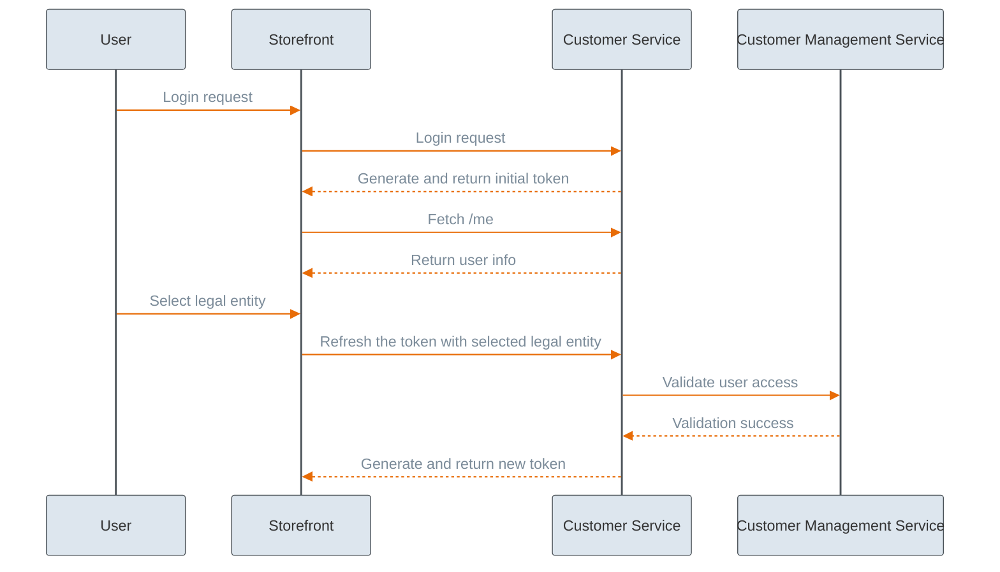
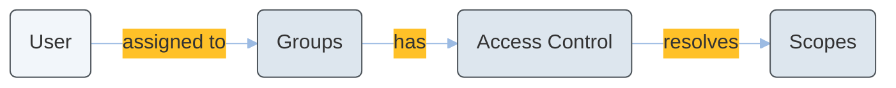
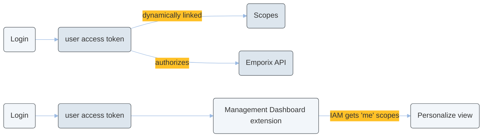

---
layout:
  width: wide
  page-outline: true
icon: user-lock
description: Tokens and scopes grant access to employee users, your storefront customers assigning them relevant permissions level to specific resources. Dedicated tokens are also required for external system-to-system integrations.
---

# Tokens and Scopes

Authentication and authorization of users is handled by tokens and associated scopes.
The Emporix API uses the [OAuth 2.0](https://oauth.net/2/) token-based authentication and authorization approach. API keys are used to generate access tokens, which are then used to authorize HTTP methods.

## API credentials

To be able to effectively use the Emporix API, you need the relevant API keys. The [Emporix Developer Portal](https://app.emporix.io) provides you with two types of credentials out-of-the-box:

* **Emporix API** — Credentials required to obtain a service access token, which is used to access Emporix resources through the Emporix API. The credentials grant access to all the resources without any restrictions. 
* **Storefront API** — The `Client_ID` credential is required to obtain an anonymous token for a customer browsing the storefront. The anonymous token stores the information about the unauthenticated customer's session, such as browsing products or adding items to cart. When a customer decides to log in, the anonymous token is required to generate a customer token that already contains the session information. The Storefront API credentials are also required to set up SSO authentication with token exchange.

In addition, you can define custom API keys credentials that bear scopes to particular resources only. This allows you to restrict system permissions and safely use these credentials in a specific use case or in a dedicated integration. For example, you can create credentials with the scopes to manage prices externally for the products in your database and use them in your CRM system integration. Custom API credentials have a dedicated `Client_ID` and `Secret`, that you can use to obtain the service access token with the specified scopes.

To learn more how to manage API Keys or create custom scopes in the Developer Portal, refer to the [Manage API Keys](https://app.gitbook.com/s/bTY7EwZtYYQYC6GOcdTj/getting-started/developer-portal/manage-apikeys) guide.


# Tokens

Emporix uses different types of tokens to authenticate and authorize different types of users. These tokens, associated with different scope levels, serve fundamentally different purposes. The Emporix system explicitly distinguishes between two types of users: employee users and customers. 

## System/integration tokens

To grant smooth access to Emporix resources through API, whether to enable backend operations in the storefront implementation or in an external system integration, you need the Service Access Token.

### Service access token

The Service Access Token serves for backend operations and administrative tasks. 

* Purpose: A service access token is required to manage core Emporix services, granting the ability to perform actions such as adding new products, modifying prices, or managing categories.
* Required credentials: Service access tokens are generated using relevant backend API credentials (such as a backend Client ID and Secret).
* Endpoint: `POST /oauth/token` [Requesting a service access token](https://developer.emporix.io/api-references/api-guides/authorization/oauth-service/api-reference/service-access-token)


Learn more about the Service Access Token in the [OAuth Service Tutorial](../../authentication/oauth-service/oauth.md).


## Employee users tokens

The employee access tokens are based on the user groups an employee user belongs to. Employees are organized into groups that share specific access controls and roles, and these access controls are applied to the APIs through token scopes. The relevant access is granted upon a user logging in to the Emporix backend applications.

### SSO Authentication Tokens

When an employee logs into the Emporix applications using Single Sign-On (SSO), an external Identity Provider (IDP) verifies their credentials. The IDP then returns a token that grants the employee access to the internal Emporix systems.



Learn more about SSO authentication approaches in the [SSO Authentication](sso-authentication.md) and [SSO Token Exchange](token-exchange.md).

Learn more about the user groups in the [Users and Groups](https://app.gitbook.com/s/bTY7EwZtYYQYC6GOcdTj/management-dashboard/administration/usersandgroups).


## End customers tokens

The following tokens are associated with end customers authentication and authorization on the storefront.

### Anonymous token

The Anonymous Token is required on a storefront for guest customers browsing and public access.

* Purpose: The anonymous token contains the `session_id` which bears the information about an unauthenticated customer's session, including the viewed products or items placed to cart, so that when the customer chooses to log in or register, their recent operations are persisted.
* Required credentials: The Storefront API `Client_ID` credential is required in the request.
* Endpoint: `GET /customerlogin/auth/anonymous/login` [Requesting an anonymous token](https://developer.emporix.io/api-references/api-guides/companies-and-customers/customer-management/api-reference/authentication-and-authorization).

### Customer token 

The Customer Token contains encrypted data associated with a specific, authenticated shopper on the storefront. It is generated when a guest shopper chooses to log in to the online store. 

* Purpose: A customer token allows the user to perform personal storefront actions associated with their account, such as completing a checkout or viewing their own orders.
* Required credentials: Customer tokens are generated using storefront credentials. When a guest shopper logs in using their email/password credentials or using SSO authentication, the system also requires an existing **anonymous token** to generate the customer token, ensuring that the user's guest shopping session (like their cart and preferences) is preserved after they authenticate. The customer token is associated with the same `session_id` as anonymous token.
* Endpoint: `POST /customer/{tenant}/login` [Requesting a customer token](https://developer.emporix.io/api-references/api-guides/companies-and-customers/customer-management/api-reference/authentication-and-authorization). 

  The response includes:
    * `accessToken` - authenticates a specific customer
    * `saasToken` - required for completing checkout by a customer
    * `refreshToken` - required to extend the customer's session


Make sure that your implementation properly covers the customer authentication flow:

1. Retrieval of an anonymous token for guest browsing

The anonymous token returns the customer's `sessionId`. The session persists information about the items put into cart by anonymous customers.

`GET /customerlogin/auth/anonymous/login`

2. Logging in or registering customers

When a customer logs in or registers a new account, the anonymous token is used to authenticate the request for the generation of the customer access token. The same `sessionId` is associated with the customer access token.

`POST /customer/{tenant}/login`

3. Merging carts

The anonymous cart has to be merged to link it with the authenticated customer. Thanks to this, the customer is able to see the items already placed into cart and continue with their purchase.

`POST https://api.emporix.io/cart/{tenant}/carts/{cartId}/merge`

For more information, see the API tutorials:
* [Customer Tutorial](../../companies-and-customers/customer-management/customer-management-tutorial)
* [Cart Tutorial](../../checkout/cart/cart#how-to-merge-carts)



### Saas Token

The Saas Token is a token associated with an authenticated customer and is further required for triggering checkout operation. It is obtained together with the customer access token.

* Endpoint: `POST /customer/{tenant}/login` [Requesting a customer token](https://developer.emporix.io/api-references/api-guides/companies-and-customers/customer-management/api-reference/authentication-and-authorization). 

### Refresh token

A Refresh Token is a specific type of access token in the Emporix API used to generate a new customer token without forcing the user to log in again. 

* Purpose: A refresh token is used to maintain a seamless customer's session. Before the customer's session expires, requesting a refresh token can extend the session so that the customer remains authenticated. The refresh token is particularly useful in B2B environments as it can also update the customer's session with their legal entity selection during the session. See also [B2B Token](#b2b-token).
* Endpoint: `GET /customer/{tenant}/refreshauthtoken` [Requesting a refresh token](https://developer.emporix.io/api-references/api-guides/companies-and-customers/customer-management/api-reference/authentication-and-authorization).

### B2B token

In B2B scenarios, customers often represent multiple companies and can act on behalf of more than one legal entity (company). The B2B token handles this by embedding the customer's currently selected legal entity directly into their authorization token. The legal entity parameter recognizes a customer's role assigned within the selected legal entity and provides the relevant permissions. Then, the B2B token populates the `legalEntityId` in the subsequent API requests triggered by the customer. 

This token-based approach guarantees a consistent user experience and centralized security enforcement while maintaining the required legal entity-based access control. Because the system updates the token securely in the background, the customer is not forced to log in again to access the relevant data and scopes for the new entity.

* Purpose: The B2B token ensures that a B2B customer's access to company-related resources is properly determined in accordance to the defined customer's roles and permissions. Once the customer access token has been issued, and the customer wants to make a purchase on behalf of a specific entity, the customer access token has to be refreshed with the `legalEntityId` provided as a parameter.
* Endpoint: `GET https://api.emporix.io/customer/{tenant}/refreshauthtoken` [Refreshing a customer token](https://developer.emporix.io/api-references/api-guides/companies-and-customers/customer-management/api-reference/authentication-and-authorization#get-customer-tenant-refreshauthtoken).

The token-based approach to pass the `legalEntityId` parameter guarantees that the relevant services use that information to retrieve relevant data. The `legalEntityId` header is injected in the requests. 


Passing the `legalEntityId` parameter in the authorization token is the appropriate way to handle the B2B customer legal entity information across services.\
The token approach ensures a consistent user experience, and centralized security enforcement while enabling the required legal entity-based access control.


* Example use cases of B2B tokens:
  * **Placing an order on behalf of a specific legal entity**: A B2B customer wants to make a purchase on behalf of a specific company. The legal entity has to be attached to the order information.
  * **Accessing company-shared orders**: A B2B customer with a manager permissions needs to access not only his own orders, but also orders placed by other customers representing the same legal entity.
  * **Resolving products availability**: With customer segments enabled, products visibility can become segment-based. Therefore, the endpoint responsible for retrieving products on the storefront has to return only these products that the customer has access to with the selected legal entity.

* Process: The following process steps demonstrate handling multiple legal entities with B2B tokens. 



For more information on accessing company-shared resources, refer to the [Company Shared Orders and Customer Groups](https://app.gitbook.com/s/bTY7EwZtYYQYC6GOcdTj/customer-use-cases/scenarios-introduction/shared-orders).





Make sure that your implementation covers the appropriate token issuance and retrieval. 





### Authenticating a customer
Upon a B2B customer logs in, a customer access token has to be issued.



### Legal entity assignment
When the B2B customer chooses a specific legal entity they want to represent and act on behalf of, the refreshing customer token has to be run to embed the selected legal entity to the token. The new refresh token embeds the `legalEntityId` parameter to the customer token.



### Data access and scope 
This updated token is populated in the subsequent requests to other services, triggered by the customer's actions, to determine the correct scopes and data visibility for the customer. The `legalEntityId` header is injected into requests, ensuring the user only accesses relevant data, such as orders or segment-based product visibility tied to that specific legal entity.



### Seamless switching
If the customer switches to a different legal entity, another refresh token request has to be called to issue a new token which is based on the previous one but with the changed `legalEntityId` information. Thanks to that the customer doesn't need to log in again and remains authenticated.



The diagram shows how the legal entity information is fetched and passed:




Find out more about the Customer Service and token generation in the [Customer Service (Customer Managed)](../../companies-and-customers/customer-service/api-reference/) API reference documentation.


### SSO generated tokens
When a customer logs into the storefront using Single Sign-On (SSO), an external Identity Provider (IDP) verifies their credentials. The IDP then returns a token that grants the customer access to the internal Emporix systems.


Learn more about SSO approaches in the [SSO Authentication](sso-authentication.md) and [Token Exchange](token-exchange.md) guides. 



# Scopes

In the Emporix API, **scopes** define which operations you are allowed to perform and which resources you can access. They are a foundational part of the token-based authorization system and help enforce security by ensuring users and applications only interact with the data they are permitted to see or modify.

## Scope identifiers and naming

Scopes follow a standardized naming convention structure: `[service_name].[resource_name]_[action_name]`. For actions that grant read-only access to a resource, the terms `read` and `view` are used interchangeably.

Scopes that the platform provisions for a specific custom entity type use a different shape: they start with the reserved `custom` prefix instead of a service name, then the custom type in lower case and the action—`custom.{lowerCaseType}_{action}` (and optional `*_own` variants). For example, for a `DOCUMENT` type you get `custom.document_read`, not `schema.document_read`.

Access to endpoints is scope-driven: each Emporix API endpoint declares the scopes it requires. User scopes in the access token are resolved from IAM group assignments and access controls, and when a required scope is missing the API returns `403 Forbidden`.

## Scope assignment by token type 

Different types of access tokens handle scopes differently based on their intended user:

* Storefront tokens: Anonymous, customer, and refresh tokens come with a pre-defined set of scopes tailored for standard storefront activities.
* Service tokens: When requesting a service access token for backend or administrative operations, you can specify exactly which scopes you need. If you choose not to specify, you can request a token with all available scopes.
  * Custom credentials: You can configure additional OAuth2 clients in Emporix with highly specific, limited scopes. This is particularly useful for granting controlled access to external integrations, third-party systems, or partners without exposing your entire backend.


Some API endpoints are implicitly readable and do not require any scopes at all.


## Custom scopes

Custom scopes are scope identifiers you define for your tenant in IAM, for example `myintegration.invoice_export_read`. They extend the permission model beyond the built-in catalog: you define a scope, add it to access controls, assign those controls to user groups, and request OAuth2 tokens that include the scope so your own services, extensions, or integrations can enforce least-privilege checks the same way Emporix APIs use predefined scopes.

The overall custom scopes flow is:



## Scopes for custom entities

Emporix platform supports tenant-specific custom scopes in IAM, automatic type-specific scopes in Schema, and ownership-aware scopes (`*_own`) for creator-limited access.

The tenant-wide Schema scopes are:

- `schema.custominstance_read`
- `schema.custominstance_manage`

These scopes apply to custom instances across all custom entity types.
When a custom entity type is created (for example `DOCUMENT`), scopes are automatically provisioned for that type:

- `custom.document_read`
- `custom.document_manage`
- `custom.document_read_own`
- `custom.document_manage_own`

These scopes target a single custom entity type and to support ownership-based access checks, custom instances include immutable owner data:

```json
{
  "owner": {
    "type": "CUSTOMER",
    "userId": "79474954",
    "legalEntityId": "0149b1314144a01491314z128"
  }
}
```

The `owner` is assigned when an instance is created and must not be updated later.

The scopes are a part of access controls that are assigned to a user group. 
The runtime authorization works in a following flow:



### Defining scopes for custom entity

Custom-instance endpoints accept one of the following scope sets:

- Read endpoints: `schema.custominstance_read` or `custom.{lowerCaseType}_read` or `custom.{lowerCaseType}_read_own`
- Manage endpoints: `schema.custominstance_manage` or `custom.{lowerCaseType}_manage` or `custom.{lowerCaseType}_manage_own`

- Use `schema.custominstance_*` when the client must handle many custom entity types.
- Use `custom.{lowerCaseType}_*` when you need least-privilege, type-specific access.
- Use `*_own` scopes when users should only access instances they created.



### Create or upsert a custom entity type in Schema

To create a custom entity type, call the [Creating a custom schema type](https://developer.emporix.io/api-references/api-guides/utilities/schema/api-reference/custom-schema-type#post-schema-tenant-custom-entities) endpoint. This step provisions type-scoped `custom.{lowerCaseType}_*` scopes.

```bash
curl -i -X POST \
  'https://api.emporix.io/schema/{tenant}/custom-entities' \
  -H 'Authorization: Bearer <YOUR_TOKEN_HERE>' \
  -H 'Content-Type: application/json' \
  -d '{
    "id": "DOCUMENT",
    "name": {
      "en": "Document"
    }
  }'
```




### Optional: Define IAM custom scopes 
The step is optional, but recommended to do.

To create or update a custom scope, call the [Upserting a custom scope](https://developer.emporix.io/api-references/api-guides/users-and-permissions/iam/api-reference/custom-scopes#put-iam-tenant-custom-scopes-scopeid) endpoint.

```bash
curl -i -X PUT \
  'https://api.emporix.io/iam/{tenant}/custom-scopes/myproject.bulk_export_manage' \
  -H 'Authorization: Bearer <YOUR_TOKEN_HERE>' \
  -H 'Content-Type: application/json' \
  -d '{
    "description": {
      "en": "Allows triggering bulk export jobs."
    }
  }'
```



### Map scopes into access controls

To map scopes into IAM, call the [Upserting an access control](https://developer.emporix.io/api-references/api-guides/users-and-permissions/iam/api-reference/access-controls#put-iam-tenant-access-controls-accesscontrolid) endpoint.

```bash
curl -i -X PUT \
  'https://api.emporix.io/iam/{tenant}/access-controls/custom-document-manage' \
  -H 'Authorization: Bearer <YOUR_TOKEN_HERE>' \
  -H 'Content-Type: application/json' \
  -d '{
    "resourceId": "custom.document",
    "roleId": "manage",
    "scopes": [
      "custom.document_manage",
      "custom.document_manage_own"
    ]
  }'
```



### Assign access controls to groups and users

To assign access controls, call the [Creating a new group](https://developer.emporix.io/api-references/api-guides/users-and-permissions/iam/api-reference/groups#post-iam-tenant-groups) endpoint and include your access controls in the group payload.

```bash
curl -i -X POST \
  'https://api.emporix.io/iam/{tenant}/groups' \
  -H 'Authorization: Bearer <YOUR_TOKEN_HERE>' \
  -H 'Content-Type: application/json' \
  -d '{
    "name": {
      "en": "Custom Document Managers"
    },
    "userType": "EMPLOYEE",
    "accessControls": [
      "custom-document-manage"
    ]
  }'
```

Then call the [Adding a user to a group](https://developer.emporix.io/api-references/api-guides/users-and-permissions/iam/api-reference/groups#post-iam-tenant-groups-groupid-users) endpoint.

```bash
curl -i -X POST \
  'https://api.emporix.io/iam/{tenant}/groups/{groupId}/users' \
  -H 'Authorization: Bearer <YOUR_TOKEN_HERE>' \
  -H 'Content-Type: application/json' \
  -d '{
    "userId": "00u4ukqvzlEP31sCk417",
    "userType": "EMPLOYEE"
  }'
```




### Request OAuth2 tokens and call Schema custom-instance APIs

Request an OAuth2 token with the configured IAM scopes, then call Schema custom-instance endpoints.

```bash
curl -i -X POST \
  'https://api.emporix.io/oauth/token' \
  -H 'Content-Type: application/x-www-form-urlencoded' \
  --data-urlencode 'grant_type=client_credentials' \
  --data-urlencode 'client_id=<CLIENT_ID>' \
  --data-urlencode 'client_secret=<CLIENT_SECRET>' \
  --data-urlencode 'scope=custom.document_manage'
```

Then call the [Creating a custom instance](https://developer.emporix.io/api-references/api-guides/utilities/schema/api-reference/custom-instance#post-schema-tenant-custom-entities-type-instances) endpoint.

```bash
curl -i -X POST \
  'https://api.emporix.io/schema/{tenant}/custom-entities/DOCUMENT/instances' \
  -H 'Authorization: Bearer <YOUR_TOKEN_HERE>' \
  -H 'Content-Type: application/json' \
  -d '{
    "id": "doc-1001",
    "name": {
      "en": "Warranty document"
    }
  }'
```




[api-reference](../../utilities/schema/api-reference/)





For more details, see the [IAM Tutorial](../../users-and-permissions/iam/iam.md) and [Schema Tutorial](../../utilities/schema/schema.md).


## Identity and Access Management (IAM) 

For internal employees working within the Emporix Management Dashboard, scopes are used to enforce Identity and Access Management (IAM) controls. When employees are assigned to specific groups, their associated roles and access permissions are translated into scopes applied to the APIs, ensuring they only have access to authorized resources.