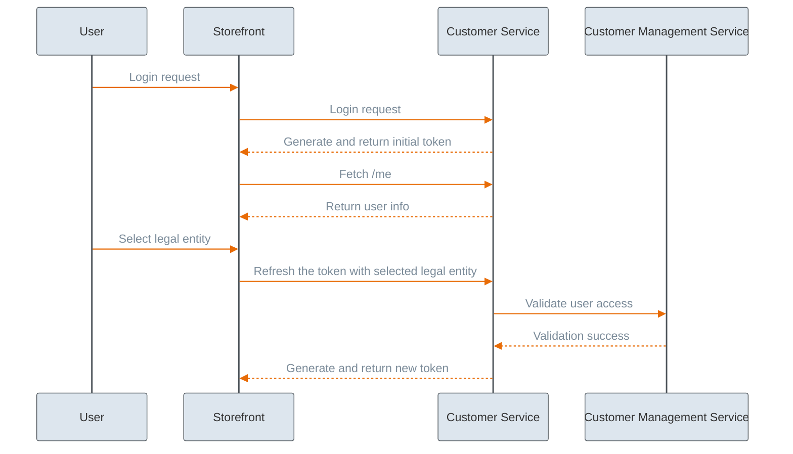

---
layout:
  width: wide
icon: user-lock
description: Tokens and scopes grant specific access to employee users and your storefront customers assigning them relevant permissions level to specific resources. Learn how to authenticate and authorize users in Emporix.
---

# Tokens and Scopes

Authentication and authorization of users is handled by tokens and associated scopes.
The Emporix API uses the [OAuth 2.0](https://oauth.net/2/) token-based authentication and authorization approach. API keys are used to generate access tokens, which are then used to authorize HTTP methods.

## API credentials

To be able to effectively use the Emporix API either as a employee user or as a customer, you need the revelant API keys. The [Emporix Developer Portal](https://app.emporix.io) provides you with two types of credentials out-of-the-box:

* **Emporix API** — used to access the API from a business user's perspective.
* **Storefront API** — used to access the API from a customer's perspective. These credentials are used to perform basic actions on the storefront — browse products, view prices, or add products to a cart.

You can define custom API keys that grant access to specific resources or specific integrations. This allows you to control authorization for particular users as well as to simulate some specific scenarios. For example, you can create dedicated scopes that allow you to manage prices externally for the products in your database, or limit scopes for particular service only. The custom scopes assign separate API keys with dedicated Client ID and Secret.


To learn more how to manage API Keys or create custom scopes in the Developer Portal, refer to the [Manage API Keys](https://app.gitbook.com/s/bTY7EwZtYYQYC6GOcdTj/getting-started/developer-portal/manage-apikeys) guide.


# Tokens

Emporix uses different types of tokens to authenticate and authorize different types of users. The Emporix system explicitly distinguishes between two types of users: customers and employee users. These tokens, associated with different scope levels, serve fundamentally different purposes.

## Employee user

### Service token

The Service Token serves for backend operations and administrative tasks, representing the business owner's or employee's perspective. 

* Scope: A service token is required to manage core Emporix services, granting the ability to perform actions such as adding new products, modifying prices, or managing categories.
* Required credentials: Service tokens are generated using backend credentials (such as a backend Client ID and Secret).
* Caching behavior in the Java SDK: The Emporix Java SDK automatically caches service tokens based on their credential name and requested scopes to optimize backend performance.
* Endpoint: `POST /oauth/token` [Requesting a service access token](https://developer.emporix.io/api-references/api-guides/authorization/oauth-service/api-reference/service-access-token)


Learn more about the Service Token in the [OAuth Service Tutorial](../../authentication/oauth-service/oauth.md).


### SSO Authentication Tokens
When employees log into the Emporix Management Dashboard or the Developer Portal using Single Sign-On (SSO), an external Identity Provider (IDP) verifies their credentials. The IDP then returns a token that grants the employee access to the internal Emporix systems.
Employees are organized into groups that share specific access controls and roles, and these access controls are applied to the APIs through token scopes. 


Learn more about SSO authentication approaches in the [SSO Authentication](sso-authentication.md) and [SSO Token Exchange](token-exchange.md).


## End customer

### Anonymous token

The Anonymous Token is used by a storefront for guest browsing and public access. It allows the storefront to access public resources with a read scope, enabling users to browse products, view prices, and add products to a cart without logging in. It is not associated with any specific customer.

* Scope: No scope associated.
* Required credentiqals: No required credentials for anonymous session or guest checkout.
* Caching behavior in Java SDK: The anonymous tokens are not cached by design. Every guest user browsing the storefront requires a unique token to maintain their individual shopping session and context (such as an active shopping cart). Since the SDK does not automatically cache these tokens, your application must manage them independently, such as by securely storing them in an HTTP session or a other caching system.
* Endpoint: `GET /customerlogin/auth/anonymous/login` [Requesting an anonymous token](https://developer.emporix.io/api-references/api-guides/companies-and-customers/customer-management/api-reference/authentication-and-authorization).

### Customer token 

The Customer Token is a JSON Web Token (JWT) that contains encrypted data associated with a specific, authenticated shopper on the storefront. 

* Scope: A customer token allows the user to perform personal storefront actions associated with their account, such as completing a checkout or viewing their own orders.
* Required credentials: Customer tokens are generated using storefront credentials. When a user logs in, the system requires an existing anonymous token to generate the customer token, ensuring that the user's guest shopping session (like their cart and preferences) is preserved after they authenticate. Furthermore, generating a customer token usually requires a customer's email and password, as well as an existing anonymous token to ensure their current browsing session (like their cart) is preserved upon logging in.
* Caching behavior in the Java SDK: Customer tokens are never cached by the SDK. Because they are unique to individual users, the storefront application must manage them independently, such as storing them securely in an HTTP session or other tools.
* Endpoint: `POST /customer/{tenant}/login` [Requesting a customer token](https://developer.emporix.io/api-references/api-guides/companies-and-customers/customer-management/api-reference/authentication-and-authorization).

### Refresh Token

A Refresh Token is a specific type of access token in the Emporix API used to generate a new customer token without forcing the user to log in again. 

* Scope: Like customer and anonymous tokens, a refresh token comes with a pre-defined set of authorization scopes that dictate which operations and resources the user can access.
Refresh tokens play a crucial role in maintaining seamless user sessions, particularly in B2B environments. For instance, when a B2B customer needs to switch the legal entity they are acting on behalf of, the storefront triggers the token refresh endpoint. This action issues a new token based on the previous one but securely embeds the newly selected `legalEntityId`, ensuring the customer's data access and product visibility adjust dynamically without requiring them to re-authenticate.
* Using in the Java SDK: If you are developing with the Emporix Java SDK, the SDK provides built-in methods to handle token renewal, such as calling `refreshCustomerToken` (expiredToken), which allows your application to easily replace an expired customer session token.
* Endpoint: `GET /customer/{tenant}/refreshauthtoken` [Requesting a refresh token](https://developer.emporix.io/api-references/api-guides/companies-and-customers/customer-management/api-reference/authentication-and-authorization).

### B2B Token

In B2B scenarios, customers often represent multiple companies and can act on behalf of more than one legal entity (company). The B2B token handles this by embedding the customer's currently selected legal entity directly into their authorization token. This token-based approach guarantees a consistent user experience and centralized security enforcement while maintaining the required legal entity-based access control. Because the system updates the token securely in the background, the customer is not forced to log in again to access the relevant data and scopes for the new entity.

* Scope: To ensure that the storefront properly reads a B2B customer's selected legal entity and determines the relevant access to resources, the authorization token generated by the [Customer Service](https://developer.emporix.io/api-references/api-guides/companies-and-customers/customer-management/api-reference/authentication-and-authorization#get-customer-tenant-refreshauthtoken) gets updated with the `legalEntityId` parameter.\
The token-based approach to pass the `legalEntityId` parameter guarantees that the relevant services use that information to retrieve relevant data. The `legalEntityId` header is injected in the requests. 


Passing the `legalEntityId` parameter in the authorization token is the proper way to handle the B2B customer legal entity information across services.\
The token approach ensures a consistent user experience, and centralized security enforcement while enabling the required legal entity-based access control.


* Example use cases:
  * Orders: The customer's assigned legal entity can be crucial for accessing orders information. B2B customers need to access their own orders, but also the orders assigned to their legal entity.
  * Products availability: With customer segments, product visibility can become segment-based. Therefore, the endpoint responsible for retrieving products on the storefront has to return only these products that the customer has access to with the selected legal entity.

* Process: The process of handling multiple legal entities looks as follows:



### Selection and verification
When a B2B customer logs in, they choose the specific legal entity they want to represent for that session. The Customer Service then verifies that the user is assigned to this selected entity.


### Token generation 
Upon verification, the [Customer Service](../companies-and-customers/customer-service/api-reference/) issues a new refresh token that embeds the `legalEntityId` parameter.


### Data access and scope 
This updated token is passed to other services to determine the correct scopes and data visibility for the user. The `legalEntityId` header is injected into requests, ensuring the user only accesses relevant data, such as orders or segment-based product visibility tied to that specific legal entity.


### Seamless switching
If the customer needs to change the legal entity they are acting on behalf of, they do not need to log in again. The storefront simply triggers the [Refreshing a customer token](https://developer.emporix.io/api-references/api-guides/companies-and-customers/customer-management/api-reference/authentication-and-authorization#get-customer-tenant-refreshauthtoken) endpoint to generate a new token based on the previous one, but with the updated `legalEntityId` information.



The diagram shows how the legal entity information is fetched and passed:



* Using in the Emporix Java SDK: You can easily refresh the token by passing the existing customer token and the new legal entity ID into the `getB2bToken` method to generate the updated token.
Example of how this is implemented in the Java SDK:

```bash
public CustomerTokenResponse switchToB2bContext(
    CustomerTokenResponse customerToken,
    String legalEntityId
) {
    return tokenService.getB2bToken(customerToken, legalEntityId);
}
```


Find out more about the Customer Service and token generation in the [Customer Service (Customer Managed)](../companies-and-customers/customer-service/api-reference/) API reference documentation.


### SSO Generated Tokens
When customer log into the storefront using Single Sign-On (SSO), an external Identity Provider (IDP) verifies their credentials. The IDP then returns a token that grants the employee access to the internal Emporix systems.


Learn more about SSO approaches in the [SSO Authentication](sso-authentication.md) and [Token Exchange](token-exchange.md) guides. 



## Scopes

In the Emporix API, **scopes** define which operations you are allowed to perform and which resources you can access. They are a foundational part of the token-based authorization system and help enforce security by ensuring users and applications only interact with the data they are permitted to see or modify.

Scopes follow a standardized naming convention structure: `[service_name].[resource_name]_[action_name]`. For actions that grant read-only access to a resource, the terms `read` and `view` are used interchangeably.


### Scope assignment by token type 

Different types of access tokens handle scopes differently based on their intended user:

* Storefront tokens: Anonymous, customer, and refresh tokens come with a pre-defined set of scopes tailored for standard storefront activities.
* Service tokens: When requesting a service access token for backend or administrative operations, you can specify exactly which scopes you need. If you choose not to specify, you can request a token with all available scopes.
* Custom credentials: You can configure additional OAuth2 clients in Emporix with highly specific, limited scopes. This is particularly useful for granting controlled access to external integrations, third-party systems, or partners without exposing your entire backend.


Some API endpoints are implicitly readable and do not require any scopes at all.


### Identity and Access Management (IAM) 

For internal employees working within the Emporix Management Dashboard, scopes are used to enforce Identity and Access Management (IAM) controls. When employees are assigned to specific groups, their associated roles and access permissions are translated into scopes applied to the APIs, ensuring they only have access to authorized services.

### Java SDK best practices 

If you are building an application using the Emporix Java SDK, there are several best practices for managing scopes:
* Use scope constants: The SDK provides nested Scopes interfaces (for example, `ProductClient.Scopes.PRODUCT_MANAGE`) so you do not have to guess the scope name. Using these constants instead of hardcoded strings provides type safety, enables IDE autocomplete, supports safe refactoring, and prevents typos.
* Principle of least privilege: It is recommended to request only the specific scopes needed for a given operation (for example, `tokenService.getServiceToken(Set.of(SCOPES))`) rather than requesting all available scopes.
* Troubleshooting: If your token lacks the required scopes for a specific API call, the system rejects the request and return a `403 Forbidden` or `Insufficient Scopes` error. If this happens, verify your credentials and request a new token with the appropriate scopes.
