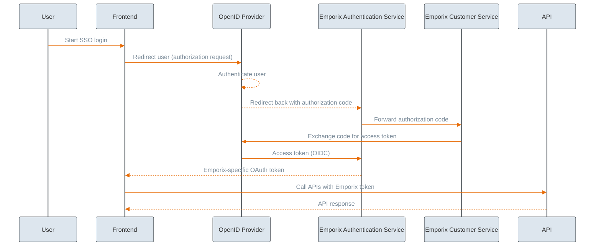

Emporix supports a Single Sign-On (SSO) mechanism based on the OAuth 2.0 authorization code flow that provides a holistic approach to customer authentication on the storefront. 


If you do not use an external IDP, the customers' data is stored in the Emporix database.


You can use the Emporix solution alone or integrate a chosen Identity Provider (IDP), such as Keycloak, Auth0, or any other OpenID Connect–compliant provider.

## How the SSO flow works

The following steps describe the end-to-end SSO authentication flow in the Emporix implementation.



### Initiation

The storefront (frontend) initiates the SSO flow by redirecting the customer to your configured Identity Provider. The customer authenticates with the IDP using its native login (for example, corporate credentials or social login).




### Callback with authentication code

After successful authentication, the Identity Provider redirects the customer back to a designated Emporix callback endpoint, including a one-time authentication code in the request. This code is short-lived and must not be used directly by the customer.




### Token exchange (backend)

The Emporix Authentication Service receives the callback and exchanges the authentication code with the OpenID Provider for an access token (and optionally a refresh token). This exchange happens server-side.



### Emporix token generation

Emporix then issues the Emporix-specific OAuth token and returns it to the client (application/system). All subsequent API calls are authenticated using this Emporix token, not the IDP token.



### API access

The client uses the Emporix token to call Emporix APIs. Authentication and session management are handled by Emporix based on this token.



This design keeps Emporix as the sole authority for the authentication-code exchange and token generation in the SSO flow. The Identity Provider is responsible for authenticating the customer. Emporix is responsible for issuing and validating tokens used to access Emporix APIs.


See the example flows that incorporate an external Identity Provider into the process:

 * [Identity Providers](../../integrations/authentication/identity-providers.md)
    * [Auth0](../../integrations/authentication/auth0.md)
    * [Keycloak](../../integrations/authentication/keycloak.md)


