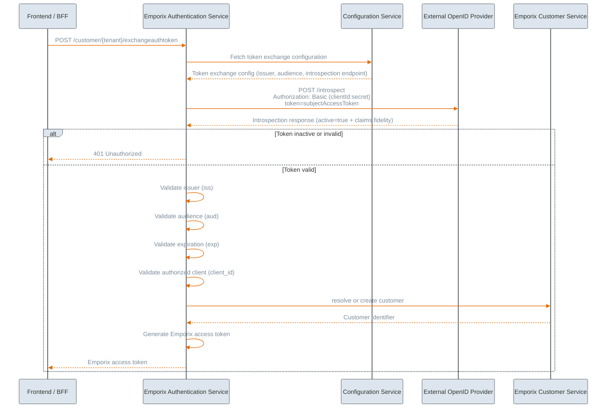

---
layout:
  width: wide
icon: square-binary
description: Implement token exchange as a way to authenticate your customers on the storefront.
---

# SSO with Token Exchange

The **Token Exchange** flow extends the existing Single Sign-On (SSO) solution to allow an alternative way to authenticate your end-customers. The standard SSO implementation (authorization code flow) offered at Emporix allows you to cover the whole authentication flow from start to end using your preferred identity provider in the middle, while Emporix manages the entire authentication code exchange.
However, at enterprises with complex enterprise ecosystems, where businesses need to use their own identity tokens across multiple platforms, it is crucial to maintain full ownership of the initial authentication process. In such a case, token exchange is a solution that allows you to unify Emporix authentication within your existing system network.

## Token exchange approach


The flow adheres to the [OAuth 2.0 Token Exchange RFC 8693](https://www.rfc-editor.org/rfc/rfc8693.html) pattern. 


In the token exchange approach, the client maintains full ownership and control over the SSO flow with the OpenID Provider. This means the client application or system handles the entire authentication sequence, including redirecting users to the identity provider and managing the authentication callback.

The client authenticates the user directly with the OpenID Provider and obtains an access token within its own system infrastructure. This token is issued by the external identity provider and represents a successful authentication event in the client's domain.

Once the client has obtained the externally issued access token, it initiates the token exchange process by calling the Emporix Token Exchange endpoint. The client passes the externally issued token as part of the exchange request, along with any required metadata or context information.

Emporix receives the external token and performs validation against the configured OpenID Provider to verify its authenticity and validity. Upon successful validation, Emporix exchanges the external token for an Emporix-specific OAuth access token, which the client can then use to authenticate all subsequent API requests to Emporix services.

## Authorization code vs Token exchange approaches 

You can choose between delegating the entire flow to Emporix for simplicity or utilizing the exchange endpoint for greater architectural flexibility. 

| Aspect | **SSO authorization code flow** | **SSO Token exchange flow** |
| ------- | --------------------- | ----------------------- |
| Integration | The standard SSO flow provides simple integration for clients, requiring only minimal OAuth logic implementation. | The token exchange flow offers full flexibility for clients to integrate Emporix with other internal or third-party services. |
| Flow Ownership | Emporix maintains centralized control over authentication and token generation throughout the entire flow. | The token exchange flow separates responsibilities: the client owns the authentication process, while Emporix owns authorization within its own domain. |
| Token lifecycle and validation | Tokens follow a consistent Emporix structure and lifecycle management. | Emporix supports token validation for externally issued tokens while maintaining its own token structure. |
| Risk mitigation | The standard flow reduces the risk of misconfiguration on the client side by handling the authentication process centrally. | Clients must correctly implement OAuth flows and token management, which increases the responsibility and potential for configuration errors. |
| Authentication code access | The authorization code is consumed exclusively by Emporix. Clients do not receive authentication codes or external access tokens, as the entire process is fully maintained at Emporix. Clients cannot generate their own tokens for non-Emporix services. | Clients can reuse authentication results because they authenticate the customer and obtain an access token in their own system before exchanging it with Emporix. |
| Limitation | The standard flow creates tight coupling between Emporix and the authentication process, limiting flexibility. | The token exchange flow requires higher integration complexity for clients, which may not be suitable for all use cases. |
| Good fit | The standard SSO flow is well-suited for enterprises that do not have external systems and do not want to invest in implementing own authentication mechanisms, but instead they want to delegate the whole authentication flow to Emporix. | The token exchange flow is ideal for large enterprises and platform customers with complex distributed ecosystems that already use own authentication flow and require greater architectural flexibility. |


SSO authentication code flow and token exchange flow are two separate approaches that you can choose from when enabling customer authentication in the webshop storefront, based on your integration needs. You cannot mix both flows in one implementation to mitigate ambiguity and security risks.


## Example token exchange flow



### External authentication
Authenticate a customer within your external authentication solution and extract the authentication code value. Identity providers provide the authentication code in the URL as a query param, for example `code=12345a12-12a1-1234-a123-abcde1123ab12.1234567a-12ab-1a12-12ab-1ab123a1a12c.12bb1234-1234-1234-1a3c-12345b12a123`.



### Exchange of the authentication code into the authentication token
Call the Emporix Token Exchange endpoint using the `POST https://api.emporix.io/customer/{tenant}/exchangeauthtoken`, which takes care of changing the authentication code into the authentication `access_token`. Provide the following parameters:

* `subjectAccessToken` - The token received from the external IDP.
* `config` - The relevant configuration key; typically it corresponds to the site configuration (for example `Site_DE`).




### Optional: Introspection of the token
Enable the introspection of the authentication token that allows Emporix to get customer's information from the authentication token. The introspection provides a possibility for online token validation.



### Token validation
Emporix runs validation of the received token to authenticate a customer and allow store's frontend access. There are two validation modes possible, depending on what you provide: online verification or offline verification methods.


Find out more about the token validation in the [Token validation](#token-validation) section.

 


### Token issuance
If the token is proved valid, Emporix generates and returns an Emporix-specific access token, refresh token and Saas token, which are passed to the store's frontend and can be further used.

The response returns JSON object containing `access_token`, `refresh_token`, `saas_token`, `expires_in`, and `scope`.



### Token validation

Token validation happens after the authentication code is received on the token exchange endpoint. The Emporix Authentication Service fetches the token exchange configuration from the Configuration Service and, based on the `config` in the request, chooses the relevant configuration for validation. 

Emporix verifies the token using one of two methods:

* Online verification - Uses the token introspection results.
* Offline verification - Uses JWKS (JSON Web Key Sets) if introspection is not possible.

**The validation checks:**

* Token must be active (`active: true`).
* `iss` - The token **Issuer** must match configuration.
* `aud` - The token **Audience** must match configuration.
* `azp` - The **Authorized Party** must match the `config.token_client_id`.

#### Online verification

Having the right configuration (or the default one as a fallback), the Authentication Service runs the token introspection to receive its details. **Online verification** uses the token introspection results. 


Online verification is the recommended approach because it ensures the highest security level as it actively checks if a token has been explicitly invalidated before its expiration time.


#### Offline verification

If your setup cannot expose an introspection endpoint (for example, where there is VPN proxy), you can use **offline verification**. To trigger this method, you must include the JSON Web Key Set (`jwks`) object within your configuration. The verification checks the fidelity of the `jwks` object that contains an array of keys used to cryptographically verify the token's signature. Each key in the array typically includes attributes like the key ID (`kid`), key type (`kty`), algorithm (`alg`), and certificate chain (`x5c`). 

#### Configuration

To configure whether Emporix uses online or offline token verification, you need to adjust your tenant's `tokenExchange` configuration object. 


The system decides which validation method to use based on the received configuration - if the `jwks` (JSON Web Key Set) configuration is provided, offline verification is run. If it is omitted, the system defaults to online verification through the token introspection.


The configuration is stored at the tenant level under the `tokenExchange` document. You can define a default configuration, as well as site-specific overrides (such as `Site_DE` or `Site_PL`).


If you want to use the token exchange flow within your authentication process, contact our [Emporix Support Team](mailto:support@emporix.com) and provide the following data required for configuration of proper token verification on Emporix end:



* `domain` - The base URL of your identity provider.
* `token_introspect_endpoint` - The path to the introspection endpoint.
* `client_id` - The credentials for a client that has the appropriate rights to perform token introspection. For example, `my-backend-service`.
* `client_secret` - The credentials for a client that has the appropriate rights to perform token introspection.
* `token_client_id` - Used to validate the `azp` (Authorized Party) claim. It recognizes if the token has been issued for the specific client, especially when a token has multiple potential recipients. For example, `my-backend-service`.
* `audience` - Used to validate the `aud` claim. It recognizes the dedicated recipient of the token, such as a system, API or a service that accepts the token. For example, `https://your-api-url.some-domain.io`, `product-service`, `commerce-system`. It secures the token authorized usage.
* `issuer` - Used to validate the `iss` claim. It represents the authentication server that issued the token. 
* optionally `storefront_client_id` - Your storefront Client ID credential, can be checked in the [Developer Portal](https://app.gitbook.com/s/bTY7EwZtYYQYC6GOcdTj/getting-started/developer-portal/manage-apikeys).
* optionally `storefront_client_secret` - Your storefront Client Secret credential, can be checked in the [Developer Portal](https://app.gitbook.com/s/bTY7EwZtYYQYC6GOcdTj/getting-started/developer-portal/manage-apikeys).



* `token_client_id` - Used to validate the `azp` (Authorized Party) claim. It recognizes if the token has been issued for the specific client, especially when a token has multiple potential recipients. For example, `my-backend-service`.
* `audience` - Used to validate the `aud` claim. It recognizes the dedicated recipient of the token, such as a system, API or a service that accepts the token. For example, `https://your-api-url.some-domain.io`, `product-service`, `commerce-system`. It secures the token authorized usage.
* `issuer` - Used to validate the `iss` claim. It represents the authentication server that issued the token. 
* `jwks` object with the array of necessary keys





### Customer autoprovisioning and identification

During the login process, once a token has been successfully validated, the Emporix Authentication Service flow calls the Customer Service endpoint that is responsible for either updating the last login date for an existing customer or automatically creating a new customer if they do not already exist in the system.

This automatic creation is controlled by a tenant-level configuration setting called `ssoCustomerAutoprovisioningDisabled`:

* Autoprovisioning enabled (`false`) - This is the default setting. If a user logs in and does not currently exist in the Emporix system, their customer profile is automatically provisioned.
* Autoprovisioning disabled (`true`) - Clients can change this setting to `true` if they pre-synchronize their customer databases and expect all user data to already be in the system before a first-time login. If autoprovisioning is turned off and an unknown customer attempts to log in, the customer account is not created and the system returns a `404` error.

You can also configure how to identify a customer. The `ssoCustomerIdentifierField` setting allows you to specify if customer is identified by either `email` or `subject`. Email is the standard identifier, but for the cases when a different identifier is associated with a customer account (such as user name, ID or other), the introspection endpoint returns the `sub` parameter for identifying the `subject` field. 


For more information about configuration settings, see the [System Preferences](https://app.gitbook.com/s/bTY7EwZtYYQYC6GOcdTj/management-dashboard/settings/system-preferences).


