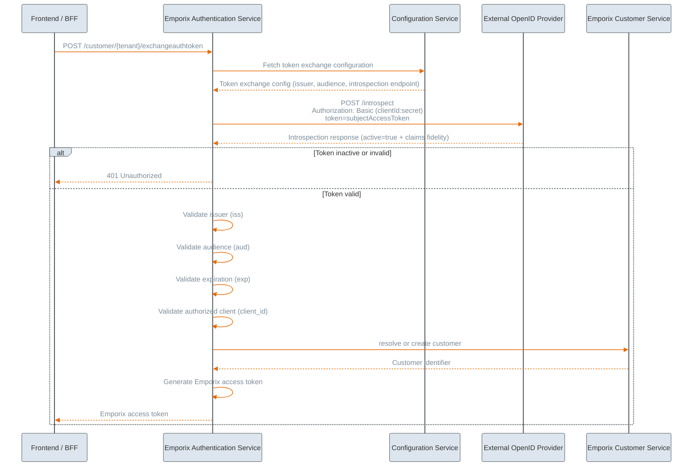

---
layout:
  width: wide
icon: square-binary
description: Implement token exchange as a way to authenticate your customers on the storefront.
---

# SSO with Token Exchange

The **Token Exchange** flow extends the existing Single Sign-On (SSO) solution to allow alternative way to authenticate your end-customers. The standard SSO implementation (authorization code flow) offered at Emporix allows you to cover the whole authentication flow from start to end using your preferred identity provider in the middle, while Emporix manages the entire authentication code exchange.
However, at enterprises with complex enterprise ecosystems, where businesses need to use their own identity tokens across multiple platforms, it is crucial to maintain full ownership of the initial authentication process. In such a case, token exchange is a solution that allows you to unify Emporix authentication within your existing system network.

## Token exchange approach


The flow adheres to the [OAuth 2.0 Token Exchange RFC 8693](https://www.rfc-editor.org/rfc/rfc8693.html) pattern. 


In the token exchange approach, the client maintains full ownership and control over the SSO flow with the OpenID Provider. This means the client application or system handles the entire authentication sequence, including redirecting users to the identity provider and managing the authentication callback.

The client authenticates the user directly with the OpenID Provider and obtains an access token within its own system infrastructure. This token is issued by the external identity provider and represents a successful authentication event in the client's domain.

Once the client has obtained the externally issued access token, it initiates the token exchange process by calling the Emporix Token Exchange endpoint. The client passes the externally issued token as part of the exchange request, along with any required metadata or context information.

Emporix receives the external token and performs validation against the configured OpenID Provider to verify its authenticity and validity. Upon successful validation, Emporix exchanges the external token for an Emporix-specific OAuth access token, which the client can then use to authenticate all subsequent API requests to Emporix services.

## Authorization code vs Token exchange approaches 

You can choose between delegating the entire flow to Emporix for simplicity or utilizing the exchange endpoint for greater architectural flexibility. 

| Aspect | **SSO authorization code flow** | **SSO Token exchange flow** |
| ------- | --------------------- | ----------------------- |
| Integration | The standard SSO flow provides simple integration for clients, requiring only minimal OAuth logic implementation. | The token exchange flow offers full flexibility for clients to integrate Emporix with other internal or third-party services. |
| Flow Ownership | Emporix maintains centralized control over authentication and token generation throughout the entire flow. | The token exchange flow separates responsibilities: the client owns the authentication process, while Emporix owns authorization within its own domain. |
| Token lifecycle and validation | Tokens follow a consistent Emporix structure and lifecycle management. | Emporix supports token validation for externally issued tokens while maintaining its own token structure. |
| Risk mitigation | The standard flow reduces the risk of misconfiguration on the client side by handling the authentication process centrally. | Clients must correctly implement OAuth flows and token management, which increases the responsibility and potential for configuration errors. |
| Authentication code access | The authorization code is consumed exclusively by Emporix. Clients do not receive authentication codes or external access tokens, as the entire process is fully maintained at Emporix. Clients cannot generate their own tokens for non-Emporix services. | Clients can reuse authentication results because they authenticate the customer and obtain an access token in their own system before exchanging it with Emporix. |
| Limitation | The standard flow creates tight coupling between Emporix and the authentication process, limiting flexibility. | The token exchange flow requires higher integration complexity for clients, which may not be suitable for all use cases. |
| Good fit | The standard SSO flow is well-suited for enterprises that do not have external systems and do not want to invest in implementing own authentication mechanisms, but instead they want to delegate the whole authentication flow to Emporix. | The token exchange flow is ideal for large enterprises and platform customers with complex distributed ecosystems that already use own authentication flow and require greater architectural flexibility. |


SSO authentication code flow and token exchange flow are two separate approaches that you can choose from when enabling customer authentication in the webshop storefront, based on your integration needs. You cannot mix both flows in one implementation to mitigate ambuguity and security risks.


## Example token exchange flow



### Generatation of an authentication code
Authenticate a customer within your external authentication solution and extract the authentication code value. Identity providers provide the authentication code in the URL as a query param, for example `code=12345a12-12a1-1234-a123-abcde1123ab12.1234567a-12ab-1a12-12ab-1ab123a1a12c.12bb1234-1234-1234-1a3c-12345b12a123`.



### Exchange of the authentication code into the authentication token
Call the Emporix Token Exchange endpoint that takes care of changing the authentication code into the authentication `access_token`.



### Optional: Introspection of the token
Enable the introspection of the authentication token that allows Emporix to get customer's information from the authentication token. The introspection provides a possibility for online token validation.



### Emporix token verification
Emporix runs verification of the received token to authenticate a customer and allow store frontend access. There are two verification modes possible, depending on what you provide:
* [online](#online-verification) 
* [offline](#offline-verification)
 


### Token verification

After receiving the access token, Emporix verifies its content to authenicate a customer and grant access.

#### Online verification

Online verification allows for instant verification. 


Emporix recommends enabling online verification as it ensures the highest security level.


##### Prerequisites

If you want to use the token exchange flow within your authentication process, contact our [Emporix Support Team](mailto:support@emporix.com) and provide the following data required for configuration of proper token verification on Emporix end:

Online version:

* `domain`
* `token_introspect_endpoint`
* `client_id`
* `client_secret`
* `token_client_id`
* `audience`
* `issuer`

Optionally:
`storefront_client_id`
`storefront_client_secret`

#### Offline verification

##### Prerequisites

Offline version: 

* `token_client_id` 
* `audience`
* `issuer`
* `jwks` array 

* The `domain` is the Keycloak domain value, for example, `keycloak.eu.yourdomain.com`.
* The `token_endpoint` is the endpoint that is used for the token call, for Keycloak it’s usually `protocol/openid-connect/token`.
* The `provider` is the provider that is configured for the IDP, the provider value can be then used in the state parameter, thanks to that it’s possible to have multiple configurations for one tenant, for example, `keycloak_siteA`, `keycloak_siteB`.
* The `client_id` and `client_secret` are the credentials provided by the customer, to find the credentials in the Keycloak app go to **Clients** -> **Clients list**.
* The `redirect_uri` is a value provided by customer that indicates where a user should be redirected after authentication flow. The value points storefront URL, for example, `https://storefront.emporix.io/keycloak`.
* The `public_key` is a value provided by customer as their signing certificate. It has to be stored in one line, however each line of the original certificate value should be separated by `\n`. Copy the value to the json in the `public_key` field and surround it with `-----BEGIN CERTIFICATE-----\n{TOKEN}\n-----END CERTIFICATE-----`

