---
seo:
  title: Multi-Site Architecture
  description: Understanding sites, catalogs, categories, availability, products, and segments in Emporix
icon: graduation-cap
layout:
  width: wide
---

# Multi-Site Architecture

This tutorial explains how Emporix's multi-site architecture works, covering the core concepts and how they connect together to enable flexible commerce operations across multiple countries, brands, and customer segments.

## Introduction

Emporix's multi-site architecture allows you to manage multiple webshops, brands, and markets from a single platform. Understanding how sites, catalogs, categories, products, availability, and segments work together is essential for building scalable commerce solutions.

## Core concepts

First, get familiar with the concepts used across this article.

### Site

**Definition:** A Site represents a single country or country/brand combination. It serves as a virtual entity that can represent:
- A web store
- A physical store
- A branded store
- A store for a specific market

**Key characteristics:**
- Site-aware: Each site can have its own configuration, payment methods, shipping options, and customer targeting
- Independent: Sites operate independently but can share underlying resources like products and categories.
- Configurable: Sites can override or augment tenant-specific configurations.

**Example site codes:**
- `Netherlands` - Single country site
- `ThermoBrand_DE` - Country/brand combination (Germany, ThermoBrand brand)
- `WarmTech_DE` - Country/brand combination (Germany, WarmTech brand)

### Catalog

**Definition:** A Catalog is site-aware and manages categories for one or more sites. It acts as a container that organizes which categories are available on which sites.

**Key characteristics:**
- **Site-aware:** Each catalog is published to specific sites through the `publishedSites` field.
- **Dynamic category assignment:** Categories can be dynamically assigned to catalogs.
- **One catalog per site (recommended):** While a catalog can be published to multiple sites, the typical pattern is one catalog per site for better organization.
- **Category management:** Catalogs control which category trees are visible on which sites.

**How it works:**
- When you create a catalog, you specify which sites it is published to.
- You assign root categories to the catalog by specifying the `categoryIds` array.
- The catalog determines which categories (and their product assignments) are visible on each site.

### Category

**Definition:** Categories represent the hierarchical structure of products. They are **not site-aware** - a single category tree exists globally and can be used across multiple sites.

**Key characteristics:**
- **Not site-aware:** Categories exist independently of sites - they're global resources.
- **Hierarchical structure:** Categories form trees with root categories and subcategories.
- **Product organization:** Products are assigned to categories to organize them.
- **Reusable:** The same category structure can be used across multiple sites and catalogs.
- **Brand-specific:** Typically, each brand has its own root category tree.

**Benefits:**
- **Less maintenance:** Create category structure once, use it across multiple sites.
- **Consistency:** Ensures consistent product organization across brands.
- **Flexibility:** Easy to reorganize products without affecting site-specific configurations.

### Product

**Definition:** Products are **not site-aware** - a single product instance exists globally within Emporix and can be made available on multiple sites.

**Key characteristics:**
- **Global resource:** One product definition serves all sites.
- **Site-independent:** Product attributes (name, description, images, etc.) are not tied to a specific site.
- **Multi-site availability:** The same product can be available on different sites with different configurations.
- **Category assignments:** Products are assigned to categories (which are then assigned to catalogs).

**How products become site-specific:**
- Products are assigned to categories
- Categories are assigned to catalogs
- Catalogs are published to sites
- Availability controls product visibility per site
- Prices are site-specific (determines which sites a product appears on)

### Availability

**Definition:** Availability is **site-aware** and manages product visibility and stock levels independently from category assignments.

**Key characteristics:**
- **Site-aware:** Each availability record is tied to a specific site.
- **Independent visibility control:** Controls whether a product is visible on a site, regardless of category assignments.
- **Stock management:** Tracks stock levels, popularity, and distribution channels per site.
- **Granular control:** Allows you to show/hide products on specific sites without changing category or catalog assignments.

**Use cases:**
- Making a product available on Site A but not Site B.
- Managing different stock levels for the same product across different sites.
- Controlling product visibility based on business rules (for example, regional restrictions).

### Segments

**Definition:** Segments are **site-aware** and manage visibility of products and/or categories based on customer roles.

**Key characteristics:**
- **Site-aware:** Segments are created per site (through the `siteCode` field).
- **Role-based:** Control visibility based on customer roles.
- **Product and category visibility:** you can control visibility of both individual products and entire categories.
- **Customer targeting:** Customers are assigned to segments, which determines what they can see.

**Use cases:**
- Showing premium products only to VIP customers.
- Restricting certain categories to specific customer groups.
- Creating brand-specific experiences for different customer segments.

## How everything connects together

Understanding the relationships between these concepts is crucial for effective multi-site management:

```mermaid
---
config:
  layout: fixed
  theme: base
  look: classic
  themeVariables:
    background: transparent
    lineColor: "#9CBBE3"
    arrowheadColor: "#9CBBE3"
---

erDiagram
  direction TB

  CATEGORY {
    string id
    string parentId
    boolean published
  }

SUBCATEGORY {
    string id
    string parentId
    boolean published
  }

  CATALOG {
    string id
    string categoryIds
    string publishedSites
  }

  SITE {
    string id
    boolean active
    boolean isDefault
  }

  PRODUCT {
    string id
    boolean published
  }

  CATEGORY_ASSIGNMENT {
    string id
    string categoryId
    string ref_id
  }

  AVAILABILITY {
    string id
    string site
    string productId
  }

  PRICE {
    string id
    string itemId
    string restrictions_siteCodes
  }

  SEGMENTS {
    string id
    string name
  }

  SEGMENT_ITEM_ASSIGNMENT {
    string id
    string segmentId
    string type
    string itemId
  }

  SEGMENT_CUSTOMER_ASSIGNMENT {
    string id
    string segmentId
    string customerId
  }

  CUSTOMER {
    string id
    boolean active
  }

  %% Relationships

  CATEGORY ||--o{ SUBCATEGORY : parent
  CATEGORY }o--o{ CATALOG : assigned_to

  CATEGORY ||--o{ CATEGORY_ASSIGNMENT : has
  PRODUCT ||--o{ CATEGORY_ASSIGNMENT : assigned_by

  PRODUCT ||--o{ AVAILABILITY : has
  SITE ||--o{ AVAILABILITY : defines

  SITE }o--o{ CATALOG : publishes

  SITE }o--o{ PRICE : defines

  PRODUCT ||--o{ PRICE : has

  SEGMENTS ||--o{ SEGMENT_ITEM_ASSIGNMENT : defines
  SEGMENTS ||--o{ SEGMENT_CUSTOMER_ASSIGNMENT : maps

  CUSTOMER ||--o{ SEGMENT_CUSTOMER_ASSIGNMENT : assigned_to
  PRODUCT ||--o{ SEGMENT_ITEM_ASSIGNMENT : belongs_to

  style CATEGORY fill:#F2F6FA, stroke:#4C5359
  style SUBCATEGORY fill:#F2F6FA, stroke:#4C5359
  style CATALOG fill:#F2F6FA, stroke:#4C5359
  style SITE fill:#F2F6FA, stroke:#4C5359
  style AVAILABILITY fill:#F2F6FA, stroke:#4C5359
  style PRICE fill:#F2F6FA, stroke:#4C5359
  style PRODUCT fill:#F2F6FA, stroke:#4C5359
  style CATEORY_ASSIGNMENT fill:#F2F6FA, stroke:#4C5359
  style SEGMENTS fill:#F2F6FA, stroke:#4C5359
  style CUSTOMER fill:#F2F6FA, stroke:#4C5359
  style CATEGORY_ASSIGNMENT fill:#F2F6FA, stroke:#4C5359
  style SEGMENT_ITEM_ASSIGNMENT fill:#F2F6FA, stroke:#4C5359
  style SEGMENT_CUSTOMER_ASSIGNMENT fill:#F2F6FA, stroke:#4C5359
```



### Connection flow

1. **Products → Categories:** Products are assigned to categories to organize them logically.
2. **Categories → Catalogs:** Root categories are assigned to catalogs through the `categoryIds`.
3. **Catalogs → Sites:** Catalogs are published to sites through the `publishedSites`.
4. **Products → Availability:** Products have availability records per site (controls visibility and stock).
5. **Products/Categories → Segments:** Segments control visibility of products and categories based on customer roles.
6. **Segments → Sites:** Segments are site-specific and work within the context of a site.

### Key relationships

**Site ↔ Catalog**
- One catalog is typically published to one site (one-to-one relationship).
- A catalog can be published to multiple sites if needed (one-to-many).
- The catalog determines which categories are available on the site.

**Category ↔ Catalog**
- Multiple categories can be assigned to one catalog (many-to-one).
- The same category can be assigned to multiple catalogs (many-to-many).
- Categories are assigned by the root category IDs.

**Product ↔ Category**
- Products are assigned to categories (many-to-many).
- A product can belong to multiple categories.
- A category can contain multiple products.

**Product ↔ Availability**
- Each product can have multiple availability records (one per site).
- Availability is site-specific and controls visibility independently.

**Product/Category ↔ Segments**
- Segments can control visibility of both products and categories.
- Segments are site-specific.
- Customers are assigned to segments, which determines what they see.

## Architecture patterns

### Pattern 1: Single site, multi-brands

**Use case:** One country with multiple brands sharing the same site.

**Example: Netherlands Setup**

```
Site:
  └─ Netherlands (single site for all brands)

Catalog:
  └─ Netherlands (one catalog for the site)

Categories:
  ├─ ThermoBrand (root category)
  │   ├─ Boilers
  │   └─ Heaters
  ├─ ComfortHeat (root category)
  │   ├─ Boilers
  │   └─ Heaters
  └─ WarmTech (root category)
      └─ Heaters

Publishing Strategy:
  └─ Netherlands catalog → published to Netherlands site
     └─ Contains all brand category trees

Availability:
  └─ Products have availability records for "Netherlands" site

Segments:
  └─ Site-specific segments control visibility by customer role
```

### Pattern 2: Multi-site, segmented brands

**Use case:** Multiple sites, each dedicated to a specific brand.

**Example: Germany setup**

```
Sites:
  ├─ ThermoBrand_DE (site for ThermoBrand brand in Germany)
  └─ WarmTech_DE (site for WarmTech brand in Germany)

Catalogs:
  ├─ ThermoBrand_DE (catalog for ThermoBrand site)
  └─ WarmTech_DE (catalog for WarmTech site)

Categories:
  ├─ ThermoBrand (root category)
  │   ├─ Boilers
  │   └─ Heaters
  └─ WarmTech (root category)
      └─ Heaters

Publishing Strategy:
  ├─ ThermoBrand_DE catalog → published to ThermoBrand_DE site
  │   └─ Contains only ThermoBrand category tree
  └─ WarmTech_DE catalog → published to WarmTech_DE site
      └─ Contains only WarmTech category tree

Availability:
  ├─ Products have availability for "ThermoBrand_DE" site
  └─ Products have availability for "WarmTech_DE" site

Segments:
  ├─ Segments for ThermoBrand_DE site
  └─ Segments for WarmTech_DE site
```

### Single site vs multi-sites patterns comparison

| **Single site** | **Multi-sites** |
| --------------- | -------------- |
| **How it works** | |
| All brands share the same site. | Each brand has its own dedicated site. |
| One catalog contains all brand category trees. | Each site has its own catalog. |
| Products from different brands are organized under their respective category trees. | Each catalog contains only the relevant brand's category tree. |
| Availability controls which products are visible on the site. | Products are made available on specific sites by respective availability records. |
| Segments can further restrict visibility based on customer roles. | Segments work independently per site. |
| **Advantages** | |
| Simple setup for single-country operations. | Brand separation and independence. |
| All brands accessible from one storefront. | Different customer experiences per brand. |
| Easy to manage shared resources. | Independent site configurations (payment, shipping, etc.). |
| | Better for brand-specific marketing and promotions. |

## Practical examples

```mermaid
---
config:
  layout: fixed
  theme: base
  look: classic
  themeVariables:
    background: transparent
    lineColor: "#9CBBE3"
    arrowheadColor: "#9CBBE3"
    edgeLabelBackground: "#FFC128" 
    edgeLabelTextColor: "#4C5359"
---
flowchart TB
A(SITE: Netherlands)
B(SITE: Germany - ThermoBrand_DE)
C(SITE: Germany - WarmTech_DE)
D(CATALOG: Netherlands)
E(CATEGORY: ComfortHeat)
F(CATEGORY: WarmTech)
G(PRODUCT: WarmTech FrostGuard Pro 2000)
H(SEGMENT: NL_WarmTech_Installer)
I(AVAILABILITY: Netherlands)
J(CATALOG: ThermoBrand Germany Catalog)
K(CATEGORY: ThermoBrand)
L(AVAILABILITY: ThermoBrand_DE)
M(PRODUCT: ThermoBrand AquaCore Boiler X500)
N(SEGMENT: DE_ThermoBrand_Wholesaler)
O(CATALOG: WarmTech Germany Catalog)
P(CATEGORY: WarmTech)
R(AVAILABILITY: WarmTech_DE)
S(SEGMENT: DE_WarmTech_Wholesaler)
T(PRODUCT: ComfortHeat Thermalux Pro)

subgraph d [**Products**]
G;
M;
T;
end

subgraph c [**Netherlands**]
A-->D;
A-.->H;
A-->I;
D-->F;
D-->E;
E-->T;
F-->G;
H-.->F;
I-->G;
H-.->G
end

subgraph a [**ThermoBrand_DE**]
B-->J;
J-->K;
K-->M;
B-->L;
B-->N;
L-.->M;
N-.->K;
N-.->M
end

subgraph b [**WarmTech_DE**]
C-->O;
C-->R;
C-->S;
O-->P;
P-->G;
R-->G;
S-.->P;
S-.->G;
end

A:::1
B:::1
C:::1
D:::2
J:::2
O:::2
E:::3
F:::3
K:::3
P:::3
G:::4
M:::4
I:::5
L:::5
R:::5
H:::6
N:::6
S:::6
T:::4

classDef 1 fill:#A1BDDC, stroke:#4C5359
classDef 2 fill:#DDE6EE, stroke:#4C5359
classDef 3 fill:#F2F6FA, stroke:#4C5359
classDef 4 fill:#3B73BB, stroke:#4C5359, color: #ffffff
classDef 5 fill:#FFC128, stroke:#4C5359, stroke-dasharray: 5
classDef 6 fill:#FAFBFC, stroke:#4C5359, stroke-dasharray: 5
```

### Example 1: Setting up Netherlands (single site, multi-brands)



#### Create the site

Create the Netherlands site by sending a request to the [Creating a site](https://developer.emporix.io/api-references/api-guides/configuration/site-settings-service/api-reference/site-settings#post-site-tenant-sites) endpoint.




[api-reference](../configuration/site-settings-service/api-reference/)


```bash
curl -X POST 'https://api.emporix.io/site/{tenant}/sites' 
  -H 'Authorization: Bearer <TOKEN>' 
  -H 'Content-Type: application/json' 
  -d '{
    "code": "NL",
    "name": "Netherlands",
    "active": false,
    "default": false,
    "defaultLanguage": "en",
    "languages": [
        "en",
        "nl"
    ],
    "currency": "EUR",
    "homeBase": {
        "address": {
            "country": "NL",
            "zipCode": "1234 AB"
        }
    },
    "shipToCountries": [
        "NL"
    ]
}'
```



#### Create category trees for each brand

Create root categories for each brand you sell. These categories can be used across multiple sites.

Call the [Creating a new category](https://developer.emporix.io/api-references/api-guides/catalogs-and-categories/category-tree/api-reference/category-resources#post-category-tenant-categories) endpoint to create two root categories.




[api-reference](../catalogs-and-categories/category-tree/api-reference/)


* `ComfortHeat`:

```bash
curl -X POST 'https://api.emporix.io/category/{tenant}/categories' 
  -H 'Authorization: Bearer <TOKEN>' 
  -H 'X-Version: v2' 
  -H 'Content-Type: application/json' 
  -d '{
    "parentId": "root",
    "localizedName": {
      "en": "ComfortHeat"
    },
    "published": true
  }'
```
* `WarmTech`:

```bash
curl -X POST 'https://api.emporix.io/category/{tenant}/categories' 
  -H 'Authorization: Bearer <TOKEN>' 
  -H 'X-Version: v2' 
  -H 'Content-Type: application/json' 
  -d '{
    "parentId": "root",
    "localizedName": {
      "en": "WarmTech"
    },
    "published": true
  }'
```

Copy the IDs of the created categories.

The same way, create subcategories for each root brand category, for example: `Heaters`, `Boilers` or similar, providing the relevant `parentid` in the request.




#### Create the catalog and assign categories

Create a catalog for the Netherlands site and assign the brand category trees to it by passing the IDs of the created categories.




[api-reference](../catalogs-and-categories/catalog/api-reference/)


```bash
curl -X POST 'https://api.emporix.io/catalog/{tenant}/catalogs' 
  -H 'Authorization: Bearer <TOKEN>' 
  -H 'Content-Type: application/json' 
  -d '{
    "name": {
      "en": "Netherlands Catalog"
    },
    "visibility": {
      "visible": true,
      "from": "2026-01-01T00:00:00.169Z",
      "to": "2028-12-31T23:59:59.169Z"
    },
    "publishedSites": ["Netherlands"],
    "categoryIds": [
      "<comfortheat-root-category-id>",
      "<warmtech-root-category-id>"
    ]
  }'
```



#### Assign products to respective categories

Call the [Assigning a resource to a category](https://developer.emporix.io/api-references/api-guides/catalogs-and-categories/category-tree/api-reference/category-assignment-resources#post-category-tenant-categories-categoryid-assignments) endpoint to assign selected products to the Thermobrand and WarmTech categories. Pass the respective `categoryId` as the path parameter.




[api-reference](../catalogs-and-categories/category-tree/api-reference/)


```bash
curl -X POST 'https://api.emporix.io/category/{tenant}/categories/{categoryId}/assignments' 
  -H 'Authorization: Bearer <TOKEN>' 
  -H 'X-Version: v2' 
  -H 'Content-Type: application/json' 
  -d '{
    "ref": {
      "id": "<product-id>",
      "type": "PRODUCT"
    }
  }'
```




#### Create availability for products

Create availability records for the products on the Netherlands site to control visibility and stock levels. Send the request to the [Creating a new availability for a product](https://developer.emporix.io/api-references/api-guides/orders/availability/api-reference/availabilities#post-availability-tenant-availability-productid-site) endpoint passing the relevant `productId` and the `site` as the path parameters. 




[api-reference](../orders/availability/api-reference/)


```bash
curl -X POST 'https://api.emporix.io/availability/{tenant}/availability/{productId}/NL' 
  -H 'Authorization: Bearer <TOKEN>' 
  -H 'Content-Type: application/json' 
  -d '{
    "stockLevel": 100,
    "available": true,
    "popularity": 5
  }'
```



### Example 2: Setting up Germany (Multi-Site, segmented brands)



#### Create sites

Create separate sites for each brand in Germany so that each brand has its own dedicated site.




[api-reference](../configuration/site-settings-service/api-reference/)


* Create `ThermoBrand_DE` site:

```bash
curl -X POST 'https://api.emporix.io/site/{tenant}/sites' 
  -H 'Authorization: Bearer <TOKEN>' 
  -H 'Content-Type: application/json' 
  -d '{
    "code": "ThermoBrand_DE",
    "name": "ThermoBrand Germany",
    "active": false,
    "default": false,
    "defaultLanguage": "de",
    "languages": [
        "en",
        "de"
    ],
    "currency": "EUR",
    "homeBase": {
        "address": {
            "country": "DE",
            "zipCode": "12345"
        }
    },
    "shipToCountries": [
        "DE"
    ]
  }'
```

* Create `WarmTech_DE` site:

```bash
curl -X POST 'https://api.emporix.io/site/{tenant}/sites' 
  -H 'Authorization: Bearer <TOKEN>' 
  -H 'Content-Type: application/json' 
  -d '{
    "code": "WarmTech_DE",
    "name": "WarmTech Germany",
    "active": false,
    "default": false,
    "defaultLanguage": "de",
    "languages": [
        "en",
        "de"
    ],
    "currency": "EUR",
    "homeBase": {
        "address": {
            "country": "DE",
            "zipCode": "12345"
        }
    },
    "shipToCountries": [
        "DE"
    ]
  }'
```



#### Create catalogs for each site

Create a dedicated catalog for each site and assign only the relevant brand's category tree to each catalog.




[api-reference](../catalogs-and-categories/catalog/api-reference/)


* Create `ThermoBrand_DE` catalog:

```bash
curl -X POST 'https://api.emporix.io/catalog/{tenant}/catalogs' 
  -H 'Authorization: Bearer <TOKEN>' 
  -H 'Content-Type: application/json' 
  -d '{
    "name": {
      "en": "ThermoBrand Germany Catalog"
    },
    "visibility": {
      "visible": true,
      "from": "2025-12-31T23:00:00.169Z",
      "to": "2028-12-31T23:00:00.169Z"
    },
    "publishedSites": ["ThermoBrand_DE"],
    "categoryIds": ["<thermobrand-root-category-id>"]
  }'
```

* Create `WarmTech_DE` catalog:

```bash
curl -X POST 'https://api.emporix.io/catalog/{tenant}/catalogs' 
  -H 'Authorization: Bearer <TOKEN>' 
  -H 'Content-Type: application/json' 
  -d '{
    "name": {
      "en": "WarmTech Germany Catalog"
    },
    "visibility": {
      "visible": true,
      "from": "2025-12-31T23:00:00.169Z",
      "to": "2028-12-31T23:00:00.169Z"
    },
    "publishedSites": ["WarmTech_DE"],
    "categoryIds": ["<warmtech-root-category-id>"]
  }'
```



#### Create site-specific availability

Create availability records for products on each site to control visibility and stock levels independently.




[api-reference](../orders/availability/api-reference/)


* Availability for `ThermoBrand_DE` site:

```bash
curl -X POST 'https://api.emporix.io/availability/{tenant}/availability/{productId}/ThermoBrand_DE' 
  -H 'Authorization: Bearer <TOKEN>' 
  -H 'Content-Type: application/json' 
  -d '{
    "stockLevel": 50,
    "available": true
  }'
```

* Availability for `WarmTech_DE` site:

```bash
curl -X POST 'https://api.emporix.io/availability/{tenant}/availability/{productId}/WarmTech_DE' 
  -H 'Authorization: Bearer <TOKEN>' 
  -H 'Content-Type: application/json' 
  -d '{
    "stockLevel": 30,
    "available": true
  }'
```



#### Create site-specific segments

Create customer segments for each site to control visibility based on customer roles and IDP roles. Use the [Creating a customer segment](https://developer.emporix.io/api-references/api-guides/companies-and-customers/customer-segments/api-reference/segments#post-customer-segment-tenant-segments) endpoint.




[api-reference](../companies-and-customers/customer-segments/api-reference/)


* Create segment for `ThermoBrand_DE`:

```bash
curl -X POST 'https://api.emporix.io/customer-segment/{tenant}/segments' 
  -H 'Authorization: Bearer <TOKEN>' 
  -H 'Content-Type: application/json' 
  -d '{
    "name": {
      "en": "ThermoBrand Wholesaler"
    },
    "status": "ACTIVE",
    "siteCode": "ThermoBrand_DE"
  }'
```

Once the specific segments are created, you can assign relevant products and/or categories, as well as specific customers using the Customer Segments Service API.




#### Key advantages of this architecture

##### Catalog advantages
- **Dynamic category assignment:** Easily add or remove categories from sites without recreating structures.
- **Flexible organization:** Mix and match categories across different sites.
- **Site-specific control:** Each site can have its own catalog with different category combinations.

##### Site advantages
- **Multi-market support:** Run different webshops per country or country/brand.
- **Independent configuration:** Each site can have different payment methods, shipping options, and settings.
- **Brand separation:** Maintain distinct brand identities across different sites.

##### Category advantages
- **Global structure:** Create category trees once, use them across multiple sites.
- **Less maintenance:** Update category structure in one place, changes reflect everywhere.
- **Brand-specific organization:** Each brand can have its own category tree while sharing the same product catalog.

##### Availability advantages
- **Granular control:** Manage product visibility on a per-site basis.
- **Independent from categories:** Control product visibility regardless of category assignments.
- **Stock management:** Track different stock levels for the same product across different sites.

##### Segments advantages
- **Role-based visibility:** Control what customers see based on their roles and segments.
- **Site-specific targeting:** Create different customer experiences per site.
- **Flexible access control:** Restrict or enhance product/category visibility for specific customer groups.

## Common use cases

These are some common examples how you can implement your storefront sites.

<table data-card-size="large" data-view="cards"><thead><tr><th align="center"></th><th align="center"></th><th align="center"></th><th></th><th align="center"></th><th></th></tr></thead><tbody><tr><td align="center"><i class="fa-warehouse-full">:warehouse-full:</i></td><td align="center"><h4>Regional product availability</h4></td><td align="center"><strong>Scenario</strong></td><td>You have a product that you want to be available in certain countries due to regulations.</td><td align="center"><strong>Solution</strong></td><td>Create availability records only for the sites where the product should be available. The product won't appear on sites without availability records.</td></tr><tr><td align="center"><i class="fa-store">:store:</i></td><td align="center"><h4>Brand-specific storefronts</h4></td><td align="center"><strong>Scenario</strong></td><td>Each brand needs its own dedicated storefront with brand-specific categories.</td><td align="center"><strong>Solution</strong></td><td>Create separate sites for each brand (e.g., <code>ThermoBrand_DE</code>, <code>WarmTech_DE</code>). Create separate catalogs for each site and assign only the relevant brand's category tree to each catalog.</td></tr><tr><td align="center"><i class="fa-wreath">:wreath:</i></td><td align="center"><h4>Premium customer access</h4></td><td align="center"><strong>Scenario</strong></td><td>You want certain products to only be visible to premium customers.</td><td align="center"><strong>Solution</strong></td><td>Create a segment for premium customers on the relevant site. Assign premium products to the segment and assign premium customers to the segment. The products will only be visible to customers in the segment.</td></tr><tr><td align="center"><i class="fa-grid-dividers">:grid-dividers:</i></td><td align="center"><h4>Multi-brand on a single site</h4></td><td align="center"><strong>Scenario</strong></td><td>Multiple brands need to co-exist on the same storefront.</td><td align="center"><strong>Solution</strong></td><td>Create one site for all brands and one catalog for the site. Assign all brand category trees to the catalog. Organize products under their respective brand categories.</td></tr></tbody></table>

## Best practices

The below recommendations can help you with consistency and organization within your resources and sites.

### Catalog organization
- **One catalog per site:** For clarity and easier management, create one catalog per site.
- **Root category assignment:** Only assign root categories to catalogs, not subcategories.
- **Category reuse:** Reuse category trees across multiple catalogs when appropriate.

### Site naming
- **Clear naming convention:** Use descriptive site codes (e.g., `ThermoBrand_DE` instead of `site1`).
- **Consistent patterns:** Follow a consistent naming pattern across all sites.
- **Country/brand format:** Use `Country` or `Brand_Country` format for clarity.

### Category structure
- **Brand-specific roots:** Create separate root categories for each brand.
- **Hierarchical organization:** Use subcategories to organize products within brand trees.
- **Global categories:** Remember categories are global - design them to work across sites.

### Availability management
- **Site-specific records:** Create availability records for each site where products should be visible.
- **Stock synchronization:** Keep stock levels synchronized across sites if needed.
- **Visibility control:** Use availability to control product visibility independently from categories.

### Segment
- **Role-based access:** Use segments to implement role-based product/category visibility
- **Customer assignment:** Assign customers to segments based on business rules.




Refer to the API documentation for each service to get better understanding what is possible and what you can achieve within the Emporix solution.
* [Site Settings](../configuration/site-settings-service/api-reference/)
* [Catalog Service](../catalogs-and-categories/catalog/api-reference/)
* [Category Service](../catalogs-and-categories/category-tree/api-reference/)
* [Availability Service](../orders/availability/api-reference/)
* [Customer Segments Service](../companies-and-customers/customer-segments/api-reference/)



