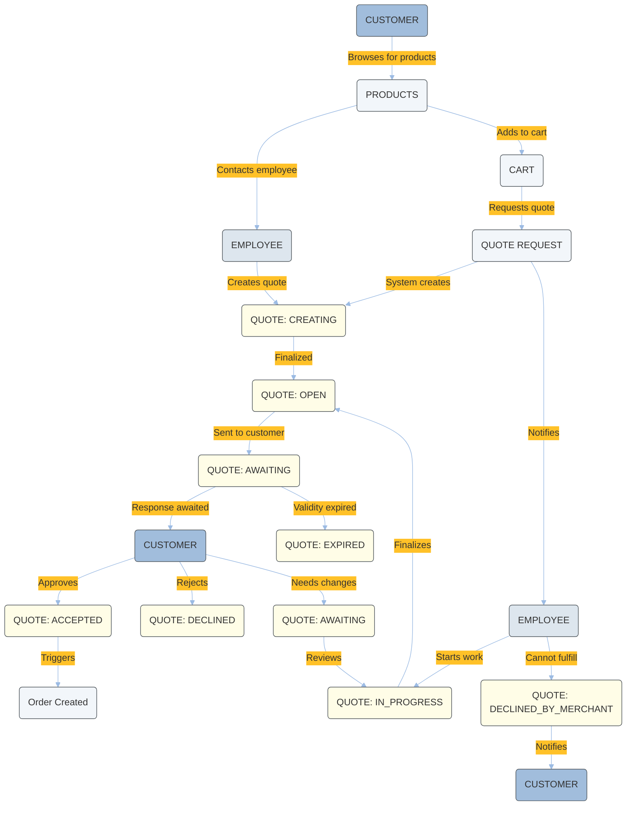

---
seo:
  title: Quote Service Tutorials
  description: Quote Management
icon: graduation-cap
layout:
  width: wide
  title:
    visible: true
  description:
    visible: true
  tableOfContents:
    visible: true
  outline:
    visible: true
  pagination:
    visible: true
  metadata:
    visible: true
---

# Quote Tutorial

The Quote Service allows you to send email notifications to customers every time a new quote is created or updated by the customers themselves or by an employee on their behalf.


The Emporix API Quote Service is only available to tenants that use the Price v2 API Service.


## Quote statuses

The Quote Service supports the following status values:

| Status | Description | Set By | When Used |
|--------|-------------|--------|-----------|
| `CREATING` | Quote is being created (temporary state) | System | During quote creation process |
| `OPEN` | Quote is ready for customer review | System/Employee | After quote is finalized and sent to customer |
| `AWAITING` | Waiting for response from customer or employee | Employee/Customer | When one party is waiting for the other's action |
| `IN_PROGRESS` | Active negotiation/changes are being made | Employee | When employee is modifying the quote |
| `ACCEPTED` | Customer accepted the quote | Customer | Customer agrees to terms, triggers order creation |
| `DECLINED` | Customer rejected the quote | Customer | Customer doesn't want to proceed |
| `DECLINED_BY_MERCHANT` | Employee/merchant rejected the quote | Employee | Merchant cannot fulfill the request |
| `EXPIRED` | Quote validity period has passed | System | When `validTo` date is exceeded |

The whole quote flow and status representations is visible in the diagram:



## Quote reasons

When a customer changes the quote status to `DECLINED` or `IN_PROGRESS`, or when an employee changes the quote status to `DECLINED_BY_MERCHANT`, they can provide a reason why they performed that action.

There are four default reasons that your customers and employees can select for the `DECLINED` or `CHANGED` quote statuses:

| Quote status | Reason code                                                                                              |
| ------------ | -------------------------------------------------------------------------------------------------------- |
| **DECLINE**  | <ul><li>PRICE_TOO_HIGH</li><li>NO_LONGER_NEEDED</li><li>DELIVERY_TIME_LATE</li><li>OTHER</li></ul>       |
| **CHANGE**   | <ul><li>WRONG_MATERIAL</li><li>PROVIDED_PRICE_TO_HIGH</li><li>DELIVERY_TIME_LATE</li><li>OTHER</li></ul> |


The quote reason of the `DECLINE` type can only be used for the `DECLINED` or `DECLINED_BY_MERCHANT` actions, while the `CHANGE` type can only be used for the `IN_PROGRESS` change of status.


## How to configure the quote service

The following merchant information is necessary for the pdf file with quote to be generated:

* `merchantName`
* `merchantAddress`
  * `merchantCity`
  * `merchantStreet`
  * `merchantStreetNo`
  * `merchantZipCode`


The pdf with quote is sent to the customer in the notification email upon the quote creation or change. It's also available for the customer on the storefront.




### Retrieve your site's mixins

First, you need to check the current site mixin configuration for the `merchantInfo` parameter by sending a request to the [Retrieving site mixins](https://developer.emporix.io/api-references/api-guides/configuration/site-settings-service/api-reference/mixins#get-site-tenant-sites-sitecode-mixins-mixinname) endpoint.


The following scope is required:

`site.site_manage`


```bash
curl -i -X GET 
  'https://api.emporix.io/site/{tenant}/sites/{siteCode}/mixins' 
  -H 'Authorization: Bearer <YOUR_TOKEN_HERE>'
```



### Update merchant information

Update the merchant information for your tenant's site by sending a request to the [Partially updating a site mixin](https://developer.emporix.io/api-references/api-guides/configuration/site-settings-service/api-reference/mixins#patch-site-tenant-sites-sitecode-mixins-mixinname) endpoint.


The following scope is required:

`site.site_manage`


```bash
curl -i -X PATCH 
  'https://api.emporix.io/site/{tenant}/sites/{siteCode}/mixins/{mixinName}' 
  -H 'Authorization: Bearer <YOUR_TOKEN_HERE>' 
  -H 'Content-Type: application/json' 
  -d '{
    "active": true
  }'
```



### Update available quote status change reasons

There are four default reasons that your customers and employees can select for the `DECLINED` or `CHANGED` quote statuses, as mentioned in [Quote Reasons](../quote/quote.md#quote-reasons).

You can create new quote status change reasons, by sending a request to the [Creating a reason for changing the quote status](https://developer.emporix.io/api-references/api-guides/quotes/quote/api-reference/quote-reason#post-quote-tenant-quote-reasons) endpoint.

```bash
curl -i -X POST 
  'https://api.emporix.io/quote/{tenant}/quote-reasons' 
  -H 'Authorization: Bearer <YOUR_TOKEN_HERE>' 
  -H 'Content-Language: de' 
  -H 'Content-Type: application/json' 
  -d '{
    "code": "PRICE_TOO_HIGH",
    "type": "CHANGE",
    "message": {
      "en": "The price is too high",
      "de": "Der Preis ist zu hoch"
    }
  }'
```





Site Settings:

[api-reference](../../configuration/site-settings-service/api-reference/)


Quote:

[api-reference](api-reference/)


## How to manage quote requests

A quote request can be created both by a customer directly on your business' storefront, or by an employee on behalf of a customer.

### Creating a quote by a customer

On the storefront, a customer adds selected products to cart. At checkout, they can proceed to purchasing the items, or requesting a quote.
If a customer places a quote request, the [Creating a quote](https://developer.emporix.io/api-references/api-guides/quotes/quote/api-reference/quote-management#post-quote-tenant-quotes) endpoint is called.


The following scope is granted to a customer group:

`quote.quote_manage_own`


The customer can place a quote request on the storefront only if they have created a cart with the requested items beforehand.

```bash
curl -i -X POST 
  'https://api.emporix.io/quote/{tenant}/quotes' 
  -H 'Authorization: Bearer <YOUR_TOKEN_HERE>' 
  -H 'Content-Type: application/json' 
  -d '{
    "customerId": "9tt954309b06d46d3cf19fe",
    "employeeId": "9tt954309b06d46d3cf19fa",
    "billingAddressId": "64672a8f9939d331699cbe6e",
    "shippingAddressId": "64672a8f9939d331699cbe6e",
    "companyName": "ABC",
    "siteCode": "main",
    "currency": "USD",
    "validTo": "2022-04-01T04:37:04.301Z",
    "shipping": {
      "value": 10,
      "methodId": "fedex-2dayground",
      "zoneId": "63440460ceeaa26d794fcbbb",
      "shippingTaxCode": "STANDARD"
    },
    "items": [
      {
        "quantity": {
          "quantity": 1,
          "unitCode": "piece"
        },
        "price": {
          "priceId": "6245aa0a78a8576e338fa9c4",
          "unitPrice": 13,
          "totalNetValue": 13,
          "tax": {
            "taxClass": "STANDARD",
            "taxRate": 20
          }
        },
        "product": {
          "productId": "7i98542309b06d46d3cf19fe"
        }
      }
    ],
    "mixins": {
      "customAttributes": {
        "attribute": {
          "value": 1,
          "unit": "kg"
        }
      }
    },
    "metadata": {
      "mixins": {
        "customAttributes": "https://res.cloudinary.com/saas-ag/raw/upload/schemata/CAAS/customAttributes.json"
      }
    }
  }'
```


The initial status of a quote request created by a customer is always set to `AWAITING`.


### Creating a quote on behalf of a customer

To create a quote request on behalf of a customer, send a request to the [Creating a quote](https://developer.emporix.io/api-references/api-guides/quotes/quote/api-reference/quote-management#post-quote-tenant-quotes) endpoint.


The following scope is required:

`quote.quote_manage`


```bash
curl -i -X POST 
  'https://api.emporix.io/quote/{tenant}/quotes' 
  -H 'Authorization: Bearer <YOUR_TOKEN_HERE>' 
  -H 'Content-Type: application/json' 
  -d '{
    "customerId": "9tt954309b06d46d3cf19fe",
    "employeeId": "9tt954309b06d46d3cf19fa",
    "billingAddressId": "64672a8f9939d331699cbe6e",
    "shippingAddressId": "64672a8f9939d331699cbe6e",
    "companyName": "ABC",
    "siteCode": "main",
    "currency": "USD",
    "validTo": "2022-04-01T04:37:04.301Z",
    "shipping": {
      "value": 10,
      "methodId": "fedex-2dayground",
      "zoneId": "63440460ceeaa26d794fcbbb",
      "shippingTaxCode": "STANDARD"
    },
    "items": [
      {
        "quantity": {
          "quantity": 1,
          "unitCode": "piece"
        },
        "price": {
          "priceId": "6245aa0a78a8576e338fa9c4",
          "unitPrice": 13,
          "totalNetValue": 13,
          "tax": {
            "taxClass": "STANDARD",
            "taxRate": 20
          }
        },
        "product": {
          "productId": "7i98542309b06d46d3cf19fe"
        }
      }
    ],
    "mixins": {
      "customAttributes": {
        "attribute": {
          "value": 1,
          "unit": "kg"
        }
      }
    },
    "metadata": {
      "mixins": {
        "customAttributes": "https://res.cloudinary.com/saas-ag/raw/upload/schemata/CAAS/customAttributes.json"
      }
    }
  }'
```


The initial status of a quote request being created by an employee is always set to `CREATING`, and, subsequently, to `OPEN` when the quote is created.


### Updating a quote by an employee

There are two scenarios when an employee may need to update a quote:

* A customer can contact your Customer Service so that an employee updates the quote request on their behalf
* Employee updates the quote request with new information for the customer to review, such as price or status change

To achieve that, the employee needs to send a request to the [Partially updating a quote](https://developer.emporix.io/api-references/api-guides/quotes/quote/api-reference/quote-management#patch-quote-tenant-quotes-quoteid) endpoint.


The following scope is required:

`quote.quote_manage`


In this example, an employee updates multiple fields:

```bash
curl -L 
  --request PATCH 
  --url 'https://api.emporix.io/quote/{tenant}/quotes/{quoteId}' 
  --header 'Authorization: Bearer YOUR_OAUTH2_TOKEN' 
  --header 'Content-Type: application/json' 
  --data '[
    {
      "op": "ADD",
      "path": "/items",
      "value": {
        "itemId": "2298854309b06d4c6d3cf1zfe",
        "quantity": {
          "quantity": 1,
          "unitCode": "H87"
        },
        "price": {
          "priceId": "14551d2309b06sd46d3cf19bq",
          "unitPrice": 13,
          "totalNetValue": 13,
          "tax": {
            "taxClass": "STANDARD",
            "taxRate": 20
          }
        },
        "product": {
          "productId": "74698542309b06dc46d3cf19fe"
        }
      }
    },
    {
      "op": "REPLACE",
      "path": "/status",
      "value": {
        "value": "OPEN",
        "comment": "new comment"
      }
    },
    {
      "op": "REPLACE",
      "path": "/items/22988s54309b06d46d3acf19fe",
      "value": {
        "quantity": {
          "quantity": 1,
          "unitCode": "H87"
        },
        "price": {
          "priceId": "14551d2309b06sd46d3cf19bq",
          "unitPrice": 13,
          "totalNetValue": 13,
          "tax": {
            "taxClass": "STANDARD",
            "taxRate": 20
          }
        },
        "product": {
          "productId": "74698542309b06dc46d3cf19fe"
        }
      }
    },
    {
      "op": "REMOVE",
      "path": "/items/124dfa82410fas824kfa"
    }
  ]'
```

In the following example, an employee updates only the price of requested item:

```bash
curl -L 
  --request PATCH 
  --url 'https://api.emporix.io/quote/{tenant}/quotes/{quoteId}' 
  --header 'Authorization: Bearer YOUR_OAUTH2_TOKEN' 
  --header 'Content-Type: application/json' 
  --data '[
    {
      "op": "REPLACE",
      "path": "/items/124dfa8241sd0fas824kfa/price",
      "value": {
        "totalNetValue": 13
      }
    }
  ]'
```

### Accepting a quote by a customer

When a customer accepts a quote on the storefront, the following endpoint is called: [Partially updating a quote](https://developer.emporix.io/api-references/api-guides/quotes/quote/api-reference/quote-management#patch-quote-tenant-quotes-quoteid).


The following scope is granted to the customer group:

`quote.quote_manage_own`


```bash

curl -i -X PATCH 
  'https://api.emporix.io/quote/{tenant}/quotes/{quoteId}' 
  -H 'Authorization: Bearer <YOUR_TOKEN_HERE>' 
  -H 'Content-Type: application/json' 
  -d '{
    "op": "replace",
    "path": "/status",
    "value": {
      "value": "ACCEPTED",
      "comment": "new comment"
    }
  }'
```

### Declining a quote by a customer

When a customer changes the quote status to `DECLINED` or `IN_PROGRESS`, or when an employee changes the quote status to `DECLINED_BY_MERCHANT`, they can provide a reason why they performed that action.\
On the storefront, when a customer declines the quote, a request to the following endpoint is sent: [Partially updating a quote](https://developer.emporix.io/api-references/api-guides/quotes/quote/api-reference/quote-management#patch-quote-tenant-quotes-quoteid).


The following scope is granted to the customer group:

`quote.quote_manage_own`


If the customer wants to provide a reason for declining a quote, they can choose one of the provided reasons from a list of available reasons and/or add comments.

In this example, a customer receives a quote and decides to decline it because the proposed price is too high. They also add a comment to negotiate the price.

```bash
curl -i -X PATCH 
  'https://api.emporix.io/quote/{tenant}/quotes/{quoteId}' 
  -H 'Authorization: Bearer <YOUR_TOKEN_HERE>' 
  -H 'Content-Type: application/json' 
  -d '{
    "op": "replace",
    "path": "/status",
    "value": {
      "value": "DECLINED",
      "comment": "Can you make the price 50$ cheaper?",
      "quoteReasonId": "6437ed5dc0dc2925289a5bbd"
    }
  }'
```



[api-reference](api-reference/)


## External prices and products support

External pricing allows you to supply your own price data directly in quote items, instead of relying on predefined internal price lists in the Emporix system.  
This is useful when pricing is managed by an external system (for example, ERP) and you want to inject those values into quotes.

By default, all products and prices in Emporix are **internal**, they reference the entities that are stored in Emporix catalog and price lists.  
However, Quote Service supports **external prices** and **external products** as well, giving you full control over the pricing data you send.

Each price object includes a `type` field that defines whether the object is an internal one, or from an external source.

* `INTERNAL` - Default behavior, the system looks up for price information using `priceId`. 
* `EXTERNAL` - Allows you to provide your own price details directly in the quote request. 

When using `EXTERNAL` pricing, you can send complete price details (for example, net and gross values) without storing them in Emporix.

To use external prices, the `cart.cart_manage_external_prices` scope is necessary. Without the scope, quote creation or updates containing external price data are rejected.

Example of an item in a quote request using an external price, where:

* The product is internal - from your Emporix catalog.
* The price is external - supplied directly in the request.
* No `priceId` is required, because you are providing all the necessary price details.

```json
{
  "product": {
    "type": "INTERNAL",
    "productId": "12345"
  },
  "price": {
    "type": "EXTERNAL",
    "currency": "EUR",
    "gross": 120.00,
    "net": 100.00,
    "tax": {
      "rate": 0.20
    }
  },
  "quantity": 2
}
```

Example of an item in a quote request using an external product and price, where both the product and price are external.

```json
{
  "product": {
    "type": "EXTERNAL",
    "name": {
      "en": "Custom Demo Service"
    },
    "media": [
      {
        "id": "img001",
        "contentType": "image/png",
        "url": "https://example.com/demo.png"
      }
    ]
  },
  "price": {
    "type": "EXTERNAL",
    "currency": "USD",
    "gross": 500.00,
    "net": 420.00,
    "tax": {
      "rate": 0.19
    }
  },
  "quantity": 1
}
```

### Support for mixins and metadata 

**Mixins** as schema extensions that allow quotes to include custom structured data beyond the standard fields.

For example:

```json
{
  "id": "q-7890",
  "status": "AWAITING_CUSTOMER_ACTION",
  "mixins": {
    "approvalMixin": {
      "approvedBy": "employee-002",
      "approvedAt": "2025-10-20T10:15:00Z",
      "approvalThreshold": 5000
    },
    "discountMixin": {
      "type": "percentage",
      "value": 10,
      "reason": "End of quarter discount"
    }
  }
}
```

**Metadata** is a flexible key-value store attached to any quote or sub-resource.
It’s intended for contextual or audit information, things like who made a change, internal reason codes, timestamps, or workflow notes.

For example:

```json
{
  "id": "q-1234",
  "status": "IN_PROGRESS",
  "metadata": {
    "quoteReason": "Customer requested price adjustment",
    "reviewedBy": "employee-001",
    "reviewTimestamp": "2025-10-20T09:45:00Z",
    "sourceChannel": "B2B Portal"
  }
}
```

#### Updating existing quotes

To add new mixins or metadata or replace existing values in a created quote, send a request to the [Partially updating a quote](https://developer.emporix.io/api-references/api-guides/quotes/quote/api-reference/quote-management#patch-quote-tenant-quotes-quoteid) endpoint.

```bash
curl -L 
  --request PATCH 
  --url 'https://api.emporix.io/quote/{tenant}/quotes/{quoteId}' 
  --header 'Authorization: Bearer YOUR_OAUTH2_TOKEN' 
  --header 'Content-Type: application/json' 
  --data '[
      {
        "status": "IN_PROGRESS",
        "metadata": {
          "quoteReason": "Adjusted discount based on approval",
          "reviewedBy": "employee-002"
        },
        "mixins": {
          "approvalMixin": {
            "approvedBy": "manager-001",
            "approvalThreshold": 10000
          }
        }
      }
```



[api-reference](api-reference/)
