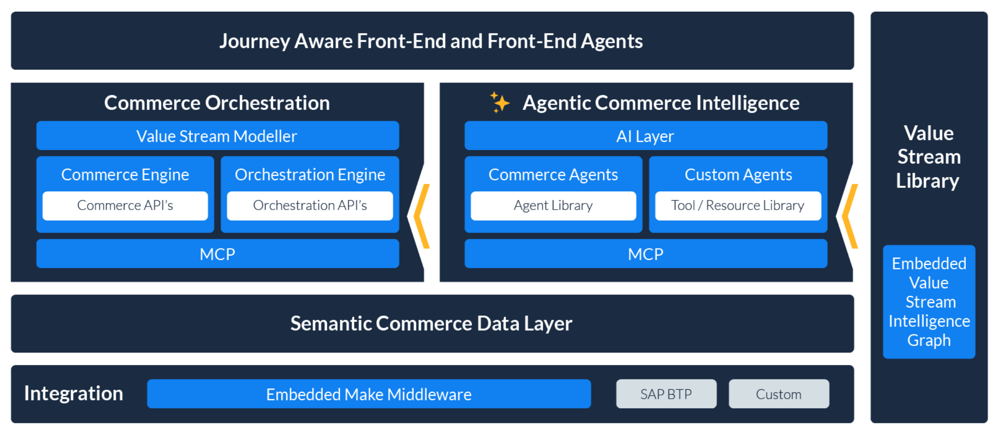

# Emporix Components Overview

The architecture comprises several core components that work together to create an autonomous and efficient ecommerce environment.

<figure><figcaption>
Emporix components overview
</figcaption></figure>

**Core Architectural Components**

* **Commerce Orchestration** - This layer serves as the central control mechanism for all business processes within the platform. Its purpose is to centrally control critical operations, ranging from managing orders to handling promotional processes. Commerce Orchestration embraces functionalities of [Commerce Engine - CE](https://app.gitbook.com/o/z8MNPigQv25NZe33g3AV/s/bTY7EwZtYYQYC6GOcdTj/) and [Value Stream Modeller - VSM](https://app.gitbook.com/o/z8MNPigQv25NZe33g3AV/s/rSc4haeKWrTrOPHzdrMO/), powered by explicit APIs.
* **Agentic Commerce Intelligence** - This is the layer that leverages AI agents to introduce intelligent automation. The layer enables smart decisions that accelerate processes and reduce operational costs. It allows the platform to function without the need for human intervention in many routine or time-consuming tasks, driving operational efficiency and extensibility. Agentic comes with a library of AI agents and space to create custom agents using different tools and resources.
* **Semantic Commerce Data Layer** - This layer addresses data consistency and accessibility across the platform. Its role is to provide a unified, understandable database. It connects systems, processes, and teams, which enables consistent decisions across the entire organization.
* **Embedded Integration Layer** - This component is responsible for ensuring the seamless connection and embedding of various external systems. It integrates critical services such as ERP (Enterprise Resource Planning), PIM (Product Information Management), and other third-party systems. This layer is designed to eliminate the need for complex interface projects.

**Supporting and Functional Layers**

In addition to the core structural components, the architecture also includes:

* **Value Stream Examples** - The [Value Stream Modeller - VSM](https://app.gitbook.com/s/rSc4haeKWrTrOPHzdrMO/value-stream-examples/pl-introduction) offers ready-made process templates for all core commerce processes. These templates are designed to be customizable and available for immediate use.
* **Journey Aware Frontend** - This component is focused on the customer experience. It helps merchants to better understand the customer experience and design it appropriately.
