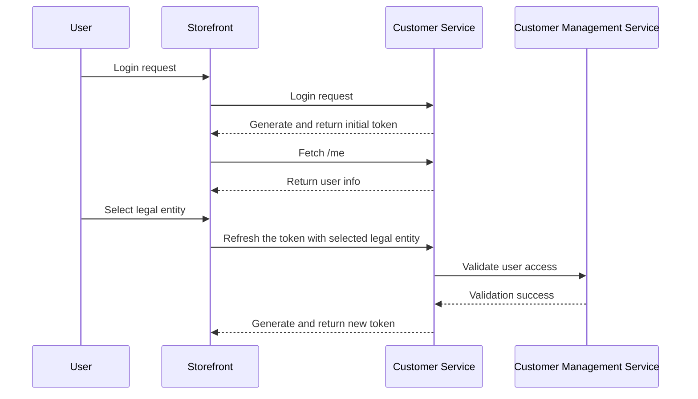

---
seo:
  title: B2B Customers - Legal Entity
  description: Standard practices
toc:
  enable: true
tocMaxDepth: 2
editPage:
  disable: true
label: B2B Customers - Legal Entity
icon: business-time
description: The B2B Token embeds a customer’s selected legal entity in their authorization token, enabling consistent access control and data visibility without re-login.
---

# B2B Token

In B2B scenarios, the customers frequently represent more than one company. They can belong to more than one legal entity that they act and make purchases on behalf of.\
Therefore, the storefront needs to identify which legal entity a user is acting on behalf of during each session to properly resolve the right data access and scope level.

Example use cases:

* Orders: The customer's assigned legal entity can be crucial for accessing orders information. B2B customers need to access their own orders, but also the orders assigned to their legal entity.
* Products availability: With customer segments, product visibility can become segment-based. Therefore, the endpoint responsible for retrieving products on the storefront has to return only these products that the customer has access to with the selected legal entity.

## Legal entity in authorization token

To ensure that the storefront properly reads a B2B customer's selected legal entity and determines the relevant access to resources, the authorization token generated by the [Customer Service](https://developer.emporix.io/api-references/api-guides/companies-and-customers/customer-management/api-reference/authentication-and-authorization#get-customer-tenant-refreshauthtoken) gets updated with the `legalEntityId` parameter.\
The token-based approach to pass the `legalEntityId` parameter guarantees that the relevant services use that information to retrieve relevant data. The `legalEntityId` header is injected in the requests.


Passing the `legalEntityId` parameter in the authorization token is the proper way to handle the B2B customer legal entity information across services.\
The token approach ensures a consistent user experience, and centralized security enforcement while enabling the required legal entity-based access control.


## How it works

1. The B2B customer logs in and chooses the legal entity they represent.
2. The Customer Service verifies the user's assignment to the selected legal entity.
3. A new `refreshToken` is issued to a customer by the [Customer Service](../companies-and-customers/customer-management/api-reference), embedding the selected legal entity.
4. In the case the customer changes the legal entity, the storefront triggers the [Refreshing a customer token](https://developer.emporix.io/api-references/api-guides/companies-and-customers/customer-management/api-reference/authentication-and-authorization#get-customer-tenant-refreshauthtoken) endpoint to generate a new token based on the previous one but with the changed `legalEntityId` information.
Thanks to that the customer isn't forced to log in again.
5. The token with the selected legal entity is passed to other services to determine the right scopes for the user.

The diagram shows how the legal entity information is fetched and passed:


Find out more about the Customer Service and token generation in the API reference [Customer Service (Customer Managed)](../companies-and-customers/customer-management/api-reference) documentation.

