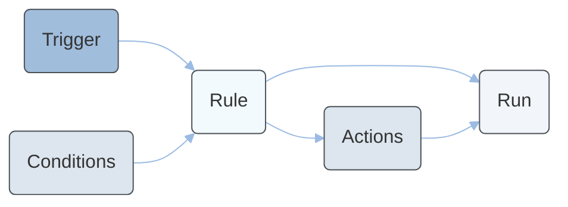

---
seo:
  title: Automation Service Tutorials
  description: Learn how to create, activate, trigger, and inspect automation rules and runs with the Automation Service.
icon: graduation-cap
layout:
  width: wide
  title:
    visible: true
  description:
    visible: true
  tableOfContents:
    visible: true
  outline:
    visible: true
  pagination:
    visible: true
  metadata:
    visible: true
---

# Automation Service Tutorial

The Automation Service runs tenant-defined rules when platform events occur, on a schedule, or on demand. Each rule evaluates optional conditions against the trigger payload and then executes one or more actions.

Use the Automation Service when you need Emporix to take an action, for example calling an HTTP endpoint after a high-value order is created. To only receive event notifications, use the [Webhook Service](../../webhooks/webhook-service/webhooks-tutorial.md) instead.

The following diagram shows how the main Automation Service resources relate to each other:



A typical workflow follows these steps:

1. **Create a rule** with a trigger, optional conditions, and at least one action.
2. **Activate the rule** so that matching events or the schedule can start runs.
3. **Trigger a dry run** if you want to validate the rule without executing actions.
4. **Inspect runs** to confirm the outcome and troubleshoot failures.

## Prerequisites

Make sure you have the following:

* A **service OAuth2 token** with the `automation.rule_manage` and `automation.run_read` scopes. To trigger runs, the token also needs the `automation.run_trigger` scope. For more information, see [Authentication and Authorization](../../quickstart/authentication-and-authorization/README.md).
* At least one subscribed platform event if the rule trigger type is `EVENT`. See [Webhook - Events](../../webhooks/webhook-events.md) for event types and payload fields you can use in conditions.


A tenant can have a maximum of 50 active rules. The service processes up to 100 runs per minute per tenant. Failed HTTP actions retry according to the rule `retryPolicy`.


## How to create and activate an automation rule

Follow these steps to authenticate, create a rule that reacts to high-value orders, and activate it.



#### Request a service access token

Use the OAuth client credentials flow with a technical client that has `automation.rule_manage`, `automation.rule_read`, `automation.run_trigger`, and `automation.run_read` scopes assigned.




[api-reference](../../authentication/oauth-service/api-reference/)


```bash
curl -i -X POST \
  'https://api.emporix.io/oauth/token' \
  -H 'Content-Type: application/x-www-form-urlencoded' \
  --data-urlencode 'grant_type=client_credentials' \
  --data-urlencode 'client_id={CLIENT_ID}' \
  --data-urlencode 'client_secret={CLIENT_SECRET}' \
  --data-urlencode 'scope=automation.rule_manage automation.rule_read automation.run_trigger automation.run_read'
```

Store the returned `access_token` and use it as `{{OAUTH2_ACCESS_TOKEN}}` in the following steps.



#### Create an automation rule

Call the [Creating an automation rule](https://developer.emporix.io/api-references/api-guides/utilities/automation-service/api-reference/rules#post-automation-tenant-rules) endpoint. New rules are created with `active` set to `false`. You activate the rule in a later step after you confirm the configuration.

This example creates a rule that runs when an `order.created` event has a total amount greater than `500` EUR. The action sends the order payload to a warehouse HTTP endpoint.




[api-reference](api-reference/)


```bash
curl -i -X POST \
  'https://api.emporix.io/automation/{tenant}/rules' \
  -H 'Authorization: Bearer {{OAUTH2_ACCESS_TOKEN}}' \
  -H 'Content-Type: application/json' \
  -d '{
    "name": "Notify warehouse on high-value orders",
    "description": "Sends high-value orders to the warehouse fulfillment endpoint.",
    "siteCode": "main",
    "trigger": {
      "type": "EVENT",
      "eventType": "order.created"
    },
    "conditions": [
      {
        "field": "totalPrice.amount",
        "operator": "GREATER_THAN",
        "value": 500
      }
    ],
    "actions": [
      {
        "type": "HTTP",
        "method": "POST",
        "destinationUrl": "https://warehouse.example.com/hooks/orders",
        "headers": {
          "X-Source": "emporix-automation"
        }
      }
    ],
    "retryPolicy": {
      "maxAttempts": 3,
      "backoffSeconds": 30
    }
  }'
```

A `201 Created` response returns the assigned rule identifier:

```json
{
  "id": "68be1a2c9f3e4a0012c8d441"
}
```

Save the `id`. You need it to activate the rule and to trigger runs.



#### Retrieve the automation rule

Call the [Retrieving an automation rule](https://developer.emporix.io/api-references/api-guides/utilities/automation-service/api-reference/rules#get-automation-tenant-rules-ruleid) endpoint to confirm the stored configuration before you activate it.




[api-reference](api-reference/)


```bash
curl -i -X GET \
  'https://api.emporix.io/automation/{tenant}/rules/68be1a2c9f3e4a0012c8d441' \
  -H 'Authorization: Bearer {{OAUTH2_ACCESS_TOKEN}}'
```

The response includes `active: false` until you activate the rule. Event and schedule triggers do not start runs while the rule is inactive.



#### Activate the automation rule

Call the [Activating an automation rule](https://developer.emporix.io/api-references/api-guides/utilities/automation-service/api-reference/rules#post-automation-tenant-rules-ruleid-activate) endpoint. After activation, matching `order.created` events start runs automatically.




[api-reference](api-reference/)


```bash
curl -i -X POST \
  'https://api.emporix.io/automation/{tenant}/rules/68be1a2c9f3e4a0012c8d441/activate' \
  -H 'Authorization: Bearer {{OAUTH2_ACCESS_TOKEN}}'
```

A `200 OK` response returns the rule with `active` set to `true`.


Activation fails with `400` when the rule has no actions. Add at least one action before you activate the rule.


Example error response:

```json
{
  "status": 400,
  "type": "validation_failure",
  "message": "A rule must contain at least one action before it can be activated."
}
```



## How to trigger and inspect a run

Event-triggered rules start runs when a matching event arrives. You can also start a run on demand, including a dry run that evaluates conditions without executing actions.

### Trigger a dry run

Call the [Triggering an automation run](https://developer.emporix.io/api-references/api-guides/utilities/automation-service/api-reference/runs#post-automation-tenant-rules-ruleid-run) endpoint with `dryRun` set to `true`. Provide a sample payload that matches the trigger event structure.




[api-reference](api-reference/)


```bash
curl -i -X POST \
  'https://api.emporix.io/automation/{tenant}/rules/68be1a2c9f3e4a0012c8d441/run' \
  -H 'Authorization: Bearer {{OAUTH2_ACCESS_TOKEN}}' \
  -H 'Content-Type: application/json' \
  -d '{
    "dryRun": true,
    "payload": {
      "id": "order-100245",
      "siteCode": "main",
      "totalPrice": {
        "amount": 749.5,
        "currency": "EUR"
      }
    }
  }'
```

A `202 Accepted` response returns the run identifier and an initial `QUEUED` status:

```json
{
  "id": "68be1b9e4c7d2f0018a91c02",
  "status": "QUEUED",
  "dryRun": true
}
```


If a run is already `QUEUED` or `RUNNING` for the same rule, the endpoint returns `409 Conflict`.


Example error response:

```json
{
  "status": 409,
  "type": "conflict",
  "message": "A run is already active for this rule."
}
```


Run status can take a few seconds to move from `QUEUED` to `RUNNING` or a terminal state. Retrieve the run again if the first response still shows `QUEUED`.


### Retrieve automation runs

To list runs for the tenant, send a request to the [Retrieving all automation runs](https://developer.emporix.io/api-references/api-guides/utilities/automation-service/api-reference/runs#get-automation-tenant-runs) endpoint. Filter by `ruleId` to inspect a single rule.




[api-reference](api-reference/)


```bash
curl -i -X GET \
  'https://api.emporix.io/automation/{tenant}/runs?ruleId=68be1a2c9f3e4a0012c8d441&pageNumber=1&pageSize=20' \
  -H 'Authorization: Bearer {{OAUTH2_ACCESS_TOKEN}}'
```

To retrieve a single run, including action results and error details, send a request to the [Retrieving an automation run](https://developer.emporix.io/api-references/api-guides/utilities/automation-service/api-reference/runs#get-automation-tenant-runs-runid) endpoint.

```bash
curl -i -X GET \
  'https://api.emporix.io/automation/{tenant}/runs/68be1b9e4c7d2f0018a91c02' \
  -H 'Authorization: Bearer {{OAUTH2_ACCESS_TOKEN}}'
```

The example response looks like:

```json
{
  "id": "68be1b9e4c7d2f0018a91c02",
  "ruleId": "68be1a2c9f3e4a0012c8d441",
  "status": "SUCCEEDED",
  "dryRun": true,
  "triggerType": "MANUAL",
  "startedAt": "2026-09-08T08:12:04Z",
  "finishedAt": "2026-09-08T08:12:05Z",
  "actions": [
    {
      "type": "HTTP",
      "status": "SKIPPED",
      "message": "Dry run did not execute the HTTP action."
    }
  ]
}
```

Possible run `status` values:

* `QUEUED` – the run is waiting to start
* `RUNNING` – the service is evaluating conditions or executing actions
* `SUCCEEDED` – all actions completed, or a dry run finished without executing actions
* `FAILED` – one or more actions failed after retries
* `SKIPPED` – conditions did not match, so no actions ran

## How to update an automation rule

To replace the full rule configuration, send a request to the [Updating an automation rule](https://developer.emporix.io/api-references/api-guides/utilities/automation-service/api-reference/rules#put-automation-tenant-rules-ruleid) endpoint. Include the current `metadata.version` value to avoid conflicts.




[api-reference](api-reference/)


```bash
curl -i -X PUT \
  'https://api.emporix.io/automation/{tenant}/rules/68be1a2c9f3e4a0012c8d441' \
  -H 'Authorization: Bearer {{OAUTH2_ACCESS_TOKEN}}' \
  -H 'Content-Type: application/json' \
  -d '{
    "name": "Notify warehouse on high-value orders",
    "description": "Sends high-value orders to the warehouse fulfillment endpoint.",
    "siteCode": "main",
    "trigger": {
      "type": "EVENT",
      "eventType": "order.created"
    },
    "conditions": [
      {
        "field": "totalPrice.amount",
        "operator": "GREATER_THAN",
        "value": 1000
      }
    ],
    "actions": [
      {
        "type": "HTTP",
        "method": "POST",
        "destinationUrl": "https://warehouse.example.com/hooks/orders",
        "headers": {
          "X-Source": "emporix-automation"
        }
      }
    ],
    "retryPolicy": {
      "maxAttempts": 5,
      "backoffSeconds": 45
    },
    "metadata": {
      "version": 1
    }
  }'
```

A `204 No Content` response confirms the update. Active rules keep running with the new configuration on the next matching event.

## How to deactivate or delete an automation rule

To stop new runs without deleting the rule, send a request to the [Deactivating an automation rule](https://developer.emporix.io/api-references/api-guides/utilities/automation-service/api-reference/rules#post-automation-tenant-rules-ruleid-deactivate) endpoint. Runs that are already `QUEUED` or `RUNNING` continue until they reach a terminal status.




[api-reference](api-reference/)


```bash
curl -i -X POST \
  'https://api.emporix.io/automation/{tenant}/rules/68be1a2c9f3e4a0012c8d441/deactivate' \
  -H 'Authorization: Bearer {{OAUTH2_ACCESS_TOKEN}}'
```

To delete the rule, send a request to the [Deleting an automation rule](https://developer.emporix.io/api-references/api-guides/utilities/automation-service/api-reference/rules#delete-automation-tenant-rules-ruleid) endpoint.

```bash
curl -i -X DELETE \
  'https://api.emporix.io/automation/{tenant}/rules/68be1a2c9f3e4a0012c8d441' \
  -H 'Authorization: Bearer {{OAUTH2_ACCESS_TOKEN}}'
```

A `204 No Content` response confirms deletion. Historical runs remain available through the run endpoints.
